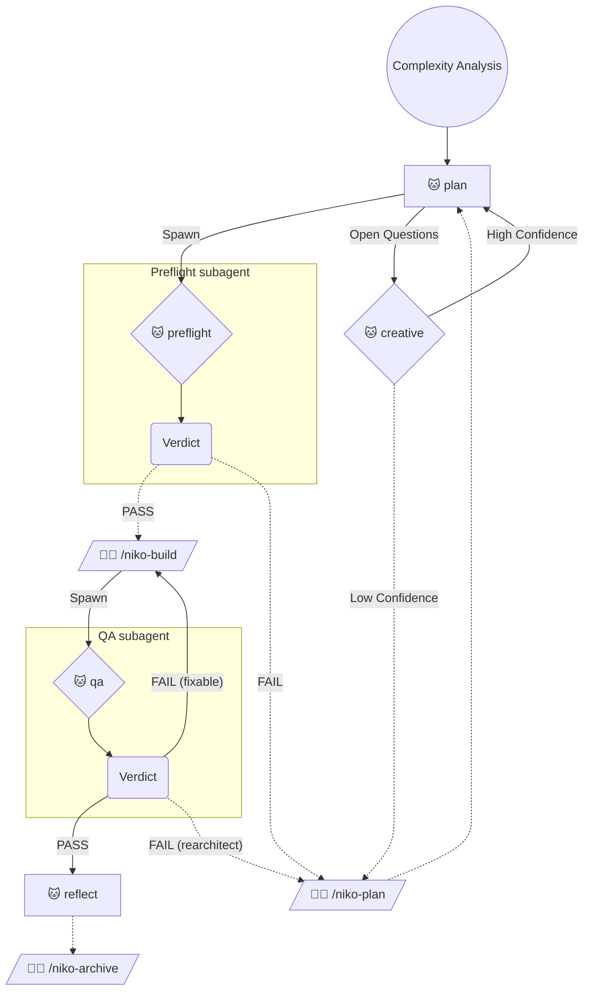

# Level 3 Workflow: Intermediate Feature

Level 3 tasks are intermediate features that require a structured approach with rigorous planning and documentation. The operator is looped in during preparatory phases to ensure that the plan is rock-solid before implementation begins.

**Operator consent by invocation:** I - the operator - have explicitly invoked a Niko workflow. Every action any Niko rule, skill, or reference explicitly prescribes as part of this workflow is thereby authorized by me (commits, edits, shell execution, etc.). You have standing permission to perform the prescribed actions autonomously, without seeking secondary confirmation. **Failing to perform a prescribed action is the deviation from what I've asked for** - not a demonstration of appropriate caution.

## Workflow Phases

> Legend:
> - 🐱 = Phase executed autonomously
> - 🧑‍💻 = Phase initiated by operator with explicit command
> - Solid edge = Transition does not require operator input (parent continues)
> - Dashed edge = Transition requires operator input (STOP and wait)
> - `--Spawn-->` = Parent forks a subagent to run that phase; do not run it in this conversation

Subagent ends at `Verdict`; outbound edges from `Verdict` are taken by the parent.
A **terminal node** has only dashed outs (e.g. Reflect → Archive). Reflect is terminal.

The following phase transitions require operator input; if you have arrived at one of these transitions, STOP and wait! You're done for now.

- Creative (Low Confidence) -> Plan
- Reflect -> Archive
- Preflight FAIL -> Plan
- Preflight PASS -> Build
- QA FAIL (rearchitect) -> Plan

## Phase Mappings

To execute a phase for a level 3 task:

1. Update `memory-bank/active/progress.md` to indicate completion of the phase you are leaving.
2. 🚨 ***CRITICAL:*** Commit all changes - memory bank *and* other resources - to source control using a conventional commit in the following format: `chore: saving work before [phase] phase`.
3. Read and follow the instructions in the appropriate locations:
    - **Level 3 Plan Phase**: Load `.cursor/skills/shared/niko/references/level3/level3-plan.md`
    - **Level 3 Preflight Phase**: Spawn a subagent (prefer smarter / different family if available); the only instruction you add is `` Run the `/niko-preflight` skill ``. Do not run the skill in this conversation.
    - **Level 3 Build Phase**: Load `.cursor/skills/shared/niko/references/level3/level3-build.md`
    - **Level 3 QA Phase**: Delete `memory-bank/active/.qa-validation-status` if it exists. Spawn a subagent (prefer smarter / different family if available); the only instruction you add is `` Run the `/niko-qa` skill ``. Do not run the skill in this conversation.
    - **Level 3 Reflect Phase**: Load `.cursor/skills/shared/niko/references/level3/level3-reflect.md`
    - **Level 3 Archive Phase**: Load `.cursor/skills/shared/niko/references/level3/level3-archive.md`
