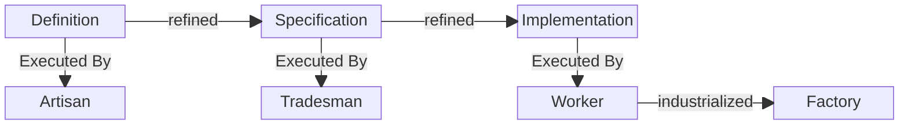
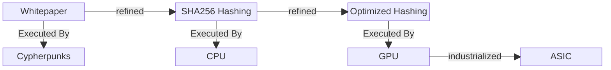

Refinement pipelines are everywhere, and they all have the same shape: stages persist even as the executors at each stage change, with the goal being more-efficient output with reduced human input.

Consider Bitcoin mining. The [Bitcoin whitepaper](https://bitcoin.org/bitcoin.pdf) described a proof-of-work system. The first people to implement it were cypherpunks running the reference client on CPUs. When the economics became clear, miners moved to GPUs - the same algorithm, a more specialized executor. Then purpose-built ASICs that do nothing except compute SHA256 hashes.

The *stages* didn't change. You still need the whitepaper's theory, the hash algorithm's specification, and the optimized implementation. What changed was who - or what - executes each stage. Nobody skipped from whitepaper to ASIC. The pipeline was load-bearing.

The same pattern appears in manufacturing, in logistics, in agriculture - anywhere humans have refined a process and then progressively swapped in more specialized executors. The [stages don't disappear](); they get *encapsulated*. You stop seeing them. But they're still in there, doing the work.

---

## Half-Baked Thoughts

- [Chainsaw origin: surgical instrument](https://en.wikipedia.org/wiki/Chainsaw)
	- General-purpose tools are transition technologies; what follows is always specialization (scalpel, bone saw, feller buncher, harvester)
- "We're in the GPU era" (software, knowledge work; code goes first) - general-purpose tools with **jigs** clamped on
- Possibly a [Butlerian Jihad addendum](): "all work is solved; now what?"
