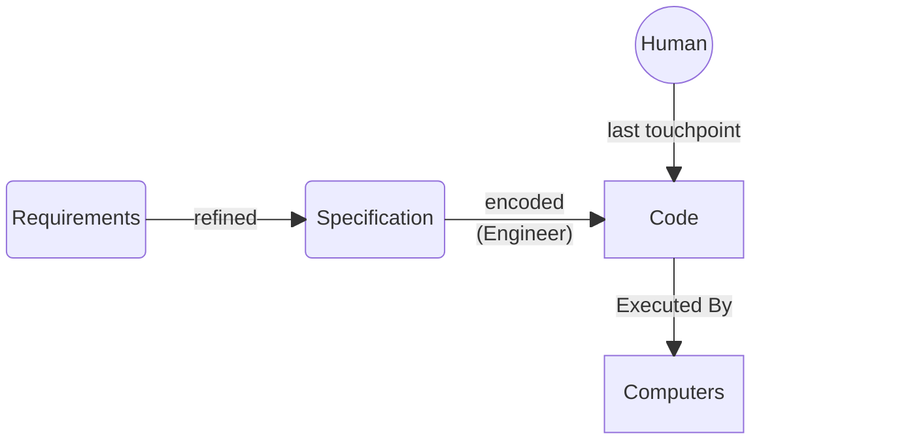
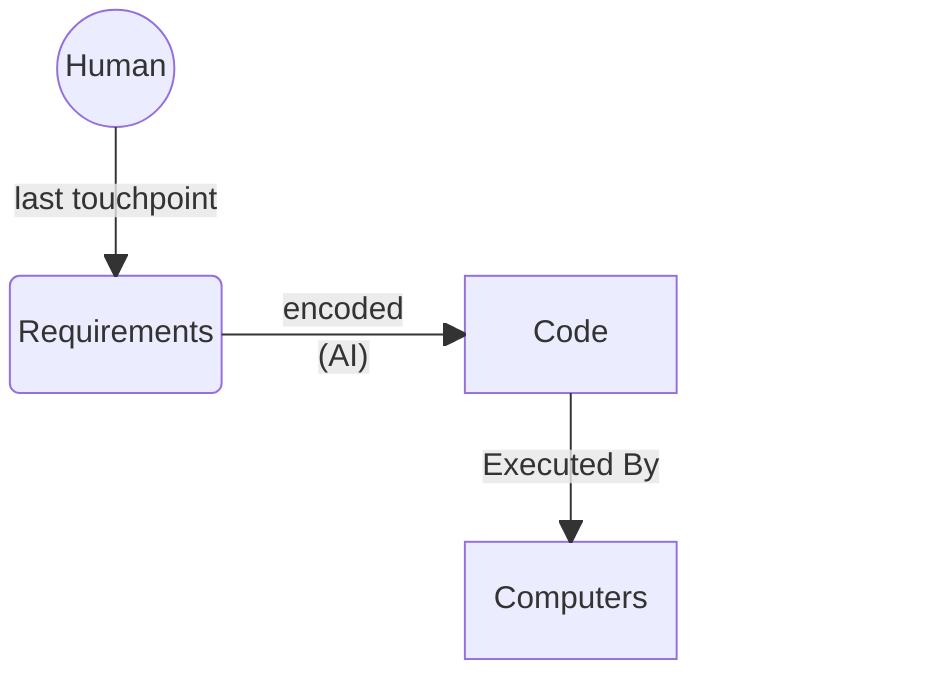
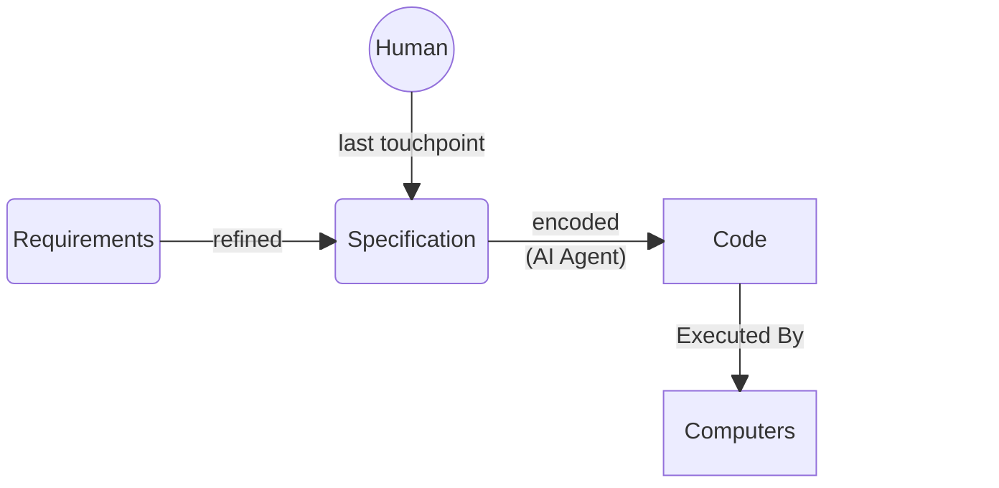
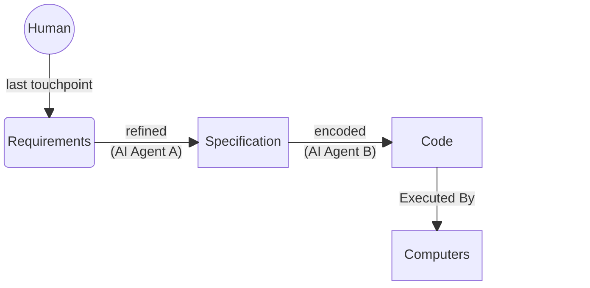



> the only programmers in a position to see all the differences in power between the various languages are those who understand the most powerful one.

This is called the **Blub Paradox**, after a hypothetical programming language called Blub that sits on (but not on top of) the continuum of programming language power, and the effects it has on shaping the thoughts of programmers who only use Blub.

In ~~2023~~ 2026, [The hottest new programming language is English](https://x.com/karpathy/status/1617979122625712128) but that *isn't* just another step up the Power Continuum, it's the top, the end. At least, of the Power Continuum of *programming languages.*

Working backwards:

The first computers were [analog machines](https://en.wikipedia.org/wiki/Difference_engine) each with a single [specific purpose](https://en.wikipedia.org/wiki/Norden_bombsight). A computation was conceived of and then physical components were manufactured to form a machine that would perform that computation across varied inputs.

The process *and* the processor were fixed, because they were one.

The digital revolution was truly that - a revolution - because it not just decoupled the process from the processor, it allowed the process to be built from *information* rather than physical materials. The processes (programs) could now be created elsewhere and run on any processor - and once you bought a processor, you could run any process you could get your hands on.

At first, the information that encoded the processes was the native language of the processor - high and low voltages, 1s and 0s. Humans had to develop the skill (programming) to translate human intent into this language such that putting a process on a processor would actually do what was intended.

Shortly thereafter, we abstracted a little bit into [assembly language](https://en.wikipedia.org/wiki/Assembly_language) - slightly more-readable than 1s and 0s, but still very close in design to the machine's native language.

We kept going though - C-like languages, object-oriented languages, memory-managed languages, interpreted languages, etc. - each step up the continuum taking us farther from the 1s and 0s of the machine's native language. To what end? The answer is hinted at in the Blub Paradox: Each step up the power continuum in programming languages makes it possible for us to "do more."

But that's not strictly true - every language from the bottom up is [Turing Complete](https://en.wikipedia.org/wiki/Turing_completeness) - they can all express the same set of computations, which is all possible computations. So why bother?

Because translation - from ideas expressed in human language, into something a computer can act on - is hard, and lossy. "Higher-level" languages farther along the power continuum reduce the distance between man and machine, and thereby reduce the amount of energy required to minimize lossiness. Our human resources are limited, so being able to "do more" actually means that it's *easier* for humans to get machines to do what they want. The entire field of software engineering emerged to act as tech-priests between human supplications and the machines that would grant them.

And now, we consider the hottest new programming language: English. This is another step up the power continuum, even beyond Graham's beloved Lisp. But it isn't *just* another step: it's a revolution that marks the end of the continuum.

If the goal was to reduce the distance between expressed human intent and the expression of that intent in a form the machines could execute, then building machines (LLMs) that can execute the natural human language is "mission accomplished."

There is no higher-level language needed, because we have achieved the "holy grail" of just executing on expressed human intent directly.

Software engineering used programming languages to mediate between human intent and machine behavior. Now, the mediator is being absorbed into the machine itself.

## The Spec Was Always There

A common objection to "programming in English" goes something like this: any specification detailed-enough for a machine to execute is just code by another name. You haven't escaped the precision burden; you've just moved where the typing happens.

This is correct, and it is the point.

The entire history laid out above is the history of *specifications converging with code*. Machine code was a specification of voltage sequences. Assembly was a specification of machine code. C was a specification of assembly. Each step up the power continuum made the specification more expressive and the resulting code more distant from the hardware - but at every level, the spec *was* the code. That's what a programming language *is*: a notation for specifying behavior precisely-enough that a machine can execute it. When someone observes that a sufficiently-detailed specification is indistinguishable from code, they haven't found a flaw in the paradigm. They've described it.

Software development has always been spec-driven. There was always a specification upstream of the code, even when it lived only in an engineer's head or on a whiteboard that got erased after the meeting. The question was never *whether* a spec existed, but how many humans stood in the pipeline between the initial expression of intent and the running software, and which of those humans you happened to be.

For decades, the picture looked like this: a product person described what should exist. An architect refined it. An engineer translated it into a formal language. A compiler translated *that* into machine instructions. Each stage was a refinement - a lossy compression of intent into something more precise - and each stage was executed by a different specialist. The human engineer's particular role was the last *human* stage: the point where intent crossed the boundary from natural language into formal language. Everything below that boundary - compilation, linking, optimization, execution - was already mechanized.

What changed is that the boundary moved.

Every step on the power continuum described above - assembly to C to Java to Python to Lisp - was a step taken *within* the category of [formal languages](https://en.wikipedia.org/wiki/Formal_language). These are languages with grammars, parsers, abstract syntax trees. Languages where you can mechanically determine whether a string is syntactically valid. Languages that are, by construction, unambiguous. We climbed a very tall ladder, but we never left the building.

When we say that the hottest new programming language is English, we are not describing another rung on that ladder, rather, we are describing a departure from the building entirely. For the first time, the boundary between "what the human specifies" and "what the machine executes" does not require a formal language as the interface. The human's output can stay in natural language - ambiguous, contextual, connotative - and the machine handles the formalization internally.

This is not just a convenience. It is a **category change**. Every prior programming language was a *notation*: a set of symbols with fixed semantics that the programmer had to learn in order to communicate with the machine. Natural language is not a notation. It has no fixed semantics. Its meaning is derived from context, convention, and shared understanding - properties that, until transformers, no machine could process.

The engineer who objects "but you still need to be precise!" is correct in the same way that someone observing "but you still need to heat the food!" is correct when told about microwaves (having previously only ever used a stove). The precision doesn't go away. The *cost* of achieving it does, because the executor changed. The requirement to refine intent into specification into code is conserved. [The *time* and *expense* are not.]()

The spec was always the point. The code was always a spec. And now, for the first time, you can write the spec in the language you already think in and hand the rest of the pipeline to a machine.

---

## Going Beyond

The only conceivable step beyond natural language is machines that read intent before it becomes language in your head. Current brain-computer interfaces - [quadriplegics asking for beer via thought](https://www.sciencetimes.com/articles/36771/20220324/paralyzed-man-speaks-asks-beer-using-mind-through-microchip-brain.htm), [playing Civ VI all night via Neuralink](https://www.neowin.net/news/the-first-neuralink-brain-patient-says-he-used-it-to-play-civilization-vi-all-night/), even [communicating through lucid dreams](https://www.sciencetimes.com/articles/51450/20241013/two-individuals-achieve-first-ever-communication-through-lucid-dreams-while-sleeping-at-separate-locations.htm) - are revolutions in *input*, not *abstraction*. Ironically, they're low on their *own* power continuum - decoding raw motor signals and attempted speech, translating them into inputs. They're the assembly language of brain-computer interfaces. The step that would extend *this* continuum - machines acting on intent you would form into words, but haven't yet - remains science fiction... [*for now.*](https://www.youtube.com/watch?v=C_cB9sSswpo)

---

## Looping Around



> If you try to make a specification document precise enough to reliably generate a working implementation you **must necessarily contort the document into code** ...

and

> There is no world where you input a document lacking clarity and detail and get a coding agent to reliably fill in that missing clarity and detail. Coding agents are not mind readers and even if they were there isn't much they can do if your own thoughts are confused.

I think the article misses (or mis-characterizes) two important points.

### A Sufficiently-Detailed Spec is Code

Yes: that was always the point. That's the job! The whole industry is about refining the expression of solutions tightly-enough that they can be executed by a machine.

However, there's actually even a wrinkle with this: Things like [DO-178C](https://en.wikipedia.org/wiki/DO-178C)-style tracing requirements. Here you *do* end up creating an incredibly-detailed spec that more-or-less *is* the code. People do this! It works! It's just, slow and expensive (... for humans to do). The criticism of this approach isn't *even* wrong; it's just that if you *execute the technique improperly* (as the author later demonstrates), you will, of course, get sub-par results.

### Coding Agents Are Not Mind Readers

We've been doing **this** for decades:

✅ **Good**

There *are* people who fit the description of those criticized in the article: people who are saying you can do this:

❌ **Bad**

The article's author correctly objects to that claim, and validates it with their Haskell experiment.

But, the targets of the criticism are in flagrant violation of [Chesterton's Fence](https://en.wikipedia.org/wiki/Chesterton%27s_fence).
Of course you wouldn't get the expected results! This is again, *the whole point:* to *engineer* a process that allows the refinement of incomplete, imprecise ideas into something robust-enough to be executed by a machine!

What the article misses is that "spec-driven development" should be understood as an indication of where the human stops directly engaging with the process rather than the presence of a specification document at some point in the process. Software development has *always* been spec-driven (see comic above)!

Today's AI agents are the humanoid robots of knowledge work - general-purpose machines designed to slot into existing processes involving *human* executors.
A side-effect of how they're general-purpose means that once you ask one to be or do something with its current context window, it's kind of locked into that one thing. You have to just swap them out 1:1 for the human roles, preserving the flow of the process through its existing phases and executors' roles.

So, to do "spec-driven development" with AI agents, then, try this:

Or even this:

And I wager [you may have a lot more success]()!
