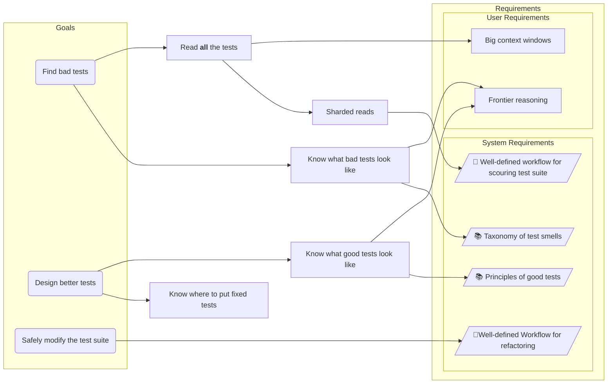



The [original post](https://x.com/housecor/status/2046619506626199791) got somewhat clowned on in a lot of its interactions, and it got me thinking... 

... that's right, I **also** have a couple massive AI-generated test suites that probably actually do gate quality but also are absolutely not pretty. They're probably pretty good, though - but are they **beyond parody?**

Unless P=NP, it's easier to verify than to execute, so it *should* be at least as easy for an AI to *clean up those test suites* as it was to write them.

Software testing has been one of my nitpicky passions for over a decade: every company I've worked for has had their internal knowledge base - be it Confluence, Backstage, or something else - blessed with at least *one* polemic on what good tests are, what bad tests are, and how to not mess it up.

So, what does an AI need in order to clean up a test suite?

So we're going to need users to have access to

1. Frontier reasoning models
2. Big context windows

and we're going to need to build:

1. A document on what makes a good test
2. A document on what makes a bad test
3. A workflow for finding bad tests
4. A workflow for authoring and inserting improved tests

Those are all pretty straightforward (bikeshed opportunities notwithstanding), except perhaps #4 - how to safely refactor a test suite.

## Don't Break the Coverage

If we're going to be changing test suites, there's a real risk that we might materially change the behavior that's protected by the test suite. How do we ensure - or at least try to ensure - that we make *safe* changes to the test suite?

Two guiding principles:

1. Only touch the tests; the production code is now your test suite
2. [Mutation Testing](https://en.wikipedia.org/wiki/Mutation_testing)

Now I don't expect anyone who's got a morass of AI-generated tests and is not already doing mutation testing to **start** doing mutation testing just to be able to apply some test cleanup, so we'll have to build a process that *can* work safely without it.

## The Suite Life of Bobs and Code

The four core deliverables are, well, *delivered* in SLOBAC:



1. A [manifesto on what makes a good test](https://texarkanine.github.io/slobac/principles/test-qualities/)
2. A [taxonomy of different patterns of bad tests](https://texarkanine.github.io/slobac/taxonomy/), tied to the "good test" principles they violate
3. [Princples](https://texarkanine.github.io/slobac/principles/refactor-qualities/) of, and [processes](https://texarkanine.github.io/slobac/principles/workflows/) for, safely modifying a test suite
4. An [agentic workflow](https://github.com/Texarkanine/slobac/blob/main/skills/slobac-audit/SKILL.md) (in the form of an [Agent Skill](https://agentskills.io)) to execute an audit

## Dogfooding it

I've tried it on two of my projects that I knew had extensive AI-generated test suites:

**ai-rizz**

[ai-rizz](https://github.com/texarkanine/ai-rizz) is a tool for managing Cursor rules and skills. It's what I use to manage the distribution and synchronization of AI agent customizations across *my* repositories. It's a single monolithic shell script with a bunch of [shunit2](https://github.com/kward/shunit2) tests.

* [One initial, tiny test-run](https://github.com/Texarkanine/ai-rizz/commit/3d2d22c1fdcdbdd13e24b12b718863d500dbf1ee)
* [A second, full cleanup run](https://github.com/Texarkanine/ai-rizz/compare/85f598e651efd77e81fd21ccc36a0bc487b2cae8...01fd41a841526a8819f04a96b675c8aab0d7dfcc)

**a16n**

[a16n](https://github.com/Texarkanine/a16n) is a tool for converting AI agent customizations between harnesses (e.g. Cursor ↔ Claude Code). It's a multi-package typescript monorepo with a *ton* of tests - unit, integration, and end-to-end.

* [One initial, tiny test-run](https://github.com/Texarkanine/a16n/commit/98b616a0f0bf0110569e8bd25f42cf5fc323c662)
* [A second, full cleanup run](https://github.com/Texarkanine/a16n/compare/d84fba171083df71d821ba705aeab04161ecea38...fb1df37bfb997b63c2b826bb571480d8a2b75110)

### Audit Results

I was surprised to see it take around 30 minutes for the (heavyweight, high-effort) models to process each test suite. I hadn't expected so much time! The report it generated was good *but* definitely not complete. It seems that even with huge context windows and sharding out to subagents so that no context compaction happened, some suites are too big to catch everything in one go.

That's fine, though - run it again and it should find some of the leftovers, and you just repeat until it stabilizes or you're happy.

I also tried running an audit with different models:

* Cursor's [Auto](https://cursor.com/docs/models-and-pricing#auto-composer-pool)
* Cursor's [Composer 2](https://cursor.com/blog/composer-2)
* GPT-5.5
* Grok 4.3

just to see if there were major differences. Auto and Composer - both "not high-effort frontier models" - found the fewest issues, and there were significant quality issues with their findings. This was expected - those models both cap at Cursor's default 200k context window, and neither is a high-effort, frontier reasoning model.

The others, though, mostly matched the benchmark of Claude Opus 4.7 (high effort) - 15 findings +/- ~3 or so, most of them the same diagnosis of the same location in the codebase.

So, SLOBAC *should* work with any high-effort, frontier model with a large context window - good!

### Audit Idiosyncracies

One problem I noticed was that when I fed the audit into an agent to address the issues, it tended to put its own, new [deliverable-fossils](https://texarkanine.github.io/slobac/taxonomy/deliverable-fossils) into the tests it was fixing! This suggests there's an opportunity to hook into agent's test-authoring process (whether part of processing a SLOBAC audit or not) to inject some guards against common test-authorship antipatterns that are cheaper to preclude up-front, than fix *ex-post-facto*.

Of course, that isn't *exactly* what SLOBAC was for - it was for the extant test suites that were *not* created with such rigor. Scope creep, or opportunity? I'm not sure yet. If nothing else, it makes it more difficult to run repeated audits on the same codebase to progressively stabilize. I'll have to audit and fix some more codebases to develop a better sense of where and how to address that.
