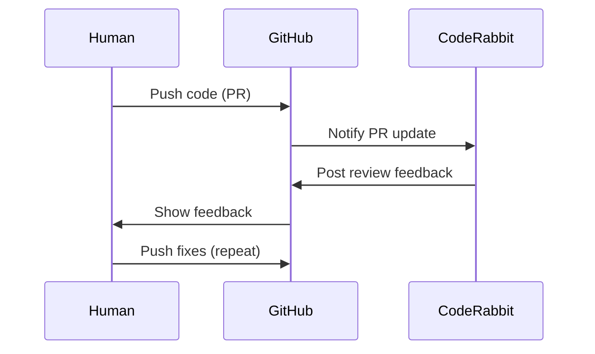
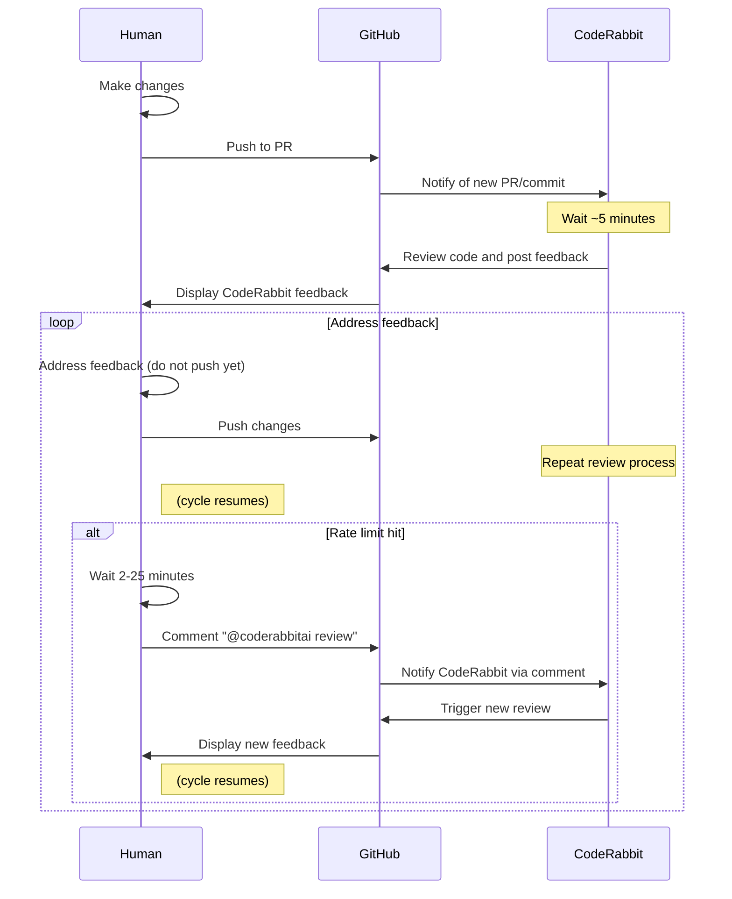

As with almost everything, [the more you use it, the more it pays to optimize it](https://xkcd.com/1205/). I [recently determined]() that re-usable workflow entry point prompts are the only real use-case for AI Coding Agent Slash Commands.

One particular kind of workflow where you'll not only be re-using the same prompt, but re-using it more than *you* the human ever could, is a [Wiggum Loop](https://ghuntley.com/ralph/). That's actually a perfect use-case for a Slash Command!

I had been looking for an application for a Wiggum Loop for a while, but I just didn't have enough *work* to feed an AI coding agent in a loop. I had an epiphany while prompting to address [CodeRabbit](https://www.coderabbit.ai/) PR feedback for the second, then third time...

CodeRabbit [is awesome](/garden/how-i-learned-to-stop-worrying-and-love-the-machine.html#coderabbit) but its reviews can take a good handful of minutes to come out (which I don't fault it for; they're fabulous)! On top of that the "free for open-source projects" tier has a rate limit that agentic coding often runs into.

So, my high-level workflow will be



But there are actually quite a few more decision points, because when you push a commit you might hit the rate limit warning instead of getting immediate feedback, and then you have to wait out *that* timer and come back and make a PR comment to get the ball rolling again:



## You Didn't Read That, Did You?

I submit that 2nd diagram not because I expect you to read it, but because I expect you to *not* read it. It's complex, it's intricate, who would *want* to have to try to do that!? But it was necessary!

Fortunately, AI Coding Agents are really good at following flowcharts. 

I had this epiphany embarassingly-late in my CodeRabbit PR Feedback career: I explained what I had been doing manually, and asked for a Slash Command suitable for handling this kind of PR Feedback in a Wiggum Loop. I'd invoke the loop with

```bash
touch wiggum.semaphore; \
while true; do \
	cursor agent \
		--stream-partial-output \
		--output-format stream-json \
		--print \
		--approve-mcps \
		--force \
		--model opus-4.5-thinking \
		"/local/wiggum-niko-coderabbit-pr - and if you cannot find that command, delete wiggum.semaphore and exit immediately." \
		"github.com/Texarkanine/<repo>/pull/<number>"; \
	[ -e wiggum.semaphore ] || break; \
	sleep 300; \
done
```

(printed here on multiple lines for you to see, but reducible to a single line I can just `alias` or paste into a shell)

And thus [/wiggum-niko-coderabbit-pr](https://github.com/Texarkanine/.cursor-rules/blob/main/rules/wiggum-niko-coderabbit-pr.md) was born! It was scary firing it off for the first couple of times, and it did take a bit of iteration on itself to get it working right.  I watched an hour-long TV show while CodeRabbit & Niko went back-and-forth iteratively improving code!

Fun things to note:

### Exit Condition

Perhaps not in the pure spirit of Wiggum™, I explicitly defined an exit condition of which the agent is aware - the `wiggum.semaphore` file - so that it can guarantee the exit when it's done.

### Safety Dance

The prompt fed into the agent is

> /local/wiggum-niko-coderabbit-pr - and if you cannot find that command, delete wiggum.semaphore and exit immediately.

Turns out that it was really easy to get Command paths wrong and when running headless it's hard to notice. Claude is so good that it'll infer a general process from the command's name and be basically correct, but miss things like knowledge of the semaphore - so the loop never ends!

While I can't seem to find this documented anywhere, the [Cursor CLI](https://cursor.com/cli) doesn't seem to take *User* Commands into account. So even though [ai-rizz](https://github.com/texarkanine/ai-rizz) gained the ability to install Slash Commands *and* to install anything to the global `~/.cursor/...` directories, global installation of `~/.cursor/commands/ai-rizz/wiggum-niko-coderabbit-pr.md` didn't work - the headless agent couldn't see it. It needs to be in the local repo, so prep each repo you want to try this in with:

```bash
ai-rizz add rule --local wiggum-niko-coderabbit-pr
```

That probably means it doesn't see User Rules, either, so... use the new `--global` mode sparingly?

## I'M HELPING

I'm sure this isn't the most-refined or efficient Way to Wiggum™ but I'm just happy to (finally) be here!
