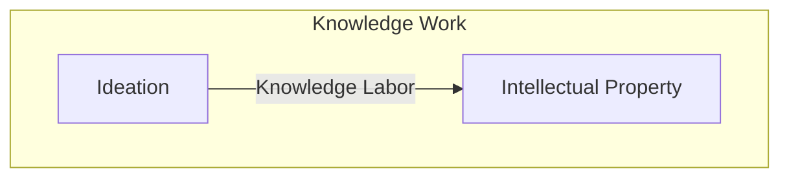

> pink margarine /pɪŋk ˈmɑːrdʒərɪn/ n. 
>  
> 1. Margarine dyed pink by legislative mandate (Wisconsin, 1895-1967) to visually distinguish it from butter and discourage purchase.
> 2. Any legal or normative effort to make a functionally-equivalent substitute artificially unappealing in order to protect an incumbent.

## One Engineer, One Week, $1,100



In early 2026, Cloudflare rebuilt the [Next.js](https://nextjs.org/) API surface on [Vite](https://vite.dev/). One engineer. One week. About $1,100 in AI costs. The result, [vinext](https://github.com/cloudflare/vinext), hit 94% API compatibility with zero copied source code.

Let that sink in: A commercially-viable (CloudFlare's got customers *using* it already) behavioral clone of a major, popular, open-source (Next.js was MIT-licensed) web framework, produced for less than a Silicon Valley engineer's monthly grocery bill.

This isn't new; there's not only precedent, but *legal* precedent: The Supreme Court already established in [*Google v. Oracle*](https://en.wikipedia.org/wiki/Google_LLC_v._Oracle_America,_Inc.) that reimplementing an API surface isn't *de facto* infringement - behavioral equivalence doesn't require copying expression. What's new is *cost*. Google's "clean-room" reimplementation of Java's APIs almost certainly took millions of dollars and years of engineering. Cloudflare did functionally the same thing with one person, one grand, and one week. The legal barrier didn't go away; the economic barrier evaporated.

## Characteristic Specificity

Copyright protection's value is designed around a property I'll call *characteristic specificity*: the degree to which the specific expression of a work ***is*** the value of the work.

Lord of the Rings is a great example. You could write a book with the same plot beats, the same themes, even the same character archetypes - and it wouldn't be Lord of the Rings. Nobody wanting Tolkien's prose, his invented languages, the particular arc of Frodo, would accept a behavioral clone. The expression is inseparable from the value. A "clean-room reimplementation" of LotR is just... a different book.

Mickey Mouse is instructive for different reasons. [Steamboat Willie entered the public domain in 2024](https://en.wikipedia.org/wiki/Steamboat_Willie#Copyright_status), and Disney pivoted to [trademark enforcement](https://web.law.duke.edu/cspd/mickey/#trademark) on the *modern* Mickey design. But the pivot was prepared decades in advance - Disney has been iteratively redesigning Mickey for generations, each visual refresh recharging what "Mickey" *is*. They understand, perhaps better than anyone, that their value lives in the specific characteristics: the particular ears, the particular gloves, the particular grin. Not in the abstract concept of "cartoon mouse." Copyright and trademark are the right tools here because the expression is the value.

It isn't always. For a couple years now, the writing has been plainly visible on the wall in the world of still visual art. The [Ghibli-fication outrage](https://www.usatoday.com/story/entertainment/movies/2025/03/28/studio-ghibli-miyazaki-ai-portraits/82703280007/) revealed a tension between people who just like things that *look like* Studio Ghibli, and people who like the specific creations *of Studio Ghibli*. Existing law on the subject is pretty well-settled: art style is [non-copyrightable](https://www.trails.umd.edu/news/ai-imitating-artist-style-drives-call-to-rethink-copyright-law), and that's [probably actually correct](https://creativecommons.org/2023/03/23/the-complex-world-of-style-copyright-and-generative-ai/).

Copyright was designed for works where form and value are inseparable.

Humans have always been allowed to observe, internalize, and reproduce behavior and style. Internalizing knowledge and re-synthesizing it back out - "standing on the shoulders of giants" - is how humanity builds and advances. It only starts to *feel* like theft (to some) when the breadth and timescale changes. Before you even get a chance to see the sights from atop the giant *you* climbed, someone else is already on *your* shoulders, and someone else upon theirs.

## Software Has No Characteristic Specificity

Software is different: its value is entirely in behavior.

Two implementations with different source code and identical behavior are perfectly interchangeable. Nobody ever loved the C standard library for its prose. "This `qsort` really speaks to me" - said no one, ever. The behavior is the product. The expression is an implementation detail. This isn't just a fact, it's a *core premise* of software's utility - the [interface](https://en.wikipedia.org/wiki/Interface_(computing)).

This creates a structural misfit: copyright protects *expression*, but software's value is *behavior*. The two are orthogonal. Software licenses have always been grafting expression-protection onto behavior-value as a proxy, and the proxy held for a long time - because the only realistic way to duplicate behavior *was* to duplicate expression. You either copy-pasted source code (which copyright catches), or you did prohibitively expensive knowledge labor to rewrite it from scratch - which almost nobody could afford. It took the likes of *Google* and *Oracle* to make a big-enough deal of behavioral duplication to get case law on the books.

[Anthropic's distillation discourse](https://www.anthropic.com/news/detecting-and-preventing-distillation-attacks) is an echo of the same underlying mismatch. The principle hasn't changed; what changed is that the knowledge labor required to reimplement behavior used to cost so much that the proxy between expression and behavior rarely got tested. Now it gets tested for $1,100.

## The Proxy Broke

AI didn't change what copyright protects. It broke the economic proxy that made copyright *seem* like it protected software.

Consider test suites and API documentation. These are, functionally, behavioral blueprints - precise specifications of what a piece of software does, published voluntarily by the people who wrote it. **Publishing your test suite is publishing your own disruption manual.** [SQLite's TH3 test suite](https://sqlite.org/th3.html) is proprietary, which was a business decision that predated both generative AI and *Google v. Oracle* - [not prescience](https://www.sqlite.org/forum/info/3cd5087abe2fb94f9b81b1547d41f87e43db42f469b40ee61c988dd4f5ae1a17), but it accidentally illustrates what a behavioral specification is worth when duplication costs drop to near zero.

SaaS products with no moat beyond "we do task X via API" are one AI session away from cloning. Not because AI copies their code - it doesn't need to. It reimplements their *behavior*, which is all anyone was paying for anyway.

And software licenses? They're *all* built atop copyright law and inherit the mismatch completely. From MIT to AGPL to proprietary commercial licenses, they all assert some form of "Per copyright law, I own this code and you cannot use it unless you play by my rules." But if someone reimplements the behavior without using the code at all... the license has nothing to attach to. The product-space protections that copyright offers are shrinking, and there's no legal mechanism to stop it - because the legal mechanism was never actually protecting the *behavior*, which was the actual value. It was protecting the *expression* and relying on the proxy.

## The Canary in the Coal Mine

Software is the canary, not the story. The mismatch is starkest in code because software has very high value relative to its *characteristic specificity* - but the mine runs much deeper.

Knowledge work is a continuum from ideation through labor to artifact:

Copyright guards the rightmost output: the finished artifact, which we call "intellectual property." AI already bangs those out faster and better every day. Vinext is an incredibly high-profile, commercial signal that AI can commoditize the middle step (labor) too.

There *are* legal tools to protect that middle step (processes)... patents! But existing patent infrastructure is both far too slow to keep pace with the current clip of knowledge labor, and far too reticent to issue things like "[Software Patents](https://en.wikipedia.org/wiki/Software_patent)." It doesn't even matter, though, since patents [don't even work on pure ideas, anyway](https://thompsonpatentlaw.com/can-ideas-be-patented/). Once the *idea* is out there, the strongest protection you could legally get would be a patent on *one way of implementing the idea*. But someone who uses a different process isn't under the purview of your patent and that's what AI has now achieved: an easy path from specification (idea), through an original process (knowledge labor) to an original artifact (intellectual property).

Neither framework was designed for an era where the costliest step in the pipeline - the human labor of turning insight into artifact - can be routed around for pocket change. 

I wrote about this at the macro level in [The Load-Bearing Rate Limiter Was Human](). The short version: we're industrializing the conversion of thought into output, and the existing legal frameworks structure their protections under the assumption that conversion is expensive. When it's not, things can break down in unexpected ways.

Every technological revolution has had its protectionists, and the protectionism that succeeded longest looks the most absurd in hindsight. Wisconsin [criminalized yellow margarine](https://daily.jstor.org/when-margarine-was-contraband/) for over seventy years because dairy farmers convinced legislators that [oleomargarine was "counterfeit butter"](https://history.house.gov/Historical-Highlights/1851-1900/1886_07_23_Oleomargarine/) - the language maps rather well to the current discourse around AI-generated images, videos, and code being "rip-offs," "stolen," or "fake" artifacts. States required margarine be dyed *pink*. A Pennsylvania bill - passed *unanimously*, by the way - once tried to require drivers to [disassemble their cars and hide the parts in shrubbery](https://en.wikipedia.org/wiki/Red_flag_traffic_laws#Apocryphal_Pennsylvania_legislation) when encountering a horse on the road. These weren't fringe positions at the time; they were serious legislative efforts to protect incumbents from technological displacement.

At least one high-profile open-source project - `tldraw`, 45,600 stars on GitHub - has already begun [entertaining the idea of taking their unit tests private](https://github.com/tldraw/tldraw/issues/8082)[^tldraw], presumably to make behavior-based duplication more difficult.

That's not the play.

Software protectionism via copyright-based licensing will probably work for at least a little while yet. Maybe a long while. But the trajectory is one-directional, and eventually it'll all look like **pink margarine.**

### What about Non-Code?

Others have said it better than I:



I'll add a recent anecdote of my own:

[Chris Camillo](https://en.wikipedia.org/wiki/Chris_Camillo) [rambled into ChatGPT for 45 minutes](https://www.youtube.com/watch?v=APvLb-pIPwI&t=875s) and got back a [McKinsey](https://en.wikipedia.org/wiki/McKinsey_%2526_Company)-quality strategic brief. The knowledge labor that used to justify a consulting engagement happened in the span of a lunch break. In the same video, YouTuber Graham Stephan mentions how the LLMs are outperforming a script-writer job that *was* on offer - and went unfilled - for $100k/year. Today, right now, AI is *already* an economically-viable option for huge swaths of knowledge labor *in general*... and we know this because it's doing it.

The thing with continuums and moving along them is that it's a big deal to go from "sitting at a place on the continuum" to "moving along it." Vinext proves that generative AI isn't just sitting at the "Intellectual Property" step of the knowledge work continuum; it's moving left.

GPT-5 [autonomously ran bio lab experiments](https://openai.com/index/accelerating-biological-research-in-the-wet-lab/) with novel results. Mathematicians [convened in secret](https://www.scientificamerican.com/article/inside-the-secret-meeting-where-mathematicians-struggled-to-outsmart-ai/) and found AI "approaching mathematical genius." GPT-5-pro found a [novel solution to an open question in a human-published mathematics paper](https://threadreaderapp.com/thread/1958198661139009862.html). Ideation isn't some distant frontier - it's under active pressure today.

## Will the People Suffer?

Less than you'd think, with one important exception.

Software licensing was a preemptive defense. If a private enterprise could take an open project, pour resources into improving it, and lock the improvements away, then anyone who wanted those improvements had to either pay up, duplicate the effort at great personal cost, or simply go without. "Open source" software licenses raised the legal cost of not sharing, which reduced the practical cost of being an individual in a world of well-funded corporations.

That defense worked because reimplementation was expensive. It's not anymore.

If CompanyX forks Vinext into VinextNext and improves it behind closed doors, the original only took $1,100 to build. If someone on the outside sees a capability they want, they don't need to fundraise a multi-year engineering effort to get it; for a pittance they can reverse-engineer the behavior into an intellectual property of their very own. The asymmetry that licensing existed to correct - corporations can afford to rewrite, individuals can't - has collapsed. Both sides have the same cheap cloning. The defense is unnecessary because the attack is toothless.

For *software*, what killed software licensing also rendered its protections unneeded.

... for software.

Where people will actually hurt is at the hardware boundary. Industry largely accepted open-source licensing terms - at least the [permissive ones](https://en.wikipedia.org/wiki/Permissive_software_license) - but there was still an active conflict zone: [Copyleft](https://en.wikipedia.org/wiki/Copyleft)'s fight against [Tivoization](https://www.gnu.org/philosophy/tivoization.en.html). "Tivoization" refers to *hardware* vendors locking open software onto closed devices, stripping users' ability to modify the thing they own. [GPLv3](https://www.gnu.org/licenses/gpl-3.0.en.html) famously stood against it by adding conditions to the license specifically against that behavior.

But if a vendor behavioral-clones the software without touching the original source, those AGPLv3 conditions have nothing to attach to. This is even worse than before! Previously, the end-user could obtain and modify the original, actual source in-use, but just couldn't get the device to run it. But devices can be cracked, and new versions released, and *in theory* the user at least has a chance, because they've got the real code on the real device - it's just not *cooperating*.

Now, they don't even have that: the next Tivo will *act like* it's running an open-source software stack, but the hardware, firmware, *and* software will all be entirely proprietary things to which the user is not entitled *any* kind of access.

Software licensing is dead. For software that runs where you choose, the death doesn't much matter. For software someone else locked in a box, we just lost a key weapon in the fight to control the things you own.

---

## Postscript

Or, ***"called it!"***

> SaaS products with no moat beyond "we do task X via API" are one AI session away from cloning.

- **2026-03-04** - [Meet the Companies Vibecoding their own CRMs](https://www.wsj.com/cio-journal/meet-the-companies-vibe-coding-their-own-crms-263e500f) (Wall Street Journal)

> But if someone reimplements the behavior without using the code at all... the license has nothing to attach to.

- **2026-03-05** - [Relicensing with AI-assisted rewrite](https://tuananh.net/2026/03/05/relicensing-with-ai-assisted-rewrite/) <small>`chardet` did a full AI behavioral-clone rewrite and switched licenses from LGPL to MIT</small>

> Ideation isn't some distant frontier - it's under active pressure today.

- **2026-03-04** - [Claude's Cycles](https://cs.stanford.edu/~knuth/papers/claude-cycles.pdf) (Donald Knuth - yeah, that [Donald Knuth](https://en.wikipedia.org/wiki/Donald_Knuth)) <small>"Shock! Shock! I learned yesterday that an open problem I'd been working on for several weeks had just been solved by Claude Opus 4.6"</small>

## Post-Postscript



Whether the AI-generated behavioral rewrites of software libraries are copyrightable or not is actually irrelevant to the future of software licensing. 

If they are copyrightable, then software licensing is dead because anyone can relicense a clone however they want without having to abide by the original license's terms.

If they aren't copyrightable, then software licensing is dead because the clones are public domain and anyone can use them without having to abide by the original license's terms.

The proxy is broken because of economics, not law. A drastic change in law would be needed to restore licensing's teeth, and I don't see what that could be.

If you fold *behavior* into copyright, you preclude competition (which is what Patents - including Software Patents - are designed to do). Among `ls` from GNU Coreutils and `ls` from FreeBSD, which *one* is allowed to list files in a directory? Can both GMail and Yahoo offer a web-based e-mail client? This is one huge reason why *software* patents are so rare in the field.

On the other hand, if you *don't* fold behavior into copyright, then the only way I can imagine an API surface being protected is in its exact expression. So, that would legally preclude things like `chardet` and `vinext`'s API-compatible drop-in replacements, but it does *not* preclude the "copy it but change a few words" kind of clone. And that clone still gives *most* people the "out" of the original license that they'd need.

No matter how you slice it, software licensing is dead.

[^tldraw]: The original case study - `tldraw` - has since revealed that taking the tests closed-source [was a joke](https://github.com/tldraw/tldraw/issues/8082#issuecomment-3964650501). In its stead, I offer you ["Cal.com is going closed source. Here's why."](https://cal.com/blog/cal-com-goes-closed-source-why) (41k stars vs tldraw's 46k)