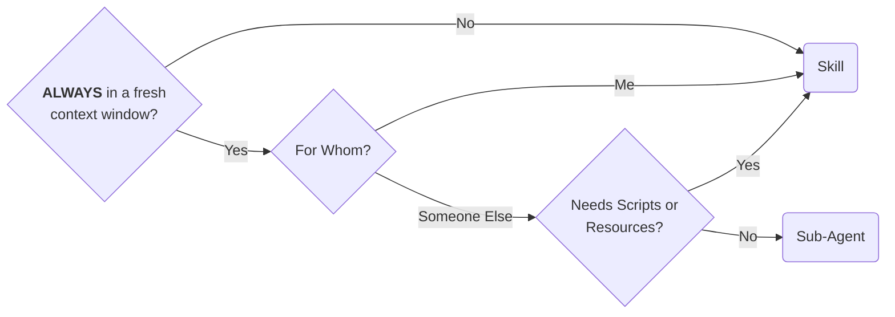

I came across [GitAgent](https://github.com/open-gitagent/gitagent) the other day: an "open standard" for defining AI agents as git repositories. I expected something novel about agent packaging. Instead I found a repo structure full of dot-folders and harness customization files - prompts, tools, workflows, memory, hooks - and my first reaction was "you're telling me the source code repo I already have is an agent?"

But that reaction was wrong, and the reason it was wrong sharpened something I'd been circling for months about how agentic coding harnesses model their primitives.

## What Sub-Agents Are

Many agentic coding harnesses offer a "Sub-Agent" primitive. The semantics vary slightly across tools, but the core mechanic is the same everywhere: a Sub-Agent is a prompt that executes in a freshly spawned context window.

That's it. That's the whole thing.

The harness opens a new context, loads the Sub-Agent's prompt (*maybe* with some scoped tool access), lets the LLM work, and returns the result to the parent. Whatever your harness calls it you're looking at `{prompt + fresh context window}` and not a whole lot more.

Some practitioners use the *choice* of primitive as a cognitive shorthand - "if I put it in `agents/` it's heavy, if I put it in `skills/` it's light." Or maybe to [categorize a workstream](https://danielmiessler.com/blog/when-to-use-skills-vs-commands-vs-agents). Those could be useful social conventions, but they're social conventions, not structural properties. Nothing about the Sub-Agent primitive enforces resource budgets, guarantees isolation semantics, or defines return types, for example. The "signal" is a folder name.

## Syntactic Sugar & Venn Diagram Overlap

I wrote previously about [the use case for slash commands](/2026/01/23/use-case-for-ai-coding-agent-slash-commands.html) and, a couple months earlier, about [the use case against them](/2025/11/24/usent-case-for-ai-coding-agent-slash-commands.html). The conclusion was that Commands are syntactic sugar over Skills. A Command is a convenient way to invoke a prompt with some preconfigured behavior, but a Skill can do everything a Command does while remaining composable, portable, and reusable. Claude Code [validated this by killing Commands altogether and making Skills directly invocable](https://code.claude.com/docs/en/changelog#2-1-3) in early January 2026.

Sub-Agents are similarly reducible to Skills.

Consider a Skill that summarizes your calendar for today. If you invoke it as a Sub-Agent, the harness spawns a fresh context window, loads the prompt, the LLM walks through the workflow, and you get your summary. If you invoke it as a Skill, the LLM walks through the same workflow in your current context. And if prompt your current context window that it should spawn a Sub-Agent to run the Skill, you get the exact same outcome as the Sub-Agent primitive - except now *you* decided whether the work happens inline or in a separate context, rather than having that decision baked into the primitive.

Skills strictly dominate. Same capability, more flexibility about where and how the work executes. The Sub-Agent primitive bakes in an execution strategy - fresh new context window - that should be an invocation-time decision.

All three are the same:

1. `invoke the my-daily-report subagent`
2. `spawn a sub-agent to run the my-daily-report skill`
3. (in a new context window) `/my-daily-report`

## "But I Always Want a Fresh Context Window"

Sure. Maybe you're building a "summarize everything I did this week for the sprint retrospective" workflow, and that's always going to be its own context because it's a lot of data and you don't want it polluting whatever else you're working on. Building that as a Sub-Agent *feels* natural.

But trace what you'd actually build. You'd probably write several skills (either explicitly, or implicitly in your prompt) as part of the workflow - one to pull git commits, one to scan PR reviews, one to check your calendar. Then you'd make a Sub-Agent that orchestrates those skills. Except... you could've just made a skill that kicked all three off. If it needs its own context window, just launch it from one... *or* just write that into the skill's prompt. The Sub-Agent primitive saved you a line of prompt at the cost of locking in an execution strategy.

There's a stronger version of the case for Sub-Agents: a Sub-Agent primitive *could* carry **execution** metadata that a bare skill can't. Because a Sub-Agent primitive **does** come with assumptions about how and where it will be executed, you could leverage that. Things like Model routing (send summarization to Haiku, complex reasoning to Opus), cost ceilings, caching strategies - real value if the harness could act on it. But no current implementation does this portably. You're writing `model: haiku` in a harness-specific config file either way, and you can't ship a Claude Code Sub-Agent with an Opus worker and Haiku orchestrator to Cursor or Gemini CLI because there's no open standard for Sub-Agents.

If the [Agent Skills](https://agentskills.io) standard or a successor ever grows a metadata field for execution hints, this argument for Sub-Agents evaporates entirely - and the fix would be enriching skills, not preserving the Sub-Agent primitive.

Today, Sub-Agents are syntactic sugar.

It's okay to have some sugar every now and then as a treat - saving a couple keystrokes on a workflow you know is always going to be its own context window. And for teams early in agentic adoption, the forced isolation of a Sub-Agent is a useful guardrail: it makes the system more predictable right up until the predictability becomes a constraint. But if you're building something to distribute, share, or compose into larger workflows, the Sub-Agent primitive is probably the wrong choice - just like Commands are.

## Bundling

Skills have a property that Sub-Agents don't: the [Agent Skills](https://agentskills.io) open standard allows bundling static resources alongside a Skill's prompt. Scripts, examples, reference data, configuration files - things that make the difference between a prompt that hopes the LLM knows what to do and a Skill that *shows* it what to do.

Sub-Agents and Commands can't do this. They're "just" prompts. If you expanded the Sub-Agent primitive to support bundled resources, you'd end up re-implementing the Agent Skills standard with one extra assumption bolted on: that execution always happens in a fresh context window. That's a lot of work just to bolt a constraint that should be optional onto machinery that already exists!

There's a piece missing from this argument that I'll address in a future post: the *execution model*. A bundle that carries prompts and static resources is good. A bundle that can directly integrate with the harness's own behaviors around opening new context windows is *better!* That's the difference between a capability definition and a fully operational unit, and it's why bundling resources alongside prompts is load-bearing rather than nice-to-have.

## Agent is a Complex Type

Which brings me back to GitAgent and why my first reaction was wrong.

When I saw their repo structure - `agent.yaml` for configuration, directories for skills, workflows, tools, memory, hooks - I thought "this is just a regular repo instrumented for agentic development - it's got dot folders for all the harness customizations." But the file layout is beside the point; the insight is that "Agent" shouldn't be a harness primitive at all. It's a [complex type](https://en.wikipedia.org/wiki/Composite_data_type).

Think about a customer service agent - human or AI, doesn't matter. They have a job description specifying what they're supposed to accomplish. A script walks them through customer interactions. Information sources let them look things up. Tools let them make changes to data or cause side effects on behalf of the customer. And a tracking system for previous interactions keeps them oriented on what they've been up to.

That maps cleanly to the set of actually useful harness primitives: prompts (serving double duty as instructions and workflow specifications), skills and MCP servers (for tools and capabilities), bundled scripts and resources (for deterministic operations), hooks (for guardrails and lifecycle control), and memory or context management (for state across interactions).

What most harnesses ship as "a Sub-Agent" is a job description stapled to a context window. What GitAgent is reaching toward - and what Claude Code plugins get closer to - is the full bundle: a composable unit of agentic functionality that carries everything it needs to operate. Its instructions, its tools, its resources, its constraints, and its workflows.

That's an Agent with a capital A. A mini-application. And you can't build one from a Sub-Agent any more than you can build a web app from a single HTTP handler.

## Don't Write a Sub-Agent, Write a Skill

Commands were syntactic sugar over Skills, with some capabilities blocked. Claude Code killed them and nobody mourned.

Sub-Agents are syntactic sugar over Skills with some capabilities (choice of context window) blocked.

If you're writing an instruction set to enable an AI to do something, Skills offer more flexibility, composability, and capability than Sub-Agents.

So don't write a Sub-Agent, write a Skill.

And if you're building a Full and Proper Agent - the complex type - find a [harness](https://code.claude.com/docs/en/plugins) that [supports](https://geminicli.com/docs/extensions/) bundling its primitives [together](https://developers.openai.com/codex/plugins) into a [single installable unit](https://opencode.ai/docs/plugins/) - that's the sort of foundation you want to be building on.

## Practically, Visually

Given that you have a task that you need an LLM to do on-demand...

You should find it quite hard to actually arrive at "Sub-Agent" in the process above!

1. If you know the task must *always* be run in a fresh context window - if it would be *wrong* to have any existing context...
2. And you're going to need to rely on someone else to launch the task correctly...
3. And this task does not require any scripts or additional resources...

*Then* a Sub-Agent is the right primitive choice, over a Skill. However, that "always" is doing a *lot* of work, make sure you're right about your answer there!

## Claude Code Subagents

Arguably the frontrunner and most-mature of the agentic coding harnesses that offer the Sub-Agent primitive, Claude Code [does offer quite a few](https://code.claude.com/docs/en/sub-agents#supported-frontmatter-fields) Sub-Agent configuration options that affect the context window of the spawned process in a way that would otherwise be more difficult to achieve.

Notably, you have *some* degree of control over the other primitives that the spawned context window will have access to, e.g.

> `skills` - Skills to load into the subagent’s context at startup. The full skill content is injected, not just made available for invocation. Subagents don’t inherit skills from the parent conversation

and

> `hooks` - Lifecycle hooks scoped to this subagent

Most of the rest of the configuration options are trivially-achievable otherwise, and exist as forms of - again - syntactic sugar around either

- The main agent invoking the `Agent(...)` tool with lots of parameters, or
- Shelling out to the `claude ...` CLI with lots of parameters.

so you can bake in the defaults you want, for the agent you're building. That's not *useless* but it's not revolutionary. Indeed, it could be *useful* if you're building for "other people" and you need all these launch parameters to be set correctly every time in order for your prompt to succeed.

The real interesting things are the harness-level customizations that you couldn't easily just set in a fresh `claude ...` session. If you launch Claude Code with a set of hooks, it's not easy - except for the Sub-Agent frontmatter - to *spawn* a new context window with a *different* set of hooks. Similarly, the `skills` frontmatter option behaves *differently* in the Sub-Agent, loading the whole skill context into the spawned window, rather than following progressive disclosure.

If anything, this should sound like a rhyme with the rest of this post. 

- If you're seeding a spawned context window with the *entirety* of a Skill, that's just another way of specifying `spawn a new context window and run the X Skill`.
- If you're seeding the context window with *multiple* Skills in full, that's just another way of bundling multiple Skill primitives together. 

It's just that *this* method involves the harness in the process, hopefully making it a more-deterministic affair.

**That** is a strong differentiator in favor of the Sub-Agent primitive in Claude Code, then: involving the harness instead of relying on the LLM. That's a whole other blog post, though.

In the meantime, the flowchart above - and the `GitAgent` insight - apply. I would suggest that, outside prototyping and personal use, you should either:

- **Design Below Critical Complexity:** Build atomic, composable units in Skills, and if you must orchestrate them, do it with another Skill.
- **Step Up to Harness-Level Plugin  (build an Agent):** If you require bundling multiple primitives together (such as 2 Skills + an orchestrator Skill), or if you need to spawn context windows with specific settings, use a [harness-level](https://geminicli.com/docs/extensions/) extension [like](https://opencode.ai/docs/plugins/) the [ones](https://developers.openai.com/codex/plugins/) already [mentioned](https://code.claude.com/docs/en/plugins).
	- GitAgent (or a similar open standard for Agents) might offer a cross-harness alternative.

If you *design for* the Sub-Agent primitive *and* try to ship it out to other people, I think you'll find yourself getting the worst of both worlds.
