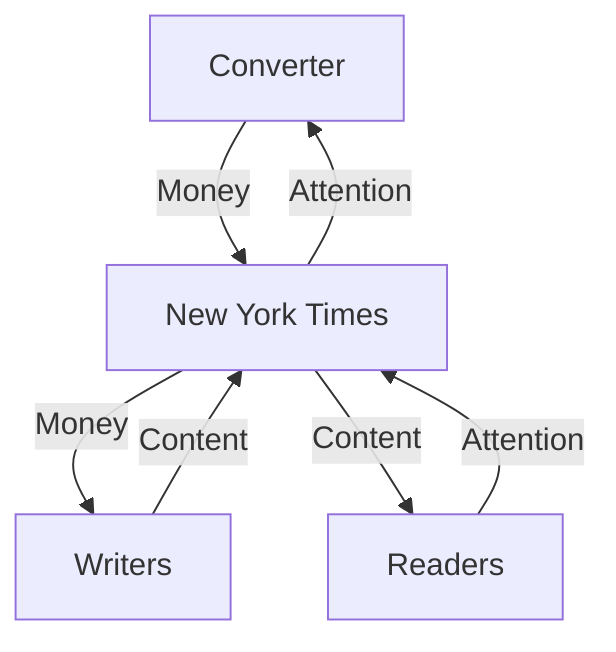
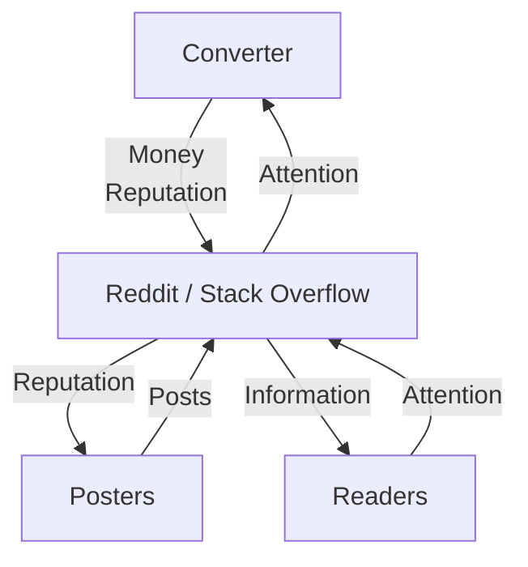
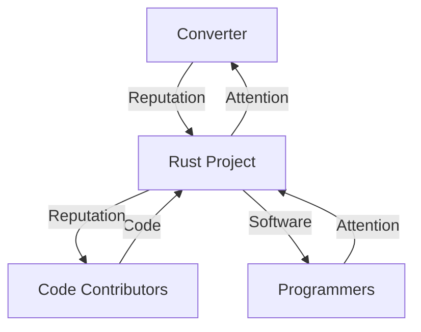
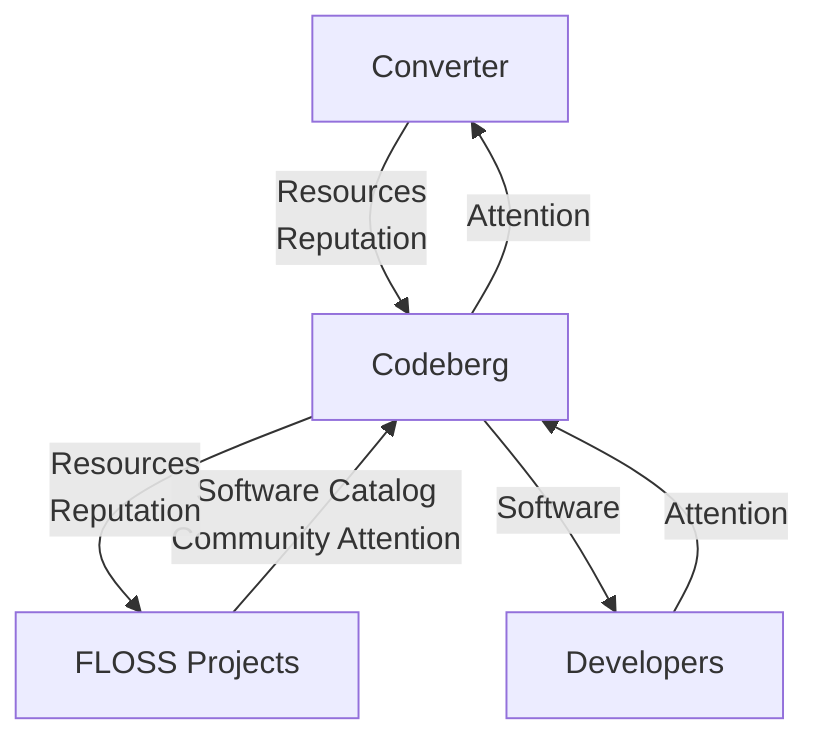
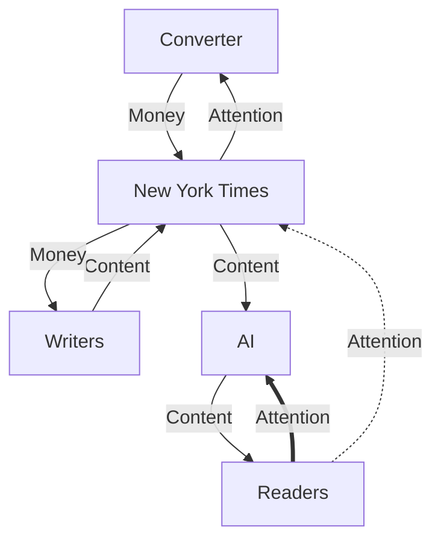
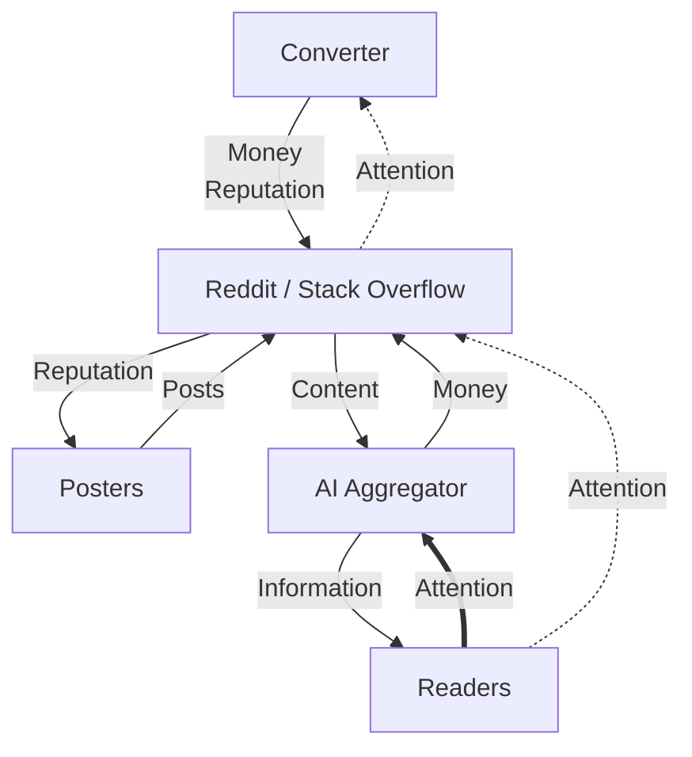
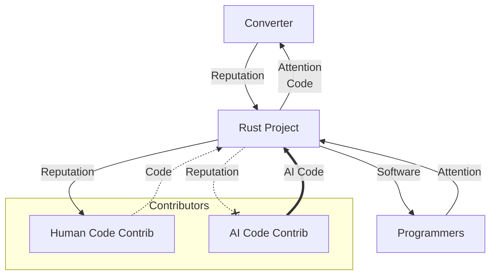
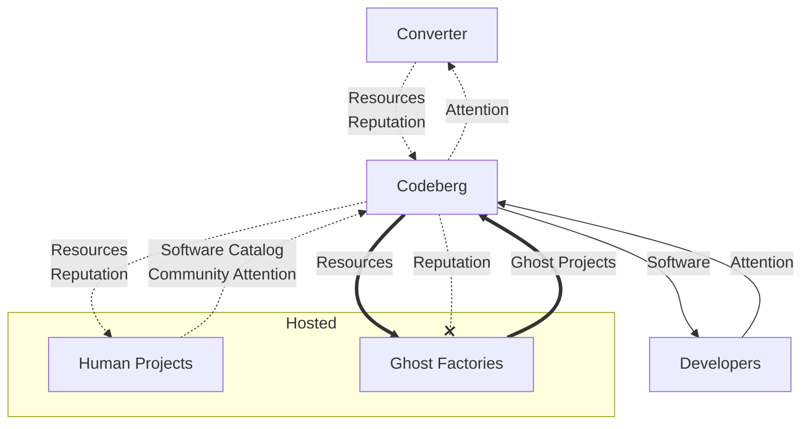

This is the outline of the essay. Not the essay. The claim, the specimens, the charts, the verdicts, and the landing, in the order a reader should meet them. I am writing it so I can look at the whole machine at once before I dress it in prose.

**Thesis:** Every platform in this fight is the same hub with three loops - consumers, a converter, producers. AI breaks the loop on different sides depending on the specimen. Most responses either draw a circle after the consumers have left, or feed the entity while starving the asset. One shape actually closes: staffed editorial producers, paid in money, selling verified-human output to AI labs as the new direct customer. That shape does not transfer to social platforms, volunteer forges, or language projects, because their producers do not eat money and their product *is* public demand telemetry. There is no template for the rest of us.

The discarded first draft opened on Netflix, climbed a tying ladder, and landed on three bets. That spine is dead. Receipts from it may be reused. The structure is four acts.

---

## Act I - Four reactions, no verdicts yet

Open on what people are *doing*, not on the theory. The reader should not yet know these are the same machine in different denominations. Optionally ask whether this is [Pink Margarine]() - purity theater - and do not answer.

Order, and the shape each one is wearing:

1. **The New York Times** - salaried publisher defending distribution rent. Sue OpenAI. Threaten `noindex`. Metered since 2011, so the balkanization was chosen a decade before any crawler mattered. Current play: chop the aggregator.
2. **Reddit and Stack Overflow** - volunteer Q&A / reputation + attention, treated as one shape. Mention that before AI you often had to search both, and multiple subs. Reddit licensed training access to Google (~$60M/year, 2024; confirm counterparty before publish). July 30, 2026 earnings: every number a beat, [worst stock rout ever](https://www.cnbc.com/2026/07/30/reddit-rddt-q2-2026-earnings-report.html), because search referrals were choppy and no new AI deals appeared. Stack Overflow question volume is an obituary with an honest caveat: the slide started in 2014; ChatGPT accelerated it. Do not overclaim SO's current AI posture.
3. **Rust** - a single OSS project. August 5, 2026 LLM policy: a PR was a contributor-formation event; polished product no longer indicates effort or intent to stay. Disclosure, not detection. Style is not evidence. They rejected Zig's ban and Linus's "just a tool."
4. **Codeberg** - a forge, one level above a project. July vote 358-144 to prohibit projects that "mostly consist of" LLM-written code. Rhymes with Reddit/SO, now in code-hosting terms. Do not yet say this is the only coherent plan.

One-line fuse, not a section: on September 15, 2026, Cloudflare will default-block Training (and Agent) on ad pages for new domains, and because Googlebot is classified Search *and* Training, that default is Googlebot-off unless you opt out. Hang the date. Spend it in Act III.

Stay at observed policy. No "Codeberg has the only plan." No patronage answer yet.

---

## Act II - The flywheels, then AI's rewrite

Now reveal the shared machinery. Every specimen is a hub with three loops:

1. **Consumers** give attention; get the thing (articles, answers, working code).
2. **Converter** (the platform's secret sauce) turns plentiful consumer-side input into platform sustenance plus what producers want, and skims a cut. Ads, subs, quotas, brand attention - mechanics vary; the principle does not.
3. **Producers** give content or presence that attracts consumers; get fame and/or fortune. Those convert into each other; the exchange rate is not 1:1 and is not a moral claim.

Load-bearing on the charts: **producers can feed producers** - social dues, community, "you're not alone." Some flywheels pay that and require it. Growth on either side, or a better converter, feeds the other branches.

### Healthy charts, in specimen order

**NYT.** Readers give attention (and pay) and get articles. Converter turns that into money, skims, pays writers. Writers supply articles that draw readers. Producer pay is salary.

**Reddit / Stack Overflow.** Same topology; producer pay is reputation, not salary. Converter skim is ads, premium, API deals. You used to have to search both.

**Rust.** Consumers (people building software) give attention and get a language that works. A much smaller contributor set is paid in reputation and community. The project's job is to convert attention into reputation and contributions into working code that draws eyeballs. The project skims brand attention.

**Codeberg.** Step up: the producers are *projects*, not PR authors. A living project pays Software Catalog plus Community Attention into the platform; the platform relays Attention into the converter. Catalog alone is not enough. Consumers still leech (clone, tarball). Converter skim is donations, e.V. membership, identity. This rhymes with Reddit/SO, in the domain the rest of the argument wants to live in.

### Broken charts, same order

**NYT - consumer-side middleman.** Pull the reader block onto AI. Embeddings over *all* sources beat a single site's index the way Google beat a twelve-site bookmark folder. Cable then Netflix: better UX, consumption moves. Attention/content loop closes on AI. The Times is hit by one consumer that sends nothing back. Residual reader-to-Times attention is a leak, not the flywheel.

**Reddit / SO - same consumer-side shape, without (or with less) dollar pay to producers.** Ask AI that has read all of them. Eyeballs do not return. The "charge the AI" money line, if drawn, feeds the platform without restoring consumer attention to pay producers. Leave that line for Act III; the break chart can show it as a stub or omit it.

**Rust - producer-side, not better-UX aggregation.** AI shows up as a producer: code that works, no community, no social dues, no human others want to socialize with. Working software still feeds consumers. Community is not paid into. Converter capacity is finite; AI code takes cycles and mints no reputation. Human code is crowded out. Linus's "just a tool" may hold for Linux. It does not hold for a project whose flywheel *is* contributor formation. The policy names this from the inside.

**Codeberg - Rust's failure pulled up a level.** The bad producer unit is the *project*. Ghosts pay catalog-shaped presence with no community attention, draw Resources, mint no Reputation. Human catalog-plus-community thins; the platform relays less Attention into the converter; less is left for living projects. Consumers can still clone. That is not converter fuel. Use "development team of none" (Codeberg's phrase) and "ghost projects" as our label; do not quote "ghost factories" unless the manifesto actually says it.

---

## Act III - Judge each response against its flywheel

Test: does the proposed fix close the loop AI broke, or only feed the platform / draw a circle that leaves a needed side outside?

### The Times, current posture: miss

Chop the middleman. Draw a circle around the old flywheel. Consumers already live outside it, on the preferred UX. Latent-space aggregation is a discovered preference; restricting supply will not reverse it. Piracy was almost always a service problem. Once tasted, no voluntary return to fragmented retrieval.

**Verdict: miss.** Circle drawn after the consumers left.

### The Times, reframed: mechanical hit, editorial only

This is the new answer. It does not salvage the current lawsuit-and-block posture. It names a different customer.

Reddit's Google check fails because Reddit producers are paid in reputation and attention. Platform dollars do not convert into that food. Times producers are staffed writers paid in money: editing, fact-check, distinct voice, investigative dispatch into meatspace. AI dollars can feed that loop.

What labs actually want, with a receipt: [Anthropic's Project Panama](https://arstechnica.com/ai/2025/06/anthropic-destroyed-millions-of-print-books-to-build-its-ai-models/) bought print books in bulk, cut the spines, scanned them, discarded the paper. Internal goal language was "how to write well" rather than "low quality internet speak"; they prioritized less-common, high-quality volumes not already sitting in the crawl. Anthropic denies destroying rare-as-collectible books - do not overclaim rarity. The news wrapper is copyright and fair use. The demand underneath is verified-human text, published-book quality, not already in the training mix, and preferably exclusive versus competitors.

Product reframe: readers still want Times *reputation and authority*. Information-access UX now lives on AI. Sell the authority coat-tails and the production pipeline to labs as the primary customer.

Mechanisms: premium AI subscriptions; exclusivity windows (a week, a month, six months before public); exclusive commissions (corpus that never, or late, hits nytimes.com). Patronage and artistic commission are millennia old and they work. Click-through becomes irrelevant: the lab already paid many zeros more than a subscriber. The public can still see the piece later. The model cites Times authority without needing the visit.

Two non-transfers, both load-bearing:

1. **Currency.** Money versus reputation. Same dollar instrument, wrong producer denomination.
2. **Steering. The social / editorial split.** Legacy media always published what *they* chose. "All the news that's fit to print" means they are choosing what is fit. You subscribe to a newspaper without knowing the table of contents; curated surprise *is* the product. Public demand telemetry was never direct input to their machine, so losing it costs them nothing they were using. Reddit and Stack Overflow are pull products. You go when you need something particular, not to read the corpus for joy. The whole product *is* the public telemetry of what is hard and what is asked. Patronage money can replace ad and subscription revenue at the Times. It cannot replace the demand signal that *is* Reddit.

Scope: aggregators must want what you produce; producers must eat money; the model must be editorial push, not social pull. Money is the only converter currency identified so far. Editorial selection is the only production steering that survives without public demand signal.

**Verdict if executed: mechanical hit for staffed editorial media only.** Market and execution risk remain (will they reframe? will labs pay exclusivity premiums? does authority dilute when licensed widely?). Not a template.

### Reddit / SO: miss

Thick new conversion line: AI's one-consumer read becomes money. Short-term, the entity is fed. Attention and reputation do not route back through the middleman to producers. Production spins down, corpus value to AI falls, licensing pay falls, consumer side already drained. Collapse from both sides.

> Sustains the entity while starving the asset.

Same dollars as the Times answer. Wrong denomination. Stack Overflow may be closer to a shrug than a licensing play - do not overclaim.

**Verdict: miss.**

### Rust: likely miss (soft Luddite)

They filter for community while still wanting the large consumer market. Mismatched loops. Personal stake, by discovered preference not edict: I would leech Rust happily, fix a bug with a PR if needed, use AI for that contribution, and not join the community. The policy correctly clocks me. Functionally it stops evaluating as open source I can contribute back to. Three years out, an AI-welcoming fork is the one I can patch.

Grace: they admit they do not know; the door is open to update priors. Tune in a year. Worse to do nothing.

Sibling, not a fifth specimen: [cloudflare-os CONTRIBUTING](https://github.com/cloudflare/cloudflare-os?tab=contributing-ov-file#contributing-to-cloudflare-os) - not seeking outside contribution, because AI made writing easy and reviewing / keeping the product coherent is the hard part; small trivially-verified PRs only. Same producer-filter, review-bandwidth shape.

**Verdict: likely miss.** Spins the contributor side down; the flywheel follows. Timestamp, not eulogy.

### Codeberg: coherent, and Amish

Looks like Rust one level up; differs in kind. Primary distinction is **loop matching**: Rust wants a large consumer market and a filtered producer community. Codeberg shrinks *both* loops and matches them inside the fence. Ghost-project filtering is real and secondary.

They lock members into the pre-AI intact flywheel shape and bet the human-collaboration niche is big enough. General-purpose forge versus single-purpose language: people can abandon a hot-dog brand; they still need somewhere to cook. Market-size risk remains. Detection is weak (style is not evidence; no disclosure fallback) - one sentence max, sequel material, not a knife in this act's back.

**Verdict: only mechanically coherent bet among the *current* postures** (the Times reframed is a different, later move). Internally consistent. Not a guarantee of growth.

Do not crown them. The coda will call this software-engineering Amish: survive inside the fence, functionally irrelevant at global scale. Fine if you want to be Amish. Most of us do not.

### Cloudflare's default is Netflix again

Spend the September 15 fuse here.

[Content Independence Day, 2026](https://blog.cloudflare.com/content-independence-day-ai-options/): new domains, Training and Agent blocked by default on ad pages; Search allowed. Multi-purpose crawlers judged by *all* behaviors, most-restrictive wins. Googlebot, Applebot, BingBot are Search plus Training. A Training block - including the new default, including legacy "Block AI bots" - blocks them. Opt-out exists. Precision: not "Cloudflare kills Googlebot for everyone."

Defaults stick. A real corner of the web falls out of Google. Cloudflare already sees that corpus at the edge, and is positioned to index it. Akamai, Fastly, whoever, may scoop too. Competing CDN-shaped catalogs. Consumers hated this the last time. They went to an aggregator as soon as they could. The blockade that "protects" content reconstitutes the aggregator problem one layer up.

CDN search scoops are distribution theater. They are not producer food. Supports the closer: only the rare currency-matched, editorial-steered deal works.

---

## Act IV - One narrow hit, no general template

Do not crown Codeberg. Do not crown the Times as a universal fix.

1. Reddit / SO - fail. Dollars in the wrong denomination; the product *was* the telemetry.
2. Times current posture - fail. Circle after the consumers left.
3. Times reframed - mechanical hit for staffed, money-paid, editorial producers. Not a template for the open web or volunteer flywheels.
4. Rust - soft Luddite. Filter the tool, mismatched loops. cloudflare-os is the same shape. Grace for trying.
5. Codeberg - Amish. Intact pre-AI shape inside the fence. Coherent. Not advice for most of us.
6. Cloudflare defaults / CDN search - fragmentation replay. Not a producer-side fix.
7. Therefore: one narrow working shape. No template for platforms whose producers eat reputation, attention, or community. No template for us as individuals.
8. False comfort, then the knife: "If GitHub goes down I will use GitLab. If Rust does not work I will use Go. I am very smart and everything is interchangeable." No. This flywheel existed *inside you* and is part of why you got smart; it too can spin down. [Yadan](https://yadan.net/writing/ai-doesnt-get-annoyed/): link only. Do not develop his argument.
9. Close: keep moving with the thing so a real choice is possible when pieces fall. Soft-link [Just Try the Thing]() and [Adeptus Mechanicus]() as unfinished habit, not a solved prescription. Do not pretend Times patronage solves Stack Overflow. Promise a better answer if one appears.

---

## What this outline is not

- Netflix as the cold open or the tying ladder.
- Yadan, cognitive commons, or the junior-to-senior pipeline as a second spine.
- Pink Margarine / Skala Colour / open-slopware except a light optional nod in Act I.
- "Pay the publishers" as the answer we had all along. That slogan erases the social/editorial split.
- Treating NYT exclusivity as "so everyone should license to AI."
- Crowning Codeberg without the Amish deflation.

## Still to verify before the prose ships

- Reddit licensing counterparty and the $60M figure against a primary.
- Stack Overflow's actual current AI posture.
- Codeberg manifesto wording: "development team of none" is in their letters; "ghost factories" may be ours.
- Anthropic book-scanning: less-common / high-quality / not-already-online, not "rare antiquarian" unless a source holds.
- Times subscription price: do not invent "$11."
- Whether the Reddit-break chart should freeze mid-state (AI money in) or show collapse. The Act III point is the money line that does not restore producer food.
