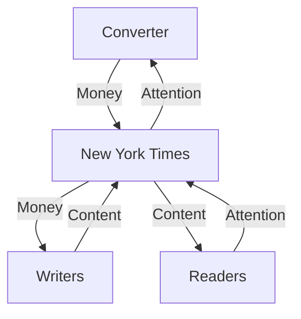
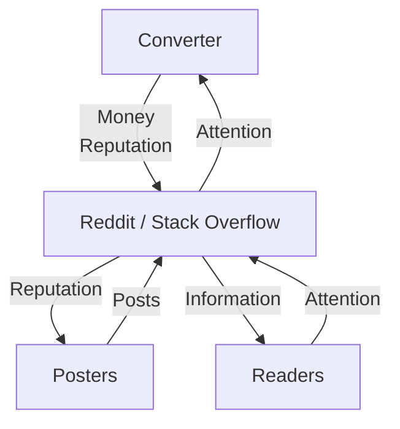
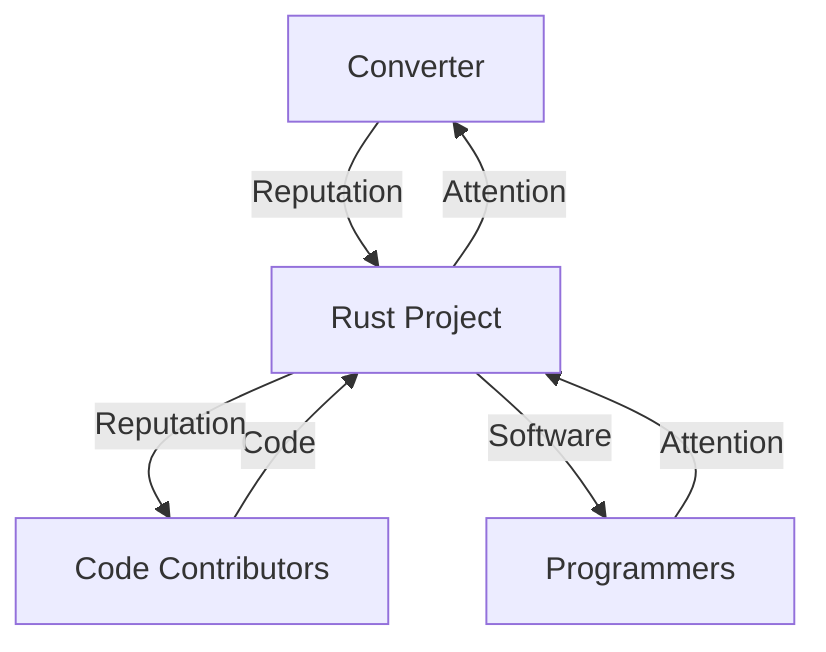
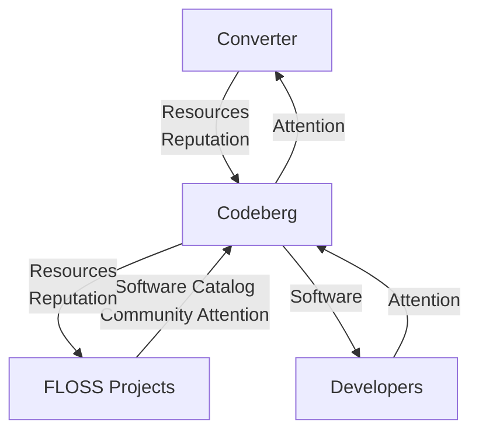
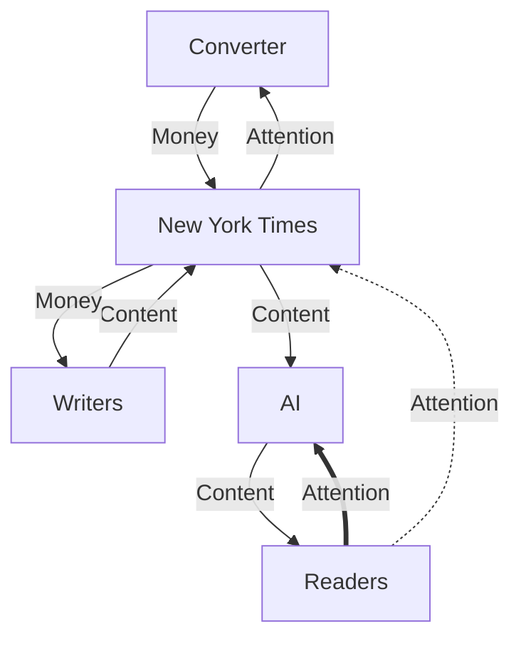
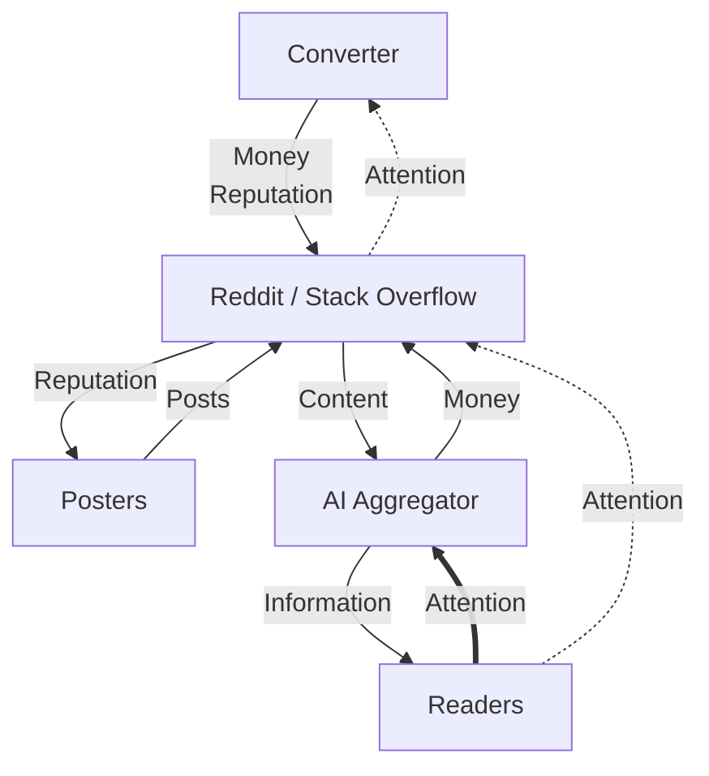
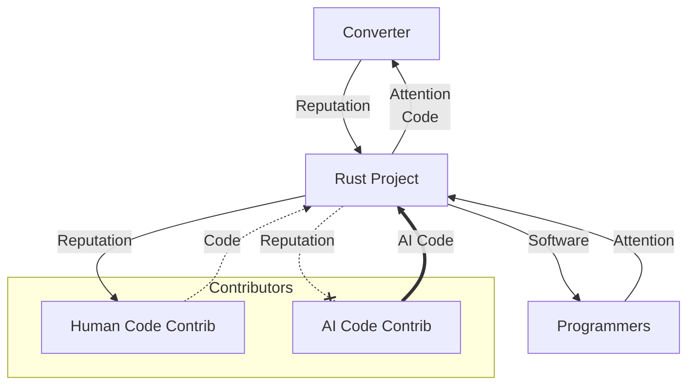
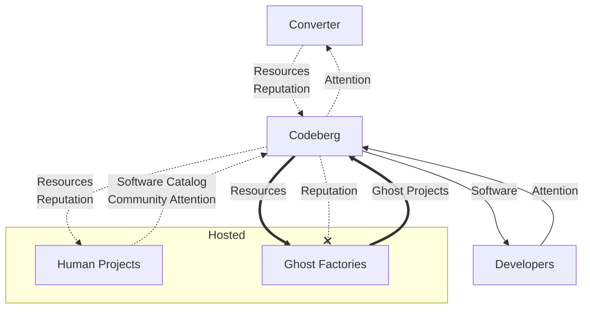

On July 30, Reddit beat every estimate it had. Revenue up 61%, profit more than doubled - and the [stock had its worst rout ever][cnbc-reddit], because search referrals were "choppy" and no new AI licensing deals appeared. Steve Huffman, on the call: "AI Overviews has yet to make a similar level of positive impact" as the ten blue links, and "we have still yet to find that win-win."

The New York Times is suing OpenAI and has, according to the [Wall Street Journal][gizmodo], discussed pointing `noindex` at itself - a directive that tells search engines to forget you exist. Rust adopted an [LLM policy][rust] that treats a pull request as a contributor-formation event, not a delivery of code. Codeberg [voted 358 to 144][codeberg] to stop hosting projects that "mostly consist of" LLM-written code.

These look like four different fights. They are the same machine, breaking on different sides, and almost every response on the table fails the same test: it does not close the loop AI actually broke. One shape does. It belongs to staffed newspapers, not to Reddit, and pretending otherwise is how you burn a year on a deal that feeds the company while the asset dies.

I want to show the machine, then judge the responses against it. I have a narrow answer for legacy media. I do not have one for anyone else, including me.

## Four Reactions

The Times is defending a distribution position. It metered the site in 2011, a decade before any crawler mattered: a deliberate trade of open reach for subscription revenue. The complaint now is that somebody else built a unified layer over the fragments and users prefer it. The current play is to chop the aggregator - sue, block, threaten to vanish from the index.

Reddit signed a 2024 deal worth about $60 million a year to let Google train on its content, and has reportedly discussed [shutting that access off][gizmodo]. Stack Overflow received [3,862 new questions in December 2025][devclass], down 78% from the year before, at a site that peaked above 200,000 questions per month in early 2014. Honesty requires the caveat: the decline [started in 2014](https://blog.pragmaticengineer.com/stack-overflow-is-almost-dead/), when moderation got aggressive and the site got unwelcoming. ChatGPT accelerated a slide that policy began. Before any of this, you often had to search both, and several subs, to get an answer. That was the product: a public pile of what people needed badly enough to ask.

Rust's policy is the most interesting document in the fight, because it names the flywheel from the inside:

> We treat PRs as an indication that someone is interested in joining our community and being mentored to work on future PRs. [...] a polished PR no longer indicates that someone is likely to stick around for the long term.

Disclosure, not detection. "Style is not evidence." They quoted [Zig's ban](https://ziglang.org/code-of-conduct/#strict-no-llm-no-ai-policy) on one side and Linus's ["AI is a tool"](https://lore.kernel.org/linux-media/CAHk-=wi4zC+Ze8e+p3tMv8TtG_80KzsZ1syL9anBtmEh5Z40vg@mail.gmail.com/) on the other, and took neither.

Codeberg is a German nonprofit forge with no ad model and no API licensing. In July its members voted to keep out the "development team of none": one person and a statistical machine that "turns energy into code." They are indifferent to `git clone`. Their crawler complaint is about method - bots walking every issue-filter permutation and every historical revision on donation-funded disks - and about ghost projects that consume like communities while throwing off no prestige.

Hang this date somewhere in your head. On September 15, 2026, [Cloudflare will default-block Training and Agent bots][cf-cid] on ad pages for new domains. Because Googlebot is classified as Search *and* Training, that default is Googlebot-off unless the site owner opts out. I will come back to it.

If this all looks like [Pink Margarine]() - incumbents dyeing the substitute so nobody will eat it - hold that. The question is which of these moves is theater and which one closes a loop.

## The Machine

Every one of these platforms is a hub with three loops.

Consumers give attention and get the thing: articles, answers, working code. Producers give content or presence that attracts consumers, and get fame or fortune - reputation, karma, salary, doors opening. Those convert into each other; the rate is not 1:1 and I am not moralizing it. In the middle sits a converter, the platform's secret sauce, which turns plentiful consumer-side input into platform sustenance plus what producers want, and skims a cut. Ads, subscriptions, hosting quotas, brand attention: the mechanics vary. The principle does not.

Some flywheels also pay producers in each other. Social dues. Community. "You're not alone." That is not decoration. It is fuel.

### How they ran

The Times is the clean picture. Readers give attention and money, get articles. The converter turns that into payroll. Writers, who have a fact-checking pipeline and a voice they spent a career on, supply the articles that draw the next readers.

Reddit and Stack Overflow are the same topology with a different producer currency. The converter skims ads and premium and API deals. Posters get reputation. You came because you needed something, not because you had subscribed to a surprise.

Rust pays a small contributor set in reputation and community, and pays consumers in a language that works. The project's job is to make that conversion run: attention into reputation, contributions into software that draws more attention. The project skims brand.

Codeberg is Rust pulled up a level. The producers are *projects*, not PR authors. A living project pays a software catalog *and* community attention into the forge. Catalog alone is not enough. Developers still clone; that leech path is fine. The converter's skim is donations, membership, identity - reputation rent, which they were already allocating disk by, via [quotas keyed on standing][codeberg-quota], before they ever voted on LLMs.

### How they break

The Times and Reddit break on the consumer side. An AI aggregator sits down between the reader and the site. Embeddings over *all* sources beat any one index, which is why people used Google instead of a twelve-site bookmark folder, and why they now ask ChatGPT instead of the Times. Attention closes on the model. The platform is hit by one consumer that sends nothing back.

Reddit can charge that one consumer. The money line is real. Watch what it does not restore.

Rust breaks on the producer side. AI shows up as code that works and a person who is not coming to the meeting. Working software still ships to consumers. Community is not paid into. Converter capacity is finite: it can only turn so much code into appreciated reputation. AI contributions take cycles and mint nothing that sticks. Human code gets crowded out. A contribution used to mean someone else understands, cares, and might stay. AI can open one PR or a hundred with no intent to return.

Codeberg gets the same failure as a unit of hosting. Ghost projects attach with no community - catalog-shaped presence, resource drain, reputation dead-letter. Living projects thin. Developers can still clone. That does not feed the converter.

## Does the Fix Close the Loop?

### The Times is suing the wrong customer

Chopping the aggregator draws a circle around the old flywheel after the readers have left. Latent-space aggregation is a discovered preference. People will not volunteer to regress to a worse interface because a publisher asked them to. Piracy was almost always a service problem. This is that problem, one layer up.

The current posture is a miss.

The Times still has a move, and Reddit's Google deal is how you see it. Reddit took dollars. Dollars are what the converter skims. Reddit's producers are paid in reputation and attention. The check does not become karma. It does not become "someone else is here." It sustains the entity while starving the asset. Production spins down, the corpus gets worse, the next licensing round is worth less, and the consumer side is already gone.

The Times's producers eat money. Staffed writers, editors, fact-checkers, people they can put on a plane. AI dollars can pay those people. That is the whole difference.

Labs are already telling you what they will pay for. [Anthropic bought print books in bulk][ars-books], cut the spines, scanned the pages, and threw the paper away - Project Panama, built to get Claude "how to write well" instead of "low quality internet speak." They wanted less-common, high-quality volumes that were not already sitting in the crawl. The lawsuit news is copyright. The demand underneath is verified-human text, at a published-book quality bar, that competitors do not already have.

Readers still want the Times's reputation. They do not want the Times's search box. So stop selling the old customer the old product. Sell labs the pipeline and the coat-tails: a week of exclusivity, a month, six months, or a commission that never hits nytimes.com. Patronage is older than newspapers. Click-through stops mattering when the lab has already paid many zeros more than a subscriber. The public can still see the piece later. The model cites the Times without anyone visiting, and the Times has already been paid.

Two things about this do not transfer, and both are load-bearing.

Producers at the Times eat money. Producers at Reddit eat reputation. Same dollars, wrong denomination.

And the Times never ran on public demand telemetry. "All the news that's fit to print" means they are choosing what is fit. You subscribe to a newspaper without knowing the table of contents. Curated surprise *is* the product. Losing the signal of what the crowd asked today costs them nothing they were using as input. Reddit and Stack Overflow *are* that signal. You did not go there recreationally. You went because you needed something particular. Patronage can replace a newsroom's payroll. It cannot replace the compass that *was* the social product.

So: mechanical hit, if they reframe, for staffed editorial media only. Will they reframe? Will labs pay real exclusivity premiums? Does authority dilute when every model wears it? Those are market risks. They are not the mechanical failure Reddit is making.

### Rust is filtering the wrong loop

Rust wants the whole world to use Rust, and a community that still forms contributors the old way. Those loops no longer match.

I keep seeing Rust. I would leech it happily. I would fix a bug with a PR if I had to. I would use AI for that contribution, and I am not joining the Rust community. The policy correctly clocks me. I will not be offended when it does. I will pick the fork I can patch.

They know they are experimenting. That is rarer than it should be. Check back in a year. I am not going to eulogize a timestamp.

The same shape showed up in [Cloudflare OS's contributing guide][cf-os]: they are not seeking outside contribution, because AI made writing easy and reviewing - keeping the product coherent - is the hard part. Small, trivially-verified PRs only. Writing was the easy half. They closed the gate to protect the hard half. That is Rust's move in a README.

### Codeberg drew the circle around a market

Codeberg looks like Rust one level up until you check the loops. Rust filters producers and still sells to everyone. Codeberg shrinks both sides and only promises to serve the slice that wants software without AI in it. Ghost projects out; human catalog plus community in; smaller, matched, fenced.

A language can lose its consumers entirely if a better one shows up. A forge is closer to "somewhere to cook." People may not all want this kitchen. Some of them will. The bet is that the niche is big enough. That is ordinary market-size risk, not the mechanical miss on the Times's lawsuit or Reddit's check.

It is also Amish. Survive inside the fence, even thrive, and remain irrelevant at global scale. Internally consistent. Fine if that is what you wanted. Most of us did not.

### September 15 is a fragmentation replay

Cloudflare's new defaults are not "Googlebot blocked for everyone." New domains, ad pages, Training off, opt-out exists. Defaults are what most people run. A corner of the web will fall out of Google because nobody changed the checkbox.

Cloudflare already sees that corner. It sits on the edge of those sites. If you wanted to search the part of the internet that was not in Google, they are positioned to do it, and if you think they will not, I have a bridge. Akamai, Fastly, whoever else runs enough of the remaining web, can scoop the same way. Then you have competing catalogs. We have watched this. Consumers hated it. They went to an aggregator the moment one existed, because the experience got uniformly worse.

The blockade reconstitutes the middleman one layer up. CDN search is distribution theater. It is not food for producers.

## No Template

Reddit's dollars feed the company and starve the posters, because posters do not eat dollars. The Times's current posture draws a circle after the readers left. The Times, if it sells labs exclusivity and commissions, can pay the newsroom in the currency the newsroom already spends - and it never needed the crowd's questions as input, because choosing was the job. Rust filters the tool and keeps wanting the whole market. Codeberg keeps the old shape for a smaller country. Cloudflare's default carves scoops out of the tub and dares someone to become Netflix again.

One working shape: staffed editorial producers, paid in money, selling verified-human output to the aggregator as the customer. That is not a template for Stack Overflow. It is not a template for a language. It is not a template for you.

The false comfort is that the pieces are interchangeable. If GitHub goes down I will use GitLab. If Rust does not work I will use Go. I am very smart. No. This flywheel existed inside you, and it is part of why you got smart, and it can spin down too. [Omry Yadan wrote about the private version][yadan]. I am not going to develop his argument here. The link is the point: the production trigger can vanish even when nobody is stealing from you.

I do not have a general answer. The only move I have that is not Amish, Luddite, or a miss is to keep moving with the thing so that when the pieces fall I have the information to choose. I have been practicing that as [trying the thing]() and as [letting the machine do the work](). Those are habits, not a prescription. If a better answer shows up, I will write it down.

[cnbc-reddit]: https://www.cnbc.com/2026/07/30/reddit-rddt-q2-2026-earnings-report.html
[gizmodo]: https://gizmodo.com/major-publishers-are-reportedly-considering-a-drastic-step-to-get-their-content-out-of-googles-ai-answers-2000788873
[rust]: https://blog.rust-lang.org/inside-rust/2026/08/05/rust-langrust-is-adopting-an-llm-policy/
[codeberg]: https://blog.codeberg.org/protecting-our-floss-commons-from-llms.html
[codeberg-quota]: https://blog.codeberg.org/new-storage-limits-on-codeberg-what-you-need-to-know.html
[devclass]: https://devclass.com/2026/01/05/dramatic-drop-in-stack-overflow-questions-as-devs-look-elsewhere-for-help/
[cf-cid]: https://blog.cloudflare.com/content-independence-day-ai-options/
[cf-os]: https://github.com/cloudflare/cloudflare-os?tab=contributing-ov-file#contributing-to-cloudflare-os
[ars-books]: https://arstechnica.com/ai/2025/06/anthropic-destroyed-millions-of-print-books-to-build-its-ai-models/
[yadan]: https://yadan.net/writing/ai-doesnt-get-annoyed/
