On July 30, 2026, Reddit beat every estimate it had. Revenue up 61%, profit more than doubled - and the stock then had its [steepest one-day drop since the 2024 IPO][yahoo-reddit]. Huffman wrote that search referrals were "choppy", and said that in AI Overviews Reddit has "still yet to find that win-win."[^cnbc-reddit] In a [same-day interview][cnbc-huffman]: "The 10 blue links have driven a tremendous amount of value for the whole ecosystem, and AI Overviews has yet to make a similar level of positive impact."

The New York Times is [suing OpenAI](https://en.wikipedia.org/wiki/The_New_York_Times_v._Microsoft_and_OpenAI) and has, according to the [Wall Street Journal][gizmodo], discussed pointing `noindex` at itself - a directive that tells search engines to forget you exist. Rust adopted an [LLM policy][rust] that treats a pull request as a contributor-formation event, not a delivery of code. That is a stance, not a mood: it changes who the community is, and it only invites the humans who will play that game. [Codeberg](https://codeberg.org) [voted 358 to 144][codeberg] to stop hosting projects that "mostly consist of" LLM-written code.

These look like four different fights. They are the same machine, breaking on different sides.

## Four Reactions

The Times is defending a distribution position. It metered the site in 2011, over a decade before any LLM crawler mattered: a deliberate trade of open reach for subscription revenue. The complaint now is that somebody else built a unified layer over the fragments and users prefer it. The current play is to chop the aggregator - sue, block, threaten to vanish from the index.

Reddit signed a [2024 deal worth about $60 million](https://thehill.com/policy/technology/4485295-reddit-gives-google-access-to-content-for-training-ai-models/) a year to let Google train on its content, and has reportedly discussed [shutting that access off][gizmodo]. Stack Overflow received [3,862 new questions in December 2025][devclass], down 78% from the year before, at a site that peaked above 200,000 questions per month in early 2014. The decline [started in 2014](https://blog.pragmaticengineer.com/stack-overflow-is-almost-dead/), when moderation got aggressive and the site got unwelcoming. ChatGPT accelerated a slide that policy began. Before any of this, you often had to search both Reddit and Stack Overflow, and several subreddits within Reddit to boot, to find an answer.

Rust's policy names the flywheel from the inside:

> We treat PRs as an indication that someone is interested in joining our community and being mentored to work on future PRs. [...] a polished PR no longer indicates that someone is likely to stick around for the long term.[^fn-rust]

Disclosure, not detection. "Style is not evidence." They quoted [Zig's ban](https://ziglang.org/code-of-conduct/#strict-no-llm-no-ai-policy) on one side and Linus's ["AI is a tool"](https://lore.kernel.org/linux-media/CAHk-=wi4zC+Ze8e+p3tMv8TtG_80KzsZ1syL9anBtmEh5Z40vg@mail.gmail.com/) on the other, and took neither.

Codeberg is a German nonprofit code forge with no ad model and no API licensing. In July 2026 its members voted to keep out the "development team of none": one person and a statistical machine that "turns energy into code."[^fn-codeberg] They are indifferent to `git clone`. Their crawler complaint is about method - bots walking every issue-filter permutation and every historical revision on donation-funded disks - and about ghost projects that consume resources as if they were full-fledged communities while throwing off no prestige.

Hang this date somewhere in your head: on September 15, 2026, [Cloudflare will default-block Training and Agent bots][cf-cid] on ad pages for new domains. Because Googlebot is classified as Search *and* Training, that default is Googlebot-off unless the site owner opts out. I will come back to it.

If this all looks like [Pink Margarine]() - incumbents thrashing about, dyeing the substitute so nobody will eat it, grasping at straws to stay relevant against the inexorable march of technological advancement - hold that for a bit.

## The Machine

Every one of these platforms is a hub with three loops.

Consumers give attention and get the thing: articles, answers, working code. Producers give content or presence that attracts consumers, and get fame or fortune - reputation, karma, salary, doors opening. Fame and fortune convert into each other, though at varying exchange rates. In the middle sits a converter: the platform's secret sauce that turns plentiful consumer-side input into platform sustenance plus what producers want, and skims a cut. Ads, subscriptions, hosting quotas, brand attention: the mechanics vary. The principle does not.

Some flywheels also pay producers in *each other*. Social dues. Community. "You're not alone." That is **fuel**.

### How They Ran

The New York Times is the clean picture: readers give attention and money, get articles. The converter turns that into payroll by laying some ad revenue on top. Writers with editors, fact-checking pipelines, and a voice they spent a career on, supply the articles that draw the next readers.

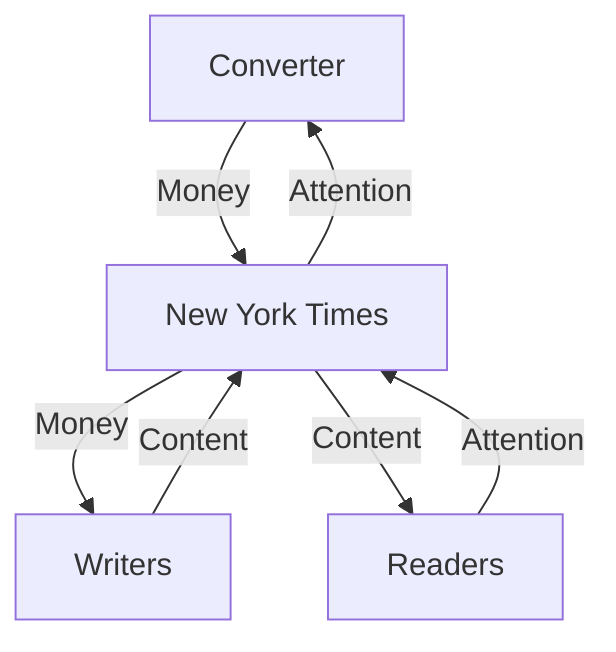

Reddit and Stack Overflow are the same topology with a different producer currency. The converter skims ads and premium platform service fees and API deals. Posters get reputation.

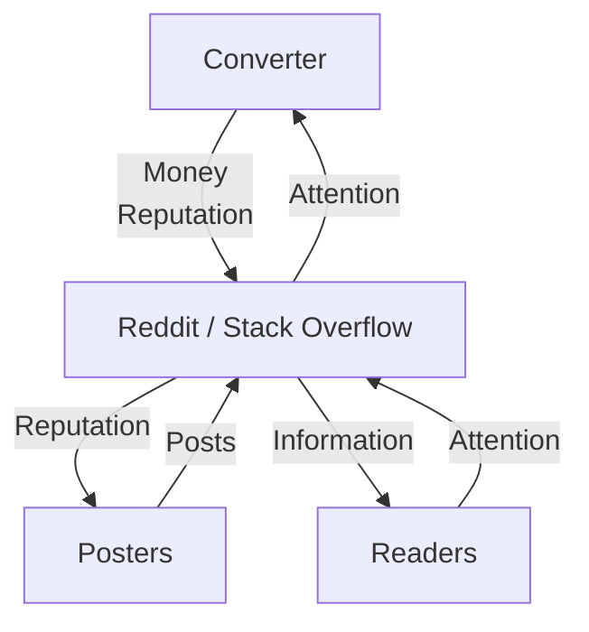

Reddit and Stack Overflow are a shape of *many* social answer or social information platforms. I submit them as two high-profile examples but they aren't unique.

Rust pays a small set of contributors in reputation and community, and pays consumers in a language that works. The project's job is to make that conversion run: attention into reputation, contributions into software that draws more attention. The project skims brand.

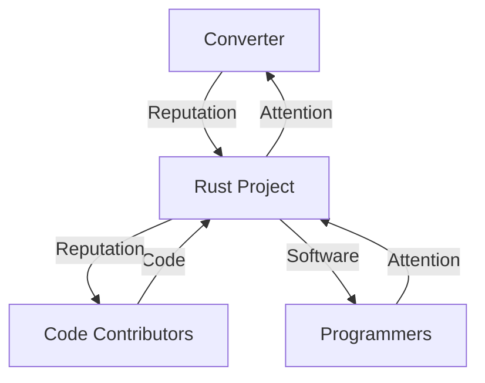

Codeberg is Rust pulled up a level. The producers are *projects*, not PR authors. A living project pays a software catalog *and* community attention into the forge. Catalog alone is not enough. Developers still clone; that leech path is fine. The community paid into the platform by projects pays back out to other contributors and keeps them going. The converter's skim is donations, membership, identity - reputation rent, which they were already allocating disk by via [quotas keyed on standing][codeberg-quota], well before they ever voted on LLMs.

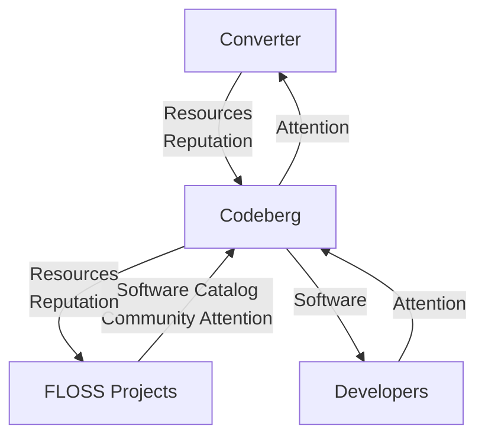

### How They Break

The Times and Reddit break on the consumer side. An AI aggregator sits down between the reader and the site... and many, many other sites. Embeddings over *all* sources beat any one index, which is why people used Google instead of a twelve-site bookmark folder back when search indices came about. Now it's why they ask ChatGPT instead of the Times. The content/attention loop closes on the LLM and the platform is hit by one consumer that sends nothing back.

Reddit is the same geometry. Readers take their questions to the aggregator. The thick attention line now points at the LLM. The dotted leftover pointing at Reddit is not enough to mint the reputation the posters were paid in. The platform still feeds the aggregator its posters' content while its posters starve.

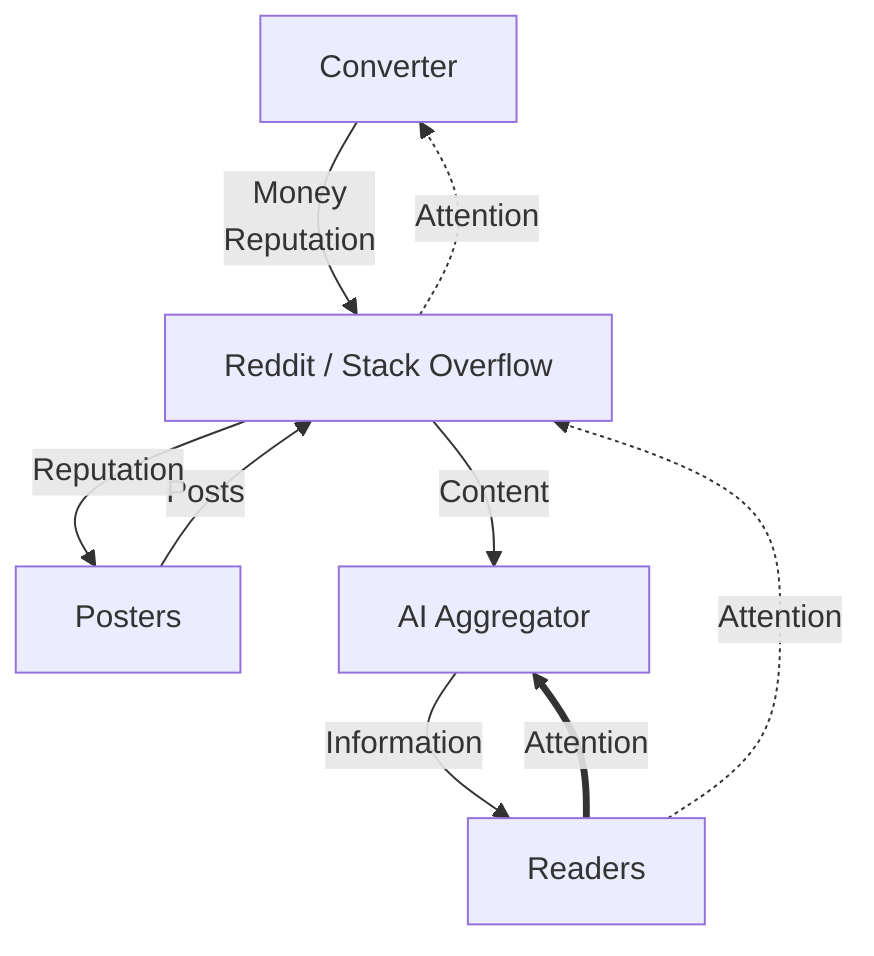

Rust breaks on the producer side. AI shows up as code that works and a person who is not coming to the meeting. Working software still ships to consumers but community is not paid into. Converter capacity is finite: it [can only turn so much code into appreciated reputation](). AI contributions take cycles and mint nothing that sticks. Human code gets crowded out. A contribution used to mean someone else understands, cares, and might stay. AI can open one PR or a hundred with no intent to return.

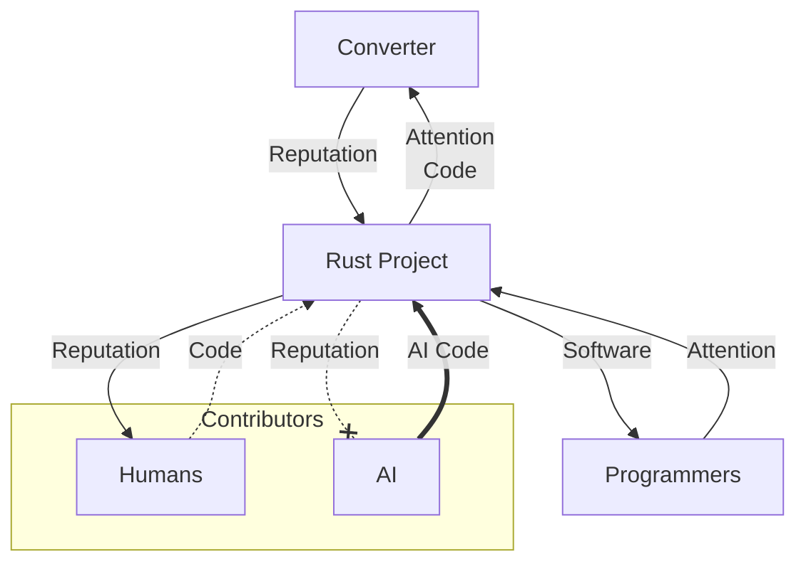

Codeberg gets the same failure one level up: the producers are *projects*, so a ghost project is hubbub with no human attached. It is a GitHub-shaped empty apartment: the lights are on but nobody lives there and Codeberg still pays the electric. More open up, and the *living* become an ever-thinner slice of the roster. Developers can still clone. That does not feed the converter.

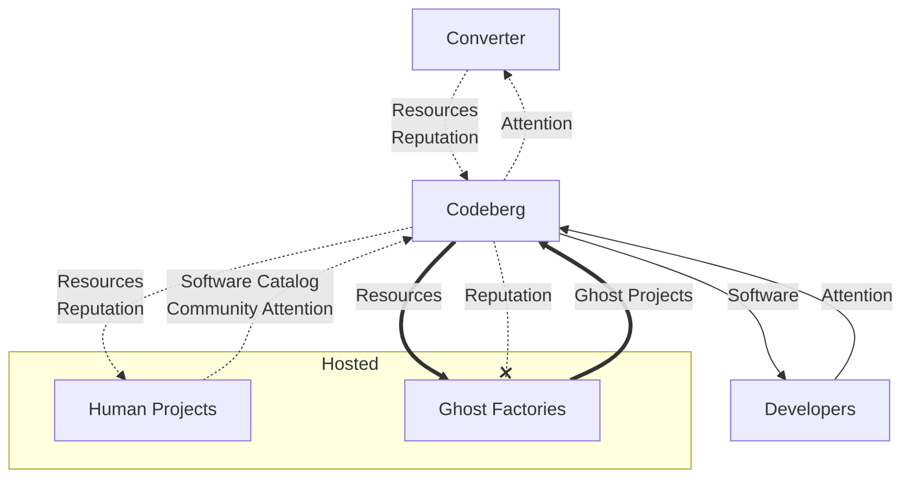

## What They Tried

### The Times Shut the Barn Door After the Cows Got Out

Cutting off the aggregator is an attempt to cut the content line into the model and herd people back to nytimes.com. The readers are already on the preferred interface. Latent-space aggregation is a discovered preference and people will not volunteer to regress just because a publisher asked them to. Piracy was almost always a service problem; this is that same shape of problem.

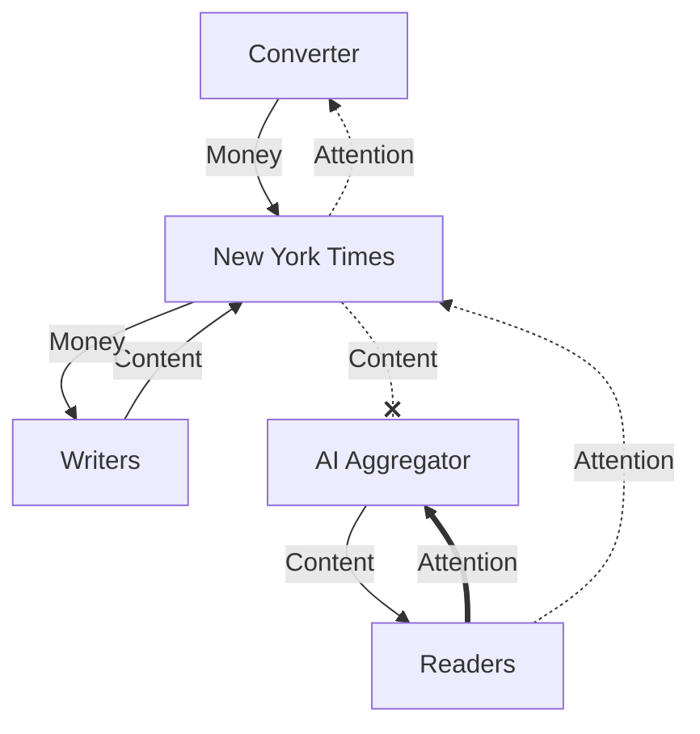

The dead content line is the lawsuit and the `noindex` threat. The thick attention line did not move. The current posture is a miss.

### Reddit Charged the One Consumer That Stayed

That deal with Google to let them train on content was a neat idea, but... see if you can spot the problem: the thick new line is money from the aggregator back to Reddit. Follow it. It arrives at the platform. It **does not continue to the posters**.

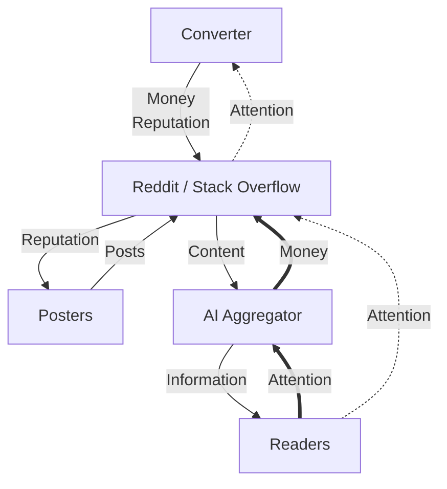

Posters are still paid in reputation. Reputation is minted from attention. The attention went to the aggregator. The check can keep the lights on for a while. It cannot pay the people who were the reason the corpus was worth buying.

> The deal sustains the entity while starving the asset.

Posting spins down, the corpus gets worse, the *next* licensing round sells for less, and the consumer side is already gone. Stack Overflow has tried on the costume: [Data Licensing][so-license] sells labs ["decades of verified, technical knowledge"][so-era] - smart humans wrote this. The check still stops at the company. Answerers are not on a newsroom payroll. They are renting out the back catalog while new questions collapse. Same geometry as Reddit, better marketing.

### Rust Filtered the Producers and Kept the Whole Market

Rust wants the world to use Rust, but also a community that still forms contributors the old way. Those loops no longer match. The policy chills AI-shaped contributions - and, with them, humans who would have used the tools and then stuck around, or at least shipped a patch.

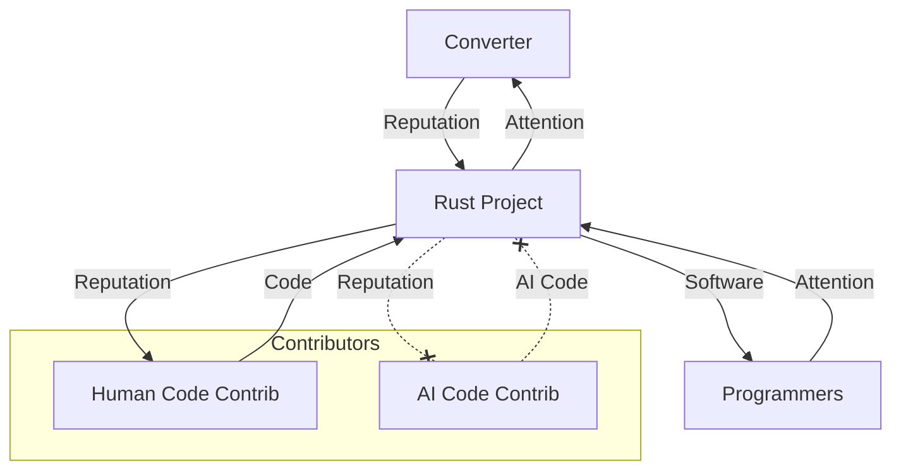

The consumer loop is still the whole market. The producer loop just got smaller, including some of the humans. They are not only cutting off rogue bots. They are cutting off people who use these tools. That is a baby-and-bathwater move.

***I*** keep seeing Rust. I would leech it happily - try it in a project where I needed high performance but not C from 1999. I would fix a bug with a PR if I had to. 

And I would use AI for that contribution, as I am indeed *not* interested in becoming "A Rust Developer" nor in joining the "Rust Community." I'm just here to make software that works, man. The policy correctly clocks me. 

> The project stops reading as open-source I can contribute back to.

It becomes a club with a language attached. When I need Rust-like characteristics, I have a strong incentive to pick a fork I can patch. I *am* the baby in that bathwater, I reckon. Of course, that's what the bathwater would say, too.

The same shape showed up in [Cloudflare OS's contributing guide][cf-os]: they are Apache-2.0-licensed and "not seeking outside contribution," because AI made writing easy and reviewing - keeping the product coherent - is the hard part. Small, trivially-verified PRs only. Writing was the easy half. They closed the gate to protect the hard half. That is Rust's move in a `CONTRIBUTING.md`.

Rust, at least, knows and admits they're experimenting. So, the door's closed to me for now, but maybe not forever. Respect.

I might grant a generous interpretation of their stance as more [literally Luddite](https://en.wikipedia.org/wiki/Luddite) - demanding a halt to radical new technology until it can be used without egregious detriment to human well-being - than the colloquial "head-in-the-sand" sense. The clock still runs. How long can you wait before the fork that accepts patches is the one everyone uses?

### Codeberg Formed an Enclave

Codeberg looks like Rust one level up until you check the loops. Rust filters producers and still sells to everyone. Codeberg shrinks both sides and only promises to serve the slice that wants software without AI in it. Ghost projects out; human catalog plus community in. The chart looks like the healthy one on purpose. The Total Addressable Market just got smaller.

*(Hey, that's the same graph as before!)*

A language can lose its consumers entirely if a better one shows up, just like a given [brand of pickles can fall out of vogue](https://www.youtube.com/watch?v=UZ9e2ASgwKo) even while people still absolutely want pickles in general. A forge is closer to "somewhere to cook." People may not all want this kitchen. Some of them will. The bet is that the niche is big enough - and *that* is just ordinary market-size risk, not the miss on the Times's lawsuit or Reddit's check.

It is also the only response already on the table that does not lie about the loops. Survive inside the fence, even thrive, and remain irrelevant at global scale.

> Codeberg offers a home for the Software-Engineering Amish

Fine if that's the life for you. For most of us, Amish is a bit extreme.

### September 15 is a Fragmentation Replay

Cloudflare's new defaults are not "Googlebot blocked for everyone." For new domains, on pages that run ads, "Training" and "Agent" behavior will be blocked by default. There *is* an opt-out (or opt-back-in?), but defaults are what most people run. A corner of the web will fall out of Google because nobody changed the checkbox.

Cloudflare already sees that corner and will continue to see it: it sits on the edge of those sites. If you wanted to search the part of the internet that was not in Google, they are positioned to do it and if you think they will not leverage that position, I have a bridge to sell you. Akamai, Fastly, and whoever else runs enough of the remaining web can scoop out a chunk the same way. Then you have competing catalogs. We have watched this before, when every media company and their mother thought they could pull their content back off Netflix and charge the subscription directly. Consumers hated it. They went to an aggregator the moment one existed, because the alternative experience was uniformly worse. Consumers will not `search.cloudflare.com` and `search.akamai.net` and `search.fastly.com` - they will *find* the aggregator that pulls from all of the sources and use that.

The blockade reconstitutes the middleman one layer up. CDN search is distribution theater. It is not food for producers.

## The Times Still Has a Customer

So the honest options look like: miss, miss, miss, go be Amish in a corner. The Times is probably doomed on the track it is on. It also has a way to thrive in this world that I have not found for anyone else, and that nobody else in this lineup has found either.

The new direct consumer is the aggregator. Producers have to eat something that consumer is willing to pay. Money is the only such something I have found in any of these flywheels. Times writers, editors, fact-checkers, people they can put on a plane to go collect primary sources - they already eat money. AI can pay those people.

Reddit took a check too, but follow that check again: it was rent charged to the aggregator - but the posters' paychecks are denominated in reputation. The rent arrived in a currency they cannot eat.

Labs are already telling you what they will pay for. [Anthropic bought print books in bulk][ars-books], cut the spines, scanned the pages, and threw the paper away - Project Panama, built to teach Claude "how to write well" instead of "how to post like a Redditor." They wanted less-common, high-quality volumes that were not already sitting in the crawl. The lawsuit news is copyright drama. The demand underneath is for: 

1. verified-human text
2. at a published-book quality bar
3. that competitors do not already have

That is exactly the kind of thing traditional media outlets are built to produce.

Readers still want the Times's reputation; they do **not** want the Times's search box. Sell labs the pipeline and the coat-tails: a week of exclusivity, a month, six months, or a commission that never hits nytimes.com. Patronage is older than newspapers. Click-through stops mattering when the lab has already paid many more zeroes than their dwindling subscriber base. The public can still see the piece later. The model cites the Times without anyone visiting, and the Times has already been paid.

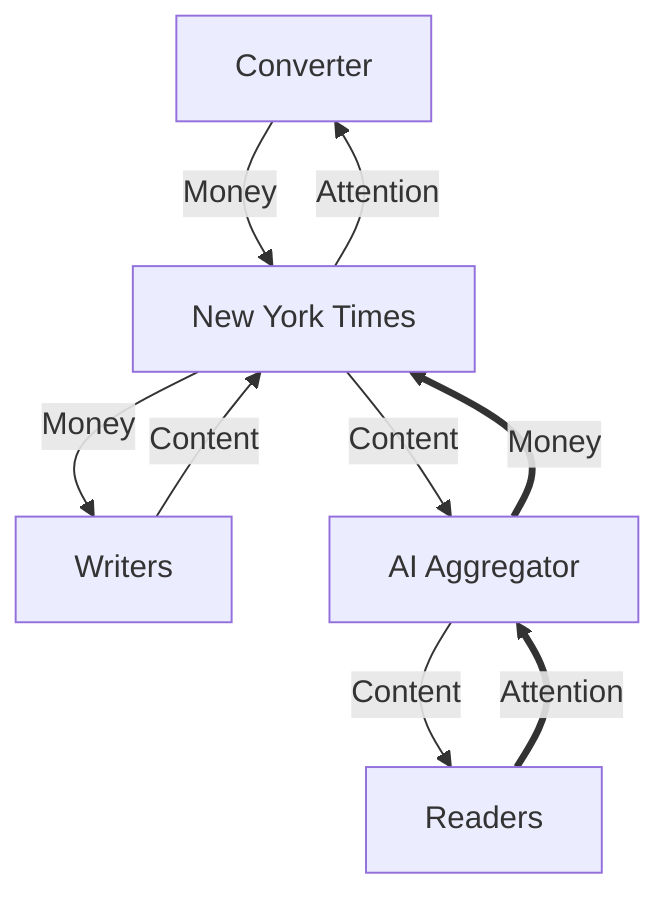

The thick line from the aggregator is the new customer. The writers are still on payroll.

> The readers never come back, and they do not have to.

This does not transfer to other platform shapes, unfortunately, for two reasons:

### The Times' Staff is Paid

The Times's producers eat money. Reddit's eat reputation. Same rent, wrong denomination for the people who have to keep showing up.

### The Times Doesn't Need to Know What You Want to Read

The Times never ran on public demand telemetry. "All the news that's fit to print" means they are choosing what is fit. You subscribe to a newspaper without knowing the table of contents: curated surprise *is* the product. Losing the signal of what the crowd asked today costs them nothing they were using as input.

Reddit and Stack Overflow *are* that signal. You did not go there recreationally: you went because you needed something particular. Patronage can replace a newsroom's payroll. It cannot replace the compass that *was* the social product.

Will they reframe? Will labs pay real exclusivity premiums? Does authority dilute when every model can rent it? Those are market risks. They are not the mechanical failure Reddit is making. They are also not a template for any other kind of platform.

## And Me?

The false comfort is that the pieces are interchangeable. If GitHub goes down I will use GitLab. If Rust does not work I will use Go. I am very smart. No. This flywheel existed inside you, and me, and it is part of why we got smart, and it can spin down too.

[Omry Yadan wrote about the private version][yadan]: friction was a signal of what needed attention. The producers in the loops above were acting on that signal in public. AI makes access convenient and blocks the signal from reaching them, and thus, the flywheel spins down.

You can do the same thing to yourself. This is not a [Butlerian sermon about getting dumber](); your problem-solving ability can stay exactly as sharp as it ever was - you just stop *seeing* problems. Once you no longer see problems to solve, your utility as a productive entity drops anyway.

I feel this nipping at my heels. Does Vite suck? I do not know. We use it in [inquirerjs-checkbox-search](https://github.com/Texarkanine/inquirerjs-checkbox-search/); [Niko](/authors/niko/) deals with it. Does Docusaurus suck? I do not know. It runs the [a16n documentation site](https://texarkanine.github.io/a16n/) and I do not deal with it. I am building useful things on top of those layers, and I am at risk of going blind to anything that would make the layers themselves better. That is a departure. If one of them sucks, I may just spend more effort in the layer where I already am, instead of recognizing a signal to drop down and fix it - because the friction got obscured.

The flywheel inside you is at risk. You are one of the shapes for which I do not have an answer. I am one of those shapes.

Perhaps this is fine as it is just the way technology goes. When I drive my car and am unhappy with my gas mileage, I might drive more gently, or wonder if I should try [hypermiling](https://www.reddit.com/r/hypermiling/). But maybe the engineers at Toyota should've just built a better engine for this car - or selected a better one. Maybe there's a tune I can put on the ECU to fix the problems. Maybe the *real* problem is a layer down below where I know to look. Despite all that... Maybe it's OK for me to just drive a little differently to stretch the gas rather than chasing shadows down the tech stack of human achievement.

Maybe not, though. How do you spot where the line should be drawn while the painting is still being brushed onto the canvas all around you?

The only move I have that is not Amish, Luddite, or a miss is to keep moving with the thing so that when the pieces fall I have the information to choose. I have been practicing that as [trying the thing]() and as [letting the machine do the work](). Those are habits, not a prescription. If a better answer shows up, I will write it down.

---

[cnbc-huffman]: https://www.cnbc.com/2026/07/30/reddit-ceo-says-googles-ai-overviews-cant-replace-10-blue-links-.html
[yahoo-reddit]: https://finance.yahoo.com/markets/article/reddit-stock-tumbles-the-most-on-record-as-lack-of-new-ai-deals-us-daily-users-metric-disappoints-153413759.html
[so-era]: https://stackoverflow.blog/2025/12/30/a-new-era-of-stack-overflow/
[so-license]: https://stackoverflow.co/data-licensing/
[gizmodo]: https://gizmodo.com/major-publishers-are-reportedly-considering-a-drastic-step-to-get-their-content-out-of-googles-ai-answers-2000788873
[codeberg-quota]: https://blog.codeberg.org/new-storage-limits-on-codeberg-what-you-need-to-know.html
[devclass]: https://devclass.com/2026/01/05/dramatic-drop-in-stack-overflow-questions-as-devs-look-elsewhere-for-help/
[cf-cid]: https://blog.cloudflare.com/content-independence-day-ai-options/
[cf-os]: https://github.com/cloudflare/cloudflare-os/blob/4e0f9593fc52944319ee7332db025f6912f6f64a/CONTRIBUTING.md
[ars-books]: https://arstechnica.com/ai/2025/06/anthropic-destroyed-millions-of-print-books-to-build-its-ai-models/
[yadan]: https://yadan.net/writing/ai-doesnt-get-annoyed/

[cnbc-reddit]: https://www.cnbc.com/2026/07/30/reddit-rddt-q2-2026-earnings-report.html
[^cnbc-reddit]: Vanian, J. (2026, July 30). Reddit shares sink 11% on “choppy” search referrals even as results blow past estimates. CNBC. [https://www.cnbc.com/2026/07/30/reddit-rddt-q2-2026-earnings-report.html][cnbc-reddit]
[codeberg]: https://blog.codeberg.org/protecting-our-floss-commons-from-llms.html
[^fn-codeberg]: Tzovaras, B. G., Richter, O., & Zijil, W. (2026, July 23). Protecting our Floss Commons from LLMS. Codeberg News. [https://blog.codeberg.org/protecting-our-floss-commons-from-llms.html][codeberg]
[rust]: https://blog.rust-lang.org/inside-rust/2026/08/05/rust-langrust-is-adopting-an-llm-policy/
[^fn-rust]: Nelson, J. (2026, August 5). Rust-Lang/Rust is adopting an LLM policy: Inside rust blog. Inside Rust Blog. [https://blog.rust-lang.org/inside-rust/2026/08/05/rust-langrust-is-adopting-an-llm-policy/][rust] 