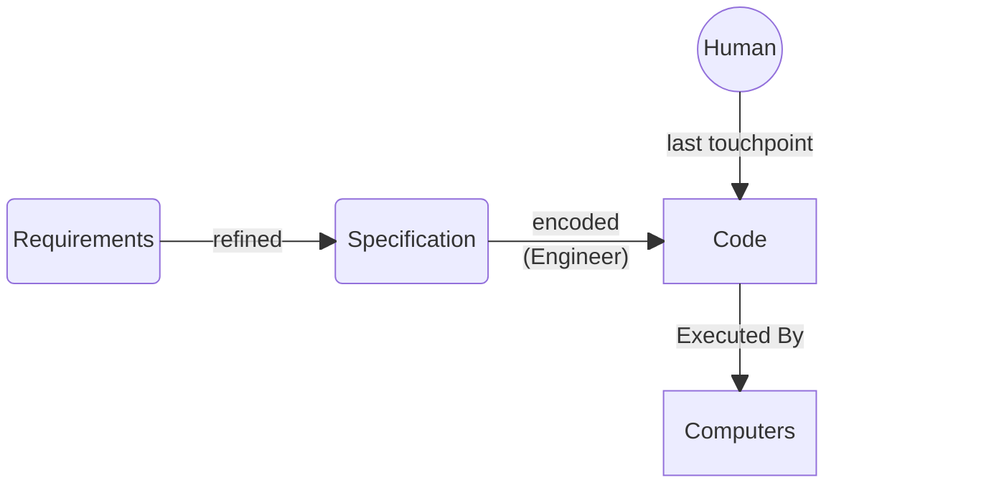
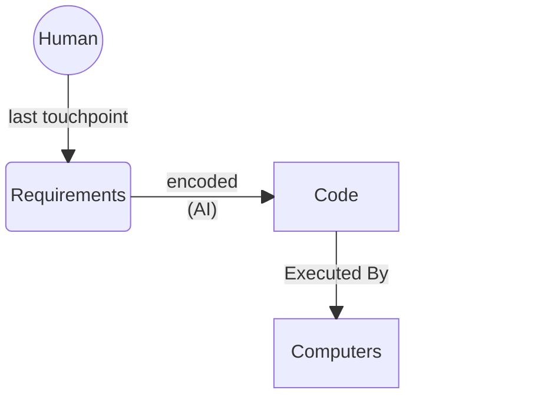
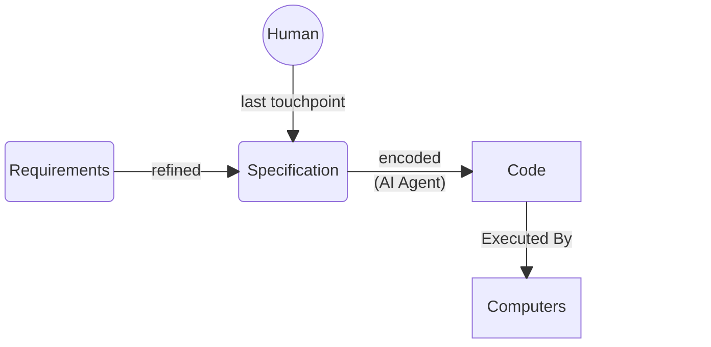
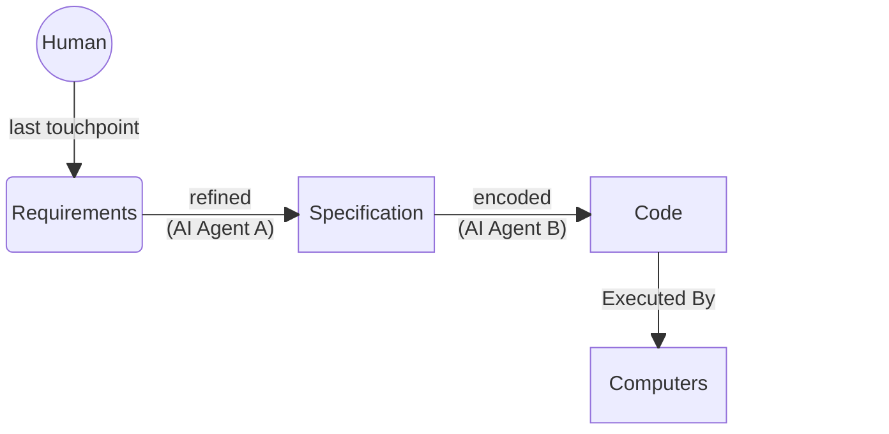



In which someone writes about trying what [OpenAI's Symphony project](https://github.com/openai/symphony) suggested: take a specification document, hand it to a coding agent, get a working implementation out the other end. It didn't work. The agent produced buggy code that, even after manual fixes, couldn't complete a simple task.

They diagnosed the failure as fundamental. Two misconceptions, they argue: that specification documents are simpler than code, and that specification work is **necessarily** more thoughtful than coding.

They say:

> If you try to make a specification document precise enough to reliably generate a working implementation you **must necessarily contort the document into code** ...

and

> There is no world where you input a document lacking clarity and detail and get a coding agent to reliably fill in that missing clarity and detail. Coding agents are not mind readers and even if they were there isn't much they can do if your own thoughts are confused.

They're right about the observation. The workflow they describe doesn't work. But I think the article misidentifies the cause - and misses what the fix actually looks like.

## A Sufficiently-Detailed Spec is Code

Yes: that was always the point. That's the job! The whole industry is about refining the expression of solutions tightly-enough that they can be executed by a machine.

There's a wrinkle, though: things like [DO-178C](https://en.wikipedia.org/wiki/DO-178C)-certified avionics software. Here you *do* end up creating an incredibly-detailed specification that more-or-less *is* the code. People do this! It works! It's slow and expensive (... for humans), but there isn't a fundamental systemic failure in the process that causes aircraft to fall out of the sky when software is DO-178C-certified. The criticism of exhaustive specification isn't *even* wrong; it's just that if you execute the technique improperly (as the author validates), you will, *of course*, get sub-par results.

## Coding Agents Are Not Mind Readers

We've been doing **this** for decades:

There *are* people who fit the description of those criticized in the article - people who claim you can do this:

The article correctly objects to that claim, and validates it with the Haskell experiment.

But the targets of the criticism are in flagrant violation of [Chesterton's Fence](https://en.wikipedia.org/wiki/Chesterton%27s_fence). Of course you wouldn't get the expected results! The pipeline between requirements and running code had multiple stages *for a reason*. The whole point was to *engineer* a process that allows the refinement of incomplete, imprecise ideas into something robust-enough to be executed by a machine! The Symphony project's mistake is offering up only the "final spec" to the general public as a complete artifact, without going full DO-178C on it. In that middle ground, upstream requirements and intent are absent and get filled-in ... to the taste of whichever agent+operator combo happens to execute on it. Normally, such a natural-language spec would be part of an interative pipeline with feedback loops whereby the *first* draft of code that came from the spec would be refined into compliance with the bigger picture. But in Symphony, that framework is absent. The end-users are offered no guidance on how to iterate their first draft into the final draft, and so "your mileage may vary!"

What the article misses is that "spec-driven development" should be understood as an indication of where the human *stops directly engaging* with the process - not the presence of a specification document at some point in the process. [Software development has *always* been spec-driven](#the-spec-was-always-there)!

Today's AI agents are the humanoid robots of knowledge work - general-purpose machines designed to slot into existing processes involving *human* executors. A side-effect of how they're general-purpose means that once you ask one to be or do something with its current context window, it's kind of locked into that one thing. You have to swap them in 1:1 for the human roles, preserving the flow of the process through its existing phases and executors' roles.

These stages won't always be visible. As the tools mature, the [pipeline will get encapsulated]() - you'll stop seeing the seams, the way you don't see the compilation stages downstream of `javac`. But they'll still be in there. Collapsing them prematurely is how you get a Symphony of errors.

So, to do "spec-driven development" with AI agents, try this:

Or even this:

And I wager [you may have a lot more success]()!
