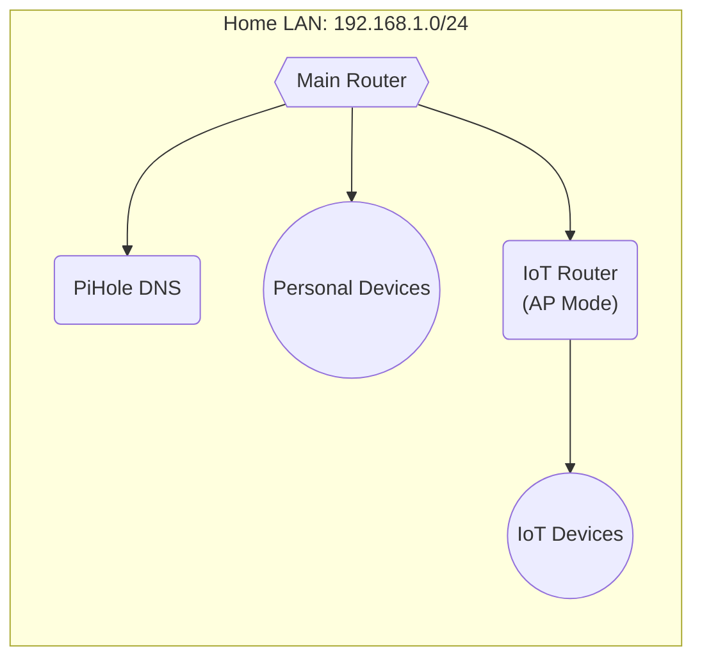
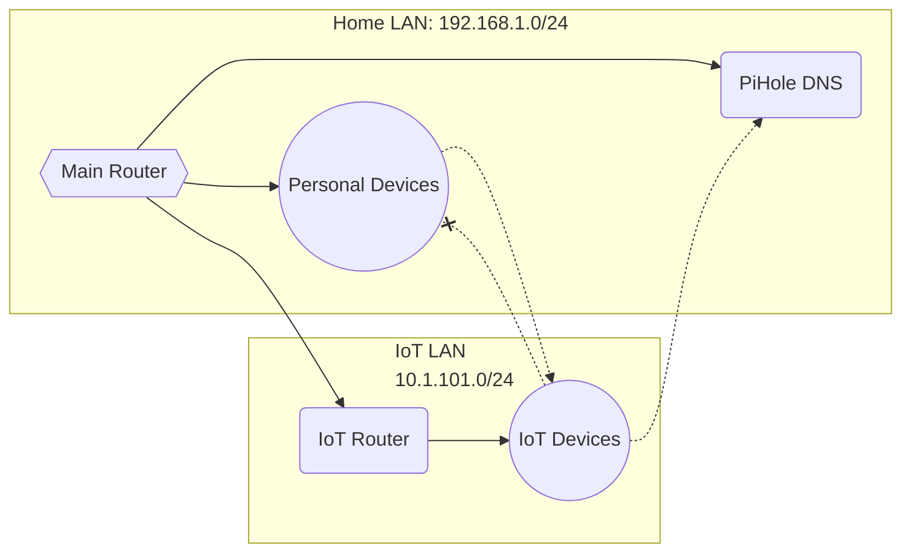

A [petcare IoT device](https://www.surepetcare.com/en-us/internet-hub/hub) "broke." It had worked for a year, connected through two switches between it and my main router. Then it stopped being able to connect to the manufacturer's servers. The manufacturer's support script was predictable: "Connect it directly to your router." I did. It worked.

This should have been the end. But I wanted to understand *why*, and that investigation became the push I needed to finish a long-deferred project: proper network isolation for IoT devices.

## The Broken Hub

The hub connects to various pet products - water fountain, pet door, etc. For a year it lived behind two unmanaged switches, happily communicating with the cloud. Then it didn't.

I tested methodically:

- Different switch ports: failed
- Different cables: failed
- Power cycling everything: failed
- Direct connection to main router: **worked**
- Back through switches: failed again

The failure was reproducible. Switches broke it. Direct router connection fixed it.

Even a single switch between the hub and router caused failure. The switches themselves worked fine for every other device. The hub's firmware was apparently so broken it couldn't survive the 2-30 second port initialization delay that occurs when connecting through a switch - the time required for MAC address learning and spanning tree protocol transitions. At least, that was our best guess.

I had a spare router (actually, a stack of them) so I popped one on the end of the hub's switch, letting it act as a full NAT'ing router, and moved the hub to it. It worked. The hub didn't need to be on the *internet-facing* router - it needed to be directly on *any* router. 

```mermaid
flowchart LR

subgraph ISP
Rise((("ISP 1")))
Spectrum((("ISP 2")))

Rise --> Modem1["Modem<br>(Fiber ONT)"]
Spectrum --> Modem2["Modem<br>(Cable)"]
end

subgraph LAN
Router1{{"Main Router"}}
Switch1("Switch1")
Switch2("Switch2")
Switch3("Switch3")
Switch4("Switch4")
Router2{{"Router2"}}

Modem1 --> Router1
Modem2 --> Router1

Router1 --> Switch1
Router1 --> Switch4
Switch1 --> Switch2
Switch2 --> Switch3
Switch2 --> Router2

end

Switch3 --> Hub0@{ shape: stadium, label: "😺 Hub ❌<br>Original Position" }
Switch3 --> Hub1@{ shape: stadium, label: "😺 Hub ❌<br>Alternate Position 1<br>(port 1)" }
Switch3 --> Hub2@{ shape: stadium, label: "😺 Hub ❌<br>Alternate Position 2<br>(port 3, different cable)" }
Switch4 --> Hub3@{ shape: stadium, label: "😺 Hub ❌<br>Alternate Position 3" }
Router1 --> Hub4@{ shape: stadium, label: "😺 Hub ✅<br>Alternate Position 4<br>(worked)" }
Router2 --> Hub5@{ shape: stadium, label: "😺 Hub ✅<br>Alternate Position 5<br>(worked)" }
```



I want to also briefly shout out to the old Linksys `WRT54GL` I pulled for this - I don't have a receipt for it, but the oldest reference I can find is from 2011 - at this point it's at least 17 years old, has been on the shelf for at least 13 years, and it powered up and routed like a champ!



## The Real Project

I couldn't run a new cable off the main router. All four LAN ports were already distributing to different rooms, with long and/or through-the-walls cable runs to switches in each. To give up a port for the hub, I would have had to run a new through-the-attic line from one room to another to daisy-chain them. No way! But this defective hub had just demonstrated something useful: I already had a router in the right location. If I converted it from an access point into a proper router with its own subnet, the hub would work - and I'd finally have the IoT network isolation I'd been meaning to set up.

The goal:

- IoT devices on their own subnet, isolated from the home LAN
- Home LAN can reach IoT devices (for management and configuration)
- IoT devices cannot initiate connections to home LAN
- IoT devices use the existing [PiHole for DNS](https://pi-hole.net/)
- Individual IoT clients visible in PiHole (not hidden behind NAT)
- Hostnames displayed in PiHole query logs

The starting topology looked like this:



Because we'd now determined that I would need the IoT Router to actually *be* a NAT'ing, DHCP'ing router, I would need something like this:



The thing that had had me putting this project off thus far was those dotted lines... We were going to have to use `iptables` and static routes.

## Converting the Router

The IoT router was a [Linksys EA6500](https://mobilespecs.net/router/Linksys/Linksys_EA6500.html) running [dd-wrt](https://dd-wrt.com/) in "Gateway" mode - effectively a switch with a wireless access point. Converting it to a proper router required several changes. I'd done this before, but it had been a while and I didn't remember all the things I had to undo at first, so I'm going to write them all down for next time:

### WAN Configuration

First, the WAN interface needed a static IP on the home LAN:

- **WAN IP**: `192.168.1.101/24`
- **Gateway**: `192.168.1.1` (main router)
- **DNS**: `192.168.1.254` (PiHole)

I initially tried DHCP for the WAN interface. The IoT router never obtained a lease from the main router... possibly because of the VLAN issue documented below. But, as this was going to be a foundational part of the network with a static route pointing to it, a static IP was probably better, anyway.

### VLAN Separation

The router had been bridging all ports together since I had just been using its ethernet ports as a LAN switch. To function as a router, WAN and LAN needed separate VLANs.

**Setup → Switch Configuration**


After applying these changes, I couldn't reach the router at any IP address. Recovery required connecting a laptop with a static IP (`10.1.101.50/24`) and manual specification of the gateway (`10.1.101.1`) directly to a LAN port, then accessing the dd-wrt web interface at `10.1.101.1`.


This is probably because I had a bunch of pollution in routing tables and dhcp lease tables from previous incorrect configurations and connections. A reboot of all involved devices would probably also have fixed it.

### The DHCP Derp

With VLANs fixed, devices connected to the IoT router were still getting IP addresses from the main router's DHCP. Something was still bridged...?

I checked the status page. DHCP Server: "Enabled - Stopped".

The syslog revealed the problem:

```
dnsmasq[1430]: inconsistent DHCP range at line 9 of /tmp/dnsmasq.conf
dnsmasq[1430]: FAILED to start up
```

The generated dnsmasq configuration showed:

```
dhcp-range=br0,10.1.101.100,10.1.102.33,255.255.255.0,1440m
```

With 190 maximum DHCP users starting at .100, the range overflowed the /24 subnet boundary. `10.1.101.100` + 190 = `10.1.102.34`. Dnsmasq correctly refused to serve an inconsistent range.

With no DHCP running on the IoT router, and no isolation enforced yet, devices were getting their DHCP queries answered by the main router. I'd actually already set up the static route (documented below) to allow traffic from the main subnet into the IoT subnet, so this was working even though it normally wouldn't have. Should have gone strictly in order!

I reduced the DHCP pool to 50 users. The range stayed within the subnet, dnsmasq started, and devices finally got addresses from the IoT router.

**I** didn't set that to 190. As far as I know, dd-wrt defaults to 50. I don't know how, but somehow it got set to 190 while I was fiddling with and restarting the router a million times.

### Network Setup

The LAN configuration:

- **Router IP**: `10.1.101.1/24`
- **DHCP Server**: Enabled
- **Start IP**: `10.1.101.100`
- **Maximum DHCP Users**: 50
- **DNS**: `192.168.1.254` (PiHole)

## Routing and Firewall

### Static Route on Main Router

The main router (running [Asuswrt-Merlin](https://www.asuswrt-merlin.net/)) needed to know how to reach the IoT subnet:

- **Destination**: `10.1.101.0/24`
- **Gateway**: `192.168.1.101`
- **Interface**: LAN

**This is one half of the magic!** This route allows the main router, who's living in a `192.168.1.0/24` subnet, to see traffic destined for the `10.1.101.0/24` subnet and go "Oh, I know who to send that to!"

### Firewall Rules

The IoT router needed firewall rules to enforce isolation. In dd-wrt, these go in Administration → Commands, saved as a firewall script:

```bash
# Allow established/related connections back to IoT devices
iptables -I FORWARD -m state --state ESTABLISHED,RELATED -j ACCEPT

# Allow home LAN to reach IoT LAN (for management)
iptables -I FORWARD -s 192.168.1.0/24 -d 10.1.101.0/24 -j ACCEPT

# Block IoT from initiating connections to home LAN
iptables -I FORWARD -s 10.1.101.0/24 -d 192.168.1.0/24 -j REJECT

# Allow IoT to reach internet
iptables -I FORWARD -s 10.1.101.0/24 -o $(nvram get wan_iface) -j ACCEPT
```

This is the other half of the magic! It essentially inverts the normal NAT semantic:

* home LAN devices **can** SSH or otherwise connect to IoT devices, access their web interfaces, push firmware updates, etc. They don't see the NAT at all.
* IoT devices cannot reach anything on the home LAN. They don't see the home LAN at all.

The dd-wrt web interface didn't make setting this up obvious:


1. At first, you have no saved commands, so all you can use is the "Commands" text box. 
2. Enter the firewall rules.
3. Click "Run Commands" to run them and see if they work.
4. Click "Save Firewall" to save them.
5. *Next time*, you will have contents in the "Firewall" text field.
6. Click "Edit" under the "Firewall" text field to populate the "Commands" text box with the firewall script.
7. GOTO 2.

## PiHole Integration

### The NAT Problem

With basic routing working, I checked the PiHole query logs. All IoT DNS queries appeared to come from `192.168.1.101` - the IoT router's WAN IP. NAT was hiding the individual clients.

This defeated a key goal. I wanted per-device DNS visibility so I could block specific IoT devices from specific domains. With everything hidden behind one IP, I could only manage IoT as a single entity.

### NAT Exemption for DNS

The solution: exempt DNS traffic from NAT, allowing the original source IP through to PiHole.

Additions to the firewall script:

```bash
# Exempt DNS to PiHole from NAT (preserve source IP)
iptables -t nat -I POSTROUTING -d 192.168.1.254 -p udp --dport 53 -j ACCEPT
iptables -t nat -I POSTROUTING -d 192.168.1.254 -p tcp --dport 53 -j ACCEPT

# Allow IoT to reach PiHole DNS
iptables -I FORWARD -s 10.1.101.0/24 -d 192.168.1.254 -p udp --dport 53 -j ACCEPT
iptables -I FORWARD -s 10.1.101.0/24 -d 192.168.1.254 -p tcp --dport 53 -j ACCEPT
```

The `-t nat -I POSTROUTING ... -j ACCEPT` rules tell iptables: "For packets going to PiHole port 53, skip the [MASQUERADE rule that rewrites the source IP](https://www.netfilter.org/documentation/HOWTO/NAT-HOWTO-6.html#ss6.1)." The packets arrive at PiHole with their original 10.1.101.x source addresses. Normally, these packets wouldn't be able to be responded to: the pihole is on a different subnet with a different gateway that wouldn't know about the `10.1.101.0/24` devices! That's what the static route on the main router is for: the pihole's gateway actually *does* know where to send responses addressed to the `10.*` addresses.

After applying these rules, individual IoT IPs appeared in the PiHole logs.

## Hostname Resolution

IP addresses appeared correctly, but the PiHole query log showed numeric IPs instead of hostnames. For the home LAN, PiHole displayed "macbook" and "desktop". For IoT devices, just `10.1.101.134`.

### Configuring the IoT Router's DNS

The IoT router needed to serve reverse DNS lookup queries about its own DHCP clients. This required several dnsmasq settings.

In Setup → Basic Setup:

- **Local Domain**: `iot.local`
- **Use DNSMasq for DNS**: Enabled

In Services → Services → Additional DNSMasq Options:


```
expand-hosts
bind-interfaces
listen-address=192.168.1.101
local=/101.1.10.in-addr.arpa/
dhcp-option=6,192.168.1.254
```

Each line serves a specific purpose:

- `expand-hosts`: Append the domain to DHCP hostnames, so we have names in the first place
- `bind-interfaces`: Required when specifying listen-address
- `listen-address=192.168.1.101`: Serve DNS on WAN interface only (for PiHole reverse DNS queries)
- `local=/101.1.10.in-addr.arpa/`: Answer reverse DNS locally instead of forwarding upstream
- `dhcp-option=6,192.168.1.254`: Tell DHCP clients to use PiHole as their DNS server (option 6 = DNS server)

The `local=` line was critical. Without it, the IoT router forwarded reverse DNS queries to internet root servers, which returned NXDOMAIN for private IP addresses. With `local=`, it answers authoritatively from its own DHCP lease table.

I tried using `auth-zone` for authoritative DNS, which would also have prevented the forwarding of reverse DNS queries, but DD-WRT's dnsmasq wasn't compiled with `HAVE_AUTH` support. The router refused to start dnsmasq at all with that directive. `local=` was the way to go.

Note also that we're *not* listening on the LAN interface (`10.1.101.1`), as a DHCP'ing router normally would. IoT devices should use PiHole for DNS, not this router. To enforce this policy, and to allow PiHole to query us for reverse DNS, we need a few more firewall rules:

```bash
# Allow reverse DNS queries FROM PiHole (via WAN interface)
iptables -I INPUT -i vlan2 -s 192.168.1.254 -p udp --dport 53 -j ACCEPT
iptables -I INPUT -i vlan2 -s 192.168.1.254 -p tcp --dport 53 -j ACCEPT

# Block DNS queries TO the gateway from IoT clients (they should use PiHole)
iptables -I INPUT -i br0 -p udp --dport 53 -j REJECT
iptables -I INPUT -i br0 -p tcp --dport 53 -j REJECT
```

### Configuring PiHole's Conditional Forwarding

PiHole needs to know where to send reverse DNS queries for the IoT subnet. The web UI supports [conditional forwarding](https://docs.pi-hole.net/ftldns/configfile/?h=forwarding#revservers), but only for a single network - mine was already configured for the home LAN.

The solution: manually add a dnsmasq configuration file on the pihole server:

```bash
# /etc/dnsmasq.d/11-iot-subnet.conf
rev-server=10.1.101.0/24,192.168.1.101
```

This tells PiHole: "For reverse DNS lookups of `10.1.101.x` addresses, query `192.168.1.101` (the IoT router's WAN IP)."

After restarting PiHole's DNS:

```bash
sudo pihole restartdns
```

Reverse DNS queries started working. `dig -x 10.1.101.134` on the PiHole server returned `macbook.iot.local`.

### The Cache Finale

Everything was configured correctly. Reverse DNS worked from the command line. The PiHole [FTL database](https://docs.pi-hole.net/database/query-database/) showed hostnames:

```
sqlite> SELECT ip, name FROM network_addresses WHERE ip LIKE '10.1.101.%';
10.1.101.134|macbook.iot.local
10.1.101.101|gateway-device-1.iot.local
10.1.101.109|gateway-device-2.iot.local
```

But the PiHole web interface still showed IP addresses.

Browser cache. A hard refresh (Ctrl+Shift+R) and hostnames appeared. It may have also been a 10-minute or so wait. I didn't test rigorously. But, it eventually started working; there was *some* kind of latency involved between proper configuration and hostnames actually showing in the Web UI.

## Final Working Configuration

### Main Router (Asuswrt-Merlin)

#### LAN → Route

**Static Route**

| Network/Host IP | Netmask       | Gateway       | Metric | Interface |
| --------------- | ------------- | ------------- | ------ | --------- |
| 10.1.101.0/24   | 255.255.255.0 | 192.168.1.101 |        | LAN       |

### IoT Router (DD-WRT)

#### Setup → Basic Setup

**WAN Connection Type**
- Connection Type: Static IP
- WAN IP Address: `192.168.1.101/24`
- Gateway: `192.168.1.1`
- Static DNS 1: `192.168.1.254`

**Optional Settings**
- Domain Name: `iot.local`

**Router IP**
- Local IP Address: `10.1.101.1/24`
- Gateway: `0.0.0.0`
- Local DNS: `192.168.1.254`

**DHCP**
- DHCP Type: DHCP Server
- DHCP Server: ✅ Enable
- Start IP Address: `10.1.101.100`
- Maximum DHCP Users: 50
- Use DNSMasq for DNS: ✅ (enabled)

#### Services → Services

**Dnsmasq Infrastructure**

*Additional Options:*
```
expand-hosts
bind-interfaces
listen-address=192.168.1.101
local=/101.1.10.in-addr.arpa/
dhcp-option=6,192.168.1.254
```

#### Administration → Commands

**Firewall**
```bash
# ===== DNS Protection =====
# Allow reverse DNS queries FROM PiHole (via WAN interface)
iptables -I INPUT -i vlan2 -s 192.168.1.254 -p udp --dport 53 -j ACCEPT
iptables -I INPUT -i vlan2 -s 192.168.1.254 -p tcp --dport 53 -j ACCEPT

# Block DNS queries TO the gateway from IoT clients (they should use PiHole)
iptables -I INPUT -i br0 -p udp --dport 53 -j REJECT
iptables -I INPUT -i br0 -p tcp --dport 53 -j REJECT
# ===== End DNS Protection =====

# Allow established/related to IoT LAN
iptables -I FORWARD -m state --state ESTABLISHED,RELATED -j ACCEPT

# Allow home LAN to reach IoT LAN
iptables -I FORWARD -s 192.168.1.0/24 -d 10.1.101.0/24 -j ACCEPT

# Block IoT from initiating to home LAN
iptables -I FORWARD -s 10.1.101.0/24 -d 192.168.1.0/24 -j REJECT

# ===== PiHole DNS Rules =====
# Exempt DNS to PiHole from NAT
iptables -t nat -I POSTROUTING -d 192.168.1.254 -p udp --dport 53 -j ACCEPT
iptables -t nat -I POSTROUTING -d 192.168.1.254 -p tcp --dport 53 -j ACCEPT

# Allow IoT to reach PiHole DNS
iptables -I FORWARD -s 10.1.101.0/24 -d 192.168.1.254 -p udp --dport 53 -j ACCEPT
iptables -I FORWARD -s 10.1.101.0/24 -d 192.168.1.254 -p tcp --dport 53 -j ACCEPT
# ===== End PiHole DNS Rules =====

# Allow IoT to the internet
iptables -I FORWARD -s 10.1.101.0/24 -o $(nvram get wan_iface) -j ACCEPT
```

### PiHole

#### `/etc/dnsmasq.d/11-iot-subnet.conf`

```
rev-server=10.1.101.0/24,192.168.1.101
```

## A Note on Subnet Selection

This post uses `10.1.101.0/24` throughout, but I actually started with `192.168.101.0/24`. Mid-configuration, I switched.

The problem was readability. The IoT router's WAN IP was `192.168.1.101`. The IoT router's LAN IP was `192.168.101.1`. When debugging firewall rules and routing tables, my brain kept swapping them. Is this the router's address on the home network, or its address on its own network? Which side of the NAT am I looking at?

Switching to `10.1.101.0/24` made everything clearer. The `192.168.x.x` addresses are home LAN. The `10.x.x.x` addresses are IoT. No ambiguity. If you're setting up something similar, pick subnets that are visually distinct.

The pivot itself was straightforward:

1. Change IoT router's LAN IP from `192.168.101.1` to `10.1.101.1`
2. Update DHCP range to `10.1.101.100-149`
3. Update main router's static route destination to `10.1.101.0/24`
4. Update all iptables rules referencing the IoT subnet
5. Update PiHole's conditional forwarding config
6. Reboot IoT router, renew DHCP leases on clients, and reboot the pihole server

## Fin

The petcare hub works. It's directly connected to a router, which is all its defective firmware ever needed. And the IoT network is finally isolated, with full per-device visibility in PiHole.

All because a petcare company couldn't write firmware can handle being connected to a network switch.
