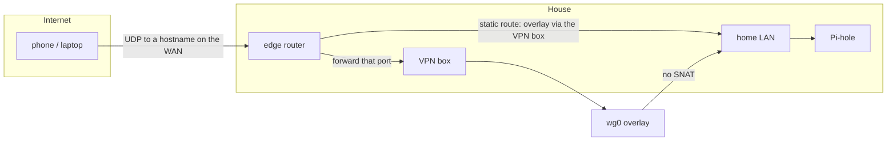
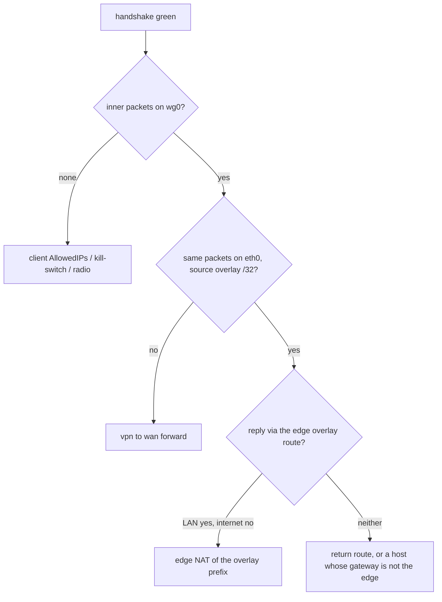

The house already had a router we liked: an Asus running [Merlin](https://www.asuswrt-merlin.net/), doing Wi-Fi, DHCP, and NAT for `192.168.1.0/24`. Same LAN as the [IoT isolation]() and [the OpenWrt rebuild of that isolation](). What it did not have was an inbound VPN we still wanted to live on.

The old one was [OpenVPN](https://openvpn.net/) on that Asus. It worked. It was also one more service on the box that already did everything else, speaking a protocol that has been "fine" for a decade in the same way a spare tire is fine. We wanted a full tunnel home (all of the client's traffic, not just packets for the house): phones on cellular, laptops on cafe Wi-Fi, DNS through the existing [Pi-hole](https://pi-hole.net/), reachability into the LAN (and, same as any host on that LAN, into the IoT subnet those posts built). Latency over throughput. One UDP hole in the firewall, not a personality transplant for the edge.

So we added a second box and refused to promote it. It does not DHCP or NAT the house. Radios stay off. It is a [WireGuard](https://www.wireguard.com/) endpoint on the LAN: one address on the home subnet, a private address range that exists only inside the tunnel (the overlay), one forwarded UDP port, one static route back. Visitors check in at the lodge. The manor keeps the keys to the kitchen.


TODO(photo): polaroid of the OpenWrt One in the network cabinet.
File: gate-lodge-cabinet.jpg
Caption: Radios off. One cable into the 2.5G jack. Furniture.


If that already sounds like the thing you wanted, keep this tab open. The paste is [Release Image to a Tunnel](#release-image-to-a-tunnel): first boot through a working client, written so you do not have to live here. Everything between here and there is why that paste is picky. Read it, or skip it and come back when a command looks strangely conservative.

## Visitors Use the Lodge



The public surface is one UDP port, forwarded to the VPN box. Everything inside the tunnel is private addressing. Return traffic for the overlay is a LAN static route on the edge router, the twin of the IoT route from [the first isolation writeup](): the Asus already knew `10.1.101.0/24` lived behind `192.168.1.101`. It now also knows `192.168.101.0/24` lives behind `192.168.1.253`.

That route only works if overlay packets still *look like* overlay packets when they hit the LAN. [Masquerade](https://wiki.nftables.org/wiki-nftables/index.php/Performing_Network_Address_Translation_%28NAT%29) on the VPN box would rewrite them to the box's home address, and the route would have nothing to match. The handshake can still go green while the house stays unreachable. I will get back to that, because it is the bug that looks like a fix.

## Banana Pi Builds It, OpenWrt Owns It

The board is an [OpenWrt One](https://openwrt.org/toh/openwrt/one): MediaTek Filogic 820, 2.5G WAN, 1G LAN, Wi-Fi 6 we never turned on, USB-C serial on the front. Two flash chips: NAND holds the live OS, NOR is recovery for when you have been unwise. [Banana Pi](https://docs.banana-pi.org/en/OpenWRT-One/BananaPi_OpenWRT-One.html) manufactures and sells it; the [OpenWrt](https://openwrt.org/) project designed it, and a slice of each sale goes to the [Software Freedom Conservancy](https://sfconservancy.org/) earmarked for OpenWrt.

Banana Pi built it. In this house "the Pi" already means the Raspberry Pi that runs Pi-hole, at `192.168.1.254`. We number infrastructure from the top of `192.168.1.0/24`, so the DNS box is `.254` and the VPN box is `.253`. Hostname `gate-lodge`. Call yours whatever you want. Do not call this one "the Pi." One of these devices will come out of your mouth under stress, and it will be the wrong one.

The edge router is configured in its own web UI. The OpenWrt box is configured over SSH as [UCI](https://openwrt.org/docs/guide-user/base-system/uci) text. The running box outranks both. I already learned that last part on [the IoT rebuild]().

## Nested, Then Lonely

Stock OpenWrt wants to be a router. Fresh out of the box the OpenWrt One serves `192.168.1.1` on the 1G jack, DHCP on, WAN masquerading. Plug that jack into a house that already uses `192.168.1.0/24` and you get a small religious war over who is `.1`.

We let it be a router for a day, on purpose, on a *side* net. Home on `eth0` (the 2.5G jack) via DHCP from the Asus. A tiny LAN on `eth1` (`br-lan`) at `192.168.67.1/24`. OpenWrt calls the home-facing jack `wan` even though, from the internet's point of view, it is just another LAN host; punching SSH from the `wan` zone is punching it from the house, not from the world. A spare laptop on the 1G jack if that punch failed. Radios off. Nested NAT on, because a nested router NATs; that masquerade is temporary and it comes off later.


Then we converted it to a host. Static `192.168.1.253/24` on `eth0`, default via `192.168.1.1`, DNS to Pi-hole. `network.lan` proto `none`. DHCP off. The `lan` → `wan` forward deleted. WAN masquerade **off**. The 1G jack stays dead: not a management DHCP port, not a second personality. Recovery, if the OS ever dies, is USB-C serial or the OpenWrt One's factory/NOR path on that jack, not a service we leave running.

The box is lonely once it is only a host. If you skip the nested day you can still get there from the serial console, or from a laptop on the 1G jack at the factory address before you join the house. The nested join is the version where you still have a door if you brick the home-facing side. Both paths are in the paste below.

[Dropbear](https://openwrt.org/docs/guide-user/security/dropbear.public-key.auth) is OpenWrt's SSH server. It reads `/etc/dropbear/authorized_keys`. A modern `ssh-copy-id` will cheerfully write `~/.ssh/authorized_keys` and you will wonder why the key you just installed does nothing. Copy the line into the Dropbear file. I lost a round to that.

## Packages.gz Was 404

The image on the box was a nightly SNAPSHOT: kernel `6.6.57`, identified as an OpenWrt One, no `kmod-wireguard`, no `tun`. Current snapshot `opkg` `Packages.gz` was HTTP 404. Release kernel modules are built against other kernels. `--force` would have been a way to install a module that could not load.

We did not force it. [Keep-settings sysupgrade](https://openwrt.org/docs/guide-user/installation/generic.sysupgrade) to official **24.10.8** (`r29233-443ec4032a`, kernel `6.6.144`), image `openwrt-24.10.8-mediatek-filogic-openwrt_one-squashfs-sysupgrade.itb`. No factory reflash, no vendor image, no `--force`. Hostname, `.253`, Dropbear keys, and the WAN default all survived. Then:

```sh
opkg update
opkg install kmod-wireguard wireguard-tools luci-proto-wireguard
```

`kmod-wireguard` came in as `6.6.144-r1`. After the first install, `ifup wg0` left netifd (OpenWrt's network daemon) on proto `none` / `NO_DEVICE`. The proto script was new to the running daemon. `/etc/init.d/network restart` attached it. Later peer edits: `ifup wg0` is enough. Do not reboot as a personality.

Flash a **release**. Snapshots are for people who enjoy 404s on the day they need a tunnel.

## The 101 We Gave Back

[The isolation writeup](#a-note-on-subnet-selection) abandoned `192.168.101.0/24` for IoT. The IoT router's address on the home LAN was `192.168.1.101`; an IoT net at `192.168.101.0/24` made every debugging session into a transposition test. They moved IoT to `10.1.101.0/24` so the first octet told you which side of the fence you were on.

We took `192.168.101.0/24` for the overlay on purpose. Same `101` as IoT, different first two octets, so it does not become `10.101.1.0/24` when a tired person transposes. Home stays `192.168.1.0/24`. IoT stays `10.1.101.0/24`. Overlay is the other 101.

Also occupied here: the retired OpenVPN net `10.8.0.0/24` (do not reuse: it is the default, and it will collide on the road), a [WSL](https://learn.microsoft.com/en-us/windows/wsl/networking) virtual net on a PC that might itself be a client, and a brief candidate `10.72.1.0/24` that we dropped because `72.0.0.0/8` is public and a tired eye can lose the `10.`. Pick an overlay that is free on *your* LAN, on your VPN clients' other nets, and in [RFC 1918](https://datatracker.ietf.org/doc/html/rfc1918).

If you also isolated IoT the way those posts did, treat overlay clients as home: they may reach `10.1.101.0/24` the way `192.168.1.0/24` does. IoT still must not initiate back, except DNS to Pi-hole. The overlay does not get a special hole punched through the IoT firewall. If isolation was the point of those posts, the VPN does not get to undo it. If you have no IoT subnet, skip this paragraph and do not invent one for the VPN.

## Cut Over, Then Listen

No shadow period, for us: dump the old OpenVPN pool, disable OpenVPN, *then* stand up WireGuard. Two inbound VPNs is two stories about which prefix a client has today. If you still need the old VPN, invert that: stand up WireGuard first, prove a client, *then* disable OpenVPN. We were done with OpenVPN. You might not be.

On the Asus: a LAN static route for the overlay via `192.168.1.253`, metric left empty, interface LAN. UDP forward of the listen port to `192.168.1.253`. OpenVPN off. Reboot the Asus once, because consumer firmware likes to be asked twice. The edge does not stop doing NAT, Wi-Fi, or DHCP. You are not replacing it. You are giving it a route and a hole. Any edge that can do a LAN static route and a UDP port forward will do; Merlin is just what this house has.

On the VPN box, `wg0` is `192.168.101.1/24`, proto `wireguard`, listen on that same UDP port. Keys generated on the box, under `/etc/wireguard/`. Do not copy private keys into a repository, a chat, or a blog post. Firewall zone `vpn` on `wg0`, masquerade **0** on both `wan` and `vpn`. Forward `vpn` → `wan` and `wan` → `vpn`. A rule `Allow-WG`: UDP dest that port, source zone `wan`.

`wan`, on this box, is the home LAN. The OpenWrt One's "WAN" jack is just the cable that faces the Asus. Punching SSH, [LuCI](https://openwrt.org/docs/guide-user/luci/start) (OpenWrt's web UI), and WireGuard from `wan` is punching them from home, not from the internet. The Asus is what faces the world; it forwards one UDP port and does not forward 22, 80, 443, or 53. I had to add `Allow-LuCI-from-home` (TCP 80/443 from `wan`) after converting to a host, because WAN input is REJECT and SSH was the only thing already punched. LuCI listened the whole time. The zone was the lock.


TODO(screenshot): LuCI Network → Interfaces → wg0, and/or Firewall zones.
File: gate-lodge-luci-wg0.png
Redact peer descriptions and public keys.


## Masquerade Eats the Return Path

A green handshake means the UDP hole works. It does not mean the inner packets have a way home.

The wrong extra click is WAN `masq=1` "so the internet works." That SNATs overlay sources onto `192.168.1.253`. The Asus then sees house-LAN traffic from the VPN box's own address. The overlay route never matches. LAN replies go missing, or they go to the box and stop. You will stare at `wg show` and a pile of RX/TX and a Pi-hole that never saw the query.

Leave `srcnat` empty. Confirm it: `fw4 print` (OpenWrt's firewall compiler) should not masquerade `192.168.101.0/24` onto the home IP. From a machine *on the house LAN*, `ping 192.168.101.1` should return. Ours came back ttl 63, one hop through the Asus. That ping is the overlay-return probe. It does not need a phone. If it fails, fix the edge route and the box's default via `192.168.1.1` before you touch a client.



Do not test "am I on the VPN" by loading the edge router's admin UI. Pick Pi-hole, or another LAN host, or a public-IP check that should show the house WAN. The edge's own web server is a special case and a time sink.

## A Peer With No Address Never Loads

I watched LuCI **Generate configuration** without **Save & Apply** leave zero peers on a box whose UI claimed otherwise. WireGuard has no DHCP. Each device is a peer with its own keypair and a `/32` on the overlay. `.1` is the box. The rest you assign. One address per device; a phone and a laptop are two peers even if they share a human.

Point a DNS name at the house WAN. Do not add that name as a WireGuard peer. LuCI will let you, then generate a config that uses the LAN IP as the endpoint, puts `192.168.101.0/24` in `Address`, and copies the listen port onto the client. Delete that row. Generate keys on a *client* row. Endpoint host and port on the server side stay empty: the phone's cell IP changes, the server only listens.

LuCI labels peer Allowed IPs optional. Leave them blank and `wg` never loads the peer; `wg show` will not list it. Set `192.168.101.x/32` and turn **Route Allowed IPs** on. Then **Save & Apply**. Generate configuration *after* that.

On the client, `AllowedIPs = 0.0.0.0/0, ::/0` is the full tunnel. Keepalive 25 for phones behind NAT. DNS is Pi-hole at `192.168.1.254`. Overlay addressing on `wg0` in this house is IPv4-only; `::/0` is leak prevention for the client's other stacks, not an invitation to put IPv6 on the home LAN. The IoT box already had to [learn that v6 is a back door](). Do not build NAT66 until a client actually stalls on AAAA.


TODO(screenshot): LuCI Generate configuration dialog with endpoint, addresses, AllowedIPs, DNS filled.
File: gate-lodge-luci-export.png
Redact keys.


Official apps: [WireGuard install](https://www.wireguard.com/install/) for Windows, Mac, Linux. On iPhone we imported a `.conf` into [Passepartout](https://apps.apple.com/us/app/passepartout-vpn-client/id1433648537). Same file format everywhere. Issue on a trusted machine, vault or delete the `.conf` once the device has it. Do not put private keys in a repository or a chat.

## Pi-hole Thinks Overlay Is Foreign

Handshake green, no websites: if a raw LAN IP loads and a name does not, the resolver never answered. Overlay packets arrive on the Pi-hole's ethernet from `192.168.101.0/24`, and [Pi-hole's default listen policy](https://docs.pi-hole.net/ftldns/interfaces/) treats that prefix as foreign even though it shares a NIC with `192.168.1.0/24`.

Allow `192.168.101.0/24` (Pi-hole v6: Settings → DNS, or `pihole.toml` listen mode). Prefer an explicit CIDR. If the only control that works is "Permit all origins," it is acceptable **only** while the edge does not forward TCP/UDP 53 from the WAN to the Pi-hole. Do not make a public resolver as a side effect of a VPN.

Point overlay DNS at Pi-hole, not at the VPN box, not at the Asus. If raw IPs fail too, it is routing, not DNS. Do not "fix" either one with `masq=1`. If you do not run Pi-hole, point `DNS` in the client file at whatever resolver you want inside the tunnel, and ignore this section.

## It Lives in the Cabinet Now

Two phones reached the LAN on foreign Wi-Fi and on cellular far from the house. A laptop that does not live here did too. That is the exam: away, Wi-Fi off or someone else's, Pi-hole in the browser, a home address that answers. Then we put the box in the network cabinet and the 1G jack stayed dark. SSH to `.253` still worked.

## Release Image to a Tunnel

This is the tab. Numbers match this house so the earlier posts stay true. Change the prefixes if yours collide. Commands are [UCI](https://openwrt.org/docs/guide-user/base-system/uci) on OpenWrt 24.10; check `uci show firewall` before you delete anything by numeric index.

### What you need

* An existing home router you want to keep (Wi-Fi, DHCP, NAT). Ours is an Asus with Merlin. Any edge that can add a LAN static route and forward one UDP port will do.
* An OpenWrt box. Two ethernet jacks make the nested-join path easy (on the OpenWrt One: 2.5G faces the house, 1G is the temporary side net). One jack plus USB-C serial also works.
* Optional: Pi-hole on the home LAN. Optional: an IoT subnet you already isolated. Neither is required to get a tunnel.
* A UDP port you will forward from the WAN. The snippets use `51820` (WireGuard's common default). Pick yours and use it in all four places: box listen port, edge forward, client `Endpoint`, `Allow-WG`.
* A DNS name pointed at the house WAN, written `vpn.example.com` below. A raw public IP works until it changes.

### Addresses (this house)

* Home LAN `192.168.1.0/24`, edge `192.168.1.1`
* Pi-hole `192.168.1.254` (do not forward WAN 53 to it)
* VPN box `192.168.1.253` on the 2.5G jack, hostname `gate-lodge`
* Overlay `192.168.101.0/24`, server `192.168.101.1/24` on `wg0`
* Nested side net, temporary: `192.168.67.1/24` on the 1G jack

Release image: [Firmware Selector](https://firmware-selector.openwrt.org/?version=24.10.8&target=mediatek%2Ffilogic&id=openwrt_one), `openwrt_one` squashfs-sysupgrade. Prefer a release over a SNAPSHOT.

### First boot, nested

Do not plug the OpenWrt One's 1G jack into a house that already uses `192.168.1.0/24`. Connect a laptop to that 1G jack instead. Factory is `http://192.168.1.1`, user `root`, empty password. Set a password before the box can see the house.

Readdress the side net, turn the radios off, and punch SSH from `wan` (the jack that will face the house):

```sh
uci set system.@system[0].hostname='gate-lodge'
uci set network.lan.ipaddr='192.168.67.1'
uci set network.lan.netmask='255.255.255.0'

uci set wireless.radio0.disabled='1'
uci set wireless.radio1.disabled='1'

uci set firewall.allow_ssh=rule
uci set firewall.allow_ssh.name='Allow-SSH-from-home'
uci set firewall.allow_ssh.src='wan'
uci set firewall.allow_ssh.proto='tcp'
uci set firewall.allow_ssh.dest_port='22'
uci set firewall.allow_ssh.target='ACCEPT'

uci commit
reload_config
wifi down
```

The laptop, if it still has a lease, is now on `192.168.67.0/24`. Plug the 2.5G jack into the house. On the edge router, find the new DHCP lease. SSH to that address as root. Put your pubkey in `/etc/dropbear/authorized_keys`, not in `~/.ssh/authorized_keys`.

Skip this whole nested day if you would rather use the USB-C serial console and set `192.168.1.253` on `eth0` directly. Same host-conversion block either way.

### Convert to host

Retire the nested LAN. The box becomes a single address on the house:

```sh
uci set network.wan.proto='static'
uci set network.wan.device='eth0'
uci set network.wan.ipaddr='192.168.1.253'
uci set network.wan.netmask='255.255.255.0'
uci set network.wan.gateway='192.168.1.1'
uci add_list network.wan.dns='192.168.1.254'

uci set network.lan.proto='none'
uci -q delete network.lan.ipaddr
uci -q delete network.lan.netmask

uci set dhcp.lan.ignore='1'
uci set dhcp.lan.dhcpv4='disabled'
uci set dhcp.lan.dhcpv6='disabled'
uci set dhcp.lan.ra='disabled'

uci set firewall.@zone[1].masq='0'
uci -q delete firewall.@forwarding[0]   # the stock lan → wan; check the index first

uci commit
reload_config
```

`uci show firewall` before you delete a forwarding by index. On a stock OpenWrt One, `wan` is often zone index 1; do not assume that if you have already added zones. After this, SSH to `192.168.1.253`. The 1G jack has no IPv4. Leave it that way.

If LuCI from home is useful:

```sh
uci set firewall.allow_luci=rule
uci set firewall.allow_luci.name='Allow-LuCI-from-home'
uci set firewall.allow_luci.src='wan'
uci set firewall.allow_luci.proto='tcp'
uci add_list firewall.allow_luci.dest_port='80'
uci add_list firewall.allow_luci.dest_port='443'
uci set firewall.allow_luci.target='ACCEPT'
uci commit firewall
fw4 reload
```

Do not forward 80 or 443 from the internet.

### Release, then WireGuard

If `opkg install kmod-wireguard` cannot find a package, you are on a SNAPSHOT whose feeds 404, or whose kernel does not match the release kmods. Copy the 24.10.8 `squashfs-sysupgrade.itb` to `/tmp` on the box and:

```sh
sysupgrade -v /tmp/openwrt-24.10.8-mediatek-filogic-openwrt_one-squashfs-sysupgrade.itb
```

No `--force`. No factory image. Settings should keep. Then:

```sh
opkg update
opkg install kmod-wireguard wireguard-tools luci-proto-wireguard

mkdir -p /etc/wireguard
umask 077
wg genkey | tee /etc/wireguard/server.key | wg pubkey > /etc/wireguard/server.pub

uci set network.wg0=interface
uci set network.wg0.proto='wireguard'
uci set network.wg0.private_key="$(cat /etc/wireguard/server.key)"
uci add_list network.wg0.addresses='192.168.101.1/24'
uci set network.wg0.listen_port='51820'

uci set firewall.vpn=zone
uci set firewall.vpn.name='vpn'
uci set firewall.vpn.input='ACCEPT'
uci set firewall.vpn.output='ACCEPT'
uci set firewall.vpn.forward='REJECT'
uci set firewall.vpn.masq='0'
uci add_list firewall.vpn.network='wg0'

uci set firewall.wg_fwd_out=forwarding
uci set firewall.wg_fwd_out.src='vpn'
uci set firewall.wg_fwd_out.dest='wan'

uci set firewall.wg_fwd_in=forwarding
uci set firewall.wg_fwd_in.src='wan'
uci set firewall.wg_fwd_in.dest='vpn'

uci set firewall.allow_wg=rule
uci set firewall.allow_wg.name='Allow-WG'
uci set firewall.allow_wg.src='wan'
uci set firewall.allow_wg.proto='udp'
uci set firewall.allow_wg.dest_port='51820'
uci set firewall.allow_wg.target='ACCEPT'

uci commit
/etc/init.d/network restart
```

Confirm: `wg show` listens. WAN masquerade is still `0`. `fw4 print` has no srcnat of the overlay.

### Edge router

LAN static routes. The IoT line is only if you already have that subnet; the overlay line is the one this post adds.

| Network/Host IP | Netmask | Gateway | Interface |
| --- | --- | --- | --- |
| 10.1.101.0/24 | 255.255.255.0 | 192.168.1.101 | LAN |
| 192.168.101.0/24 | 255.255.255.0 | 192.168.1.253 | LAN |

Forward UDP `51820` to `192.168.1.253:51820`. Disable the old VPN after a client works, unless you are also done with it and willing to cut first. Do not forward 22, 53, 80, or 443 from the internet.

From a house machine, `ping 192.168.101.1`. That is the overlay-return probe. It should answer before any phone is involved.

### One client

On a trusted machine with `wg`:

```sh
umask 077
wg genkey | tee client.key | wg pubkey > client.pub
```

On the box, public key only, next free `/32` (`.1` is the box; do not reuse a live one):

```sh
uci add network wireguard_wg0
uci set network.@wireguard_wg0[-1].description='example-phone'
uci set network.@wireguard_wg0[-1].public_key='PASTE_CLIENT_PUBKEY'
uci set network.@wireguard_wg0[-1].allowed_ips='192.168.101.2/32'
uci set network.@wireguard_wg0[-1].route_allowed_ips='1'
uci set network.@wireguard_wg0[-1].persistent_keepalive='25'
uci commit network
ifup wg0
```

Client file. Private key stays on the device. `PublicKey` is the *server* pubkey from `/etc/wireguard/server.pub`.

```ini
[Interface]
PrivateKey = CLIENT_PRIVATE_KEY
Address = 192.168.101.2/32
DNS = 192.168.1.254

[Peer]
PublicKey = SERVER_PUBLIC_KEY
Endpoint = vpn.example.com:51820
AllowedIPs = 0.0.0.0/0, ::/0
PersistentKeepalive = 25
```

`wg show` on the box must list that public key. If it does not, Allowed IPs were empty or you skipped Save & Apply. Import the file, connect from cellular, load `http://192.168.1.254` (or some other home address, if you have no Pi-hole). Then delete `client.key` from the trusted machine.

### Pi-hole

Allow queries from `192.168.101.0/24`. Keep WAN 53 closed. If you isolated IoT already, leave that isolation as it was.

## Furniture

The lodge is boring on purpose. It has one job, it sits on one cable, and it does not get an opinion about the rest of the house. That is the part worth stealing even if you never touch our prefixes: keep the edge, give visitors a host, and do not masquerade the people you just let in.
