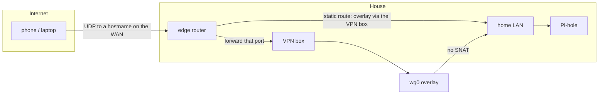
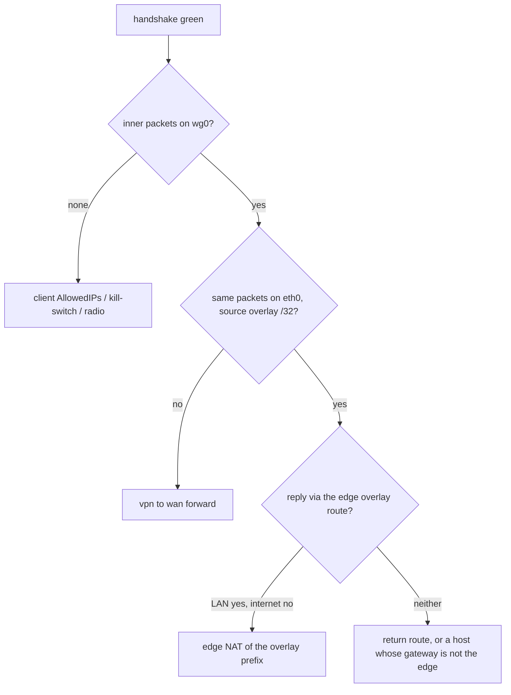

The house already had a router we liked. Wi-Fi, DHCP, NAT, the whole manor. What it did not have was an inbound VPN we still wanted to live on.

The old one was [OpenVPN](https://openvpn.net/) on the Asus. It worked. It was also one more service on the box that already did everything else, speaking a protocol that has been "fine" for a decade in the same way a spare tire is fine. We wanted a full tunnel home: phones on cellular, laptops on foreign Wi-Fi, DNS through the existing [Pi-hole](https://pi-hole.net/), reachability into the LAN (and, same as a host sitting on that LAN, into the [IoT segment]()). Latency over throughput. One UDP hole in the firewall, not a personality transplant for the edge.

So we added a second box and refused to promote it. It does not DHCP. It does not NAT the house. The radios stay off. It is a [WireGuard](https://www.wireguard.com/) terminus on the LAN: one address on the home subnet, one overlay prefix, one forwarded UDP port, one static route back. Visitors check in at the lodge. The manor keeps the keys to the kitchen.


TODO(photo): polaroid of the OpenWrt One in the network cabinet.
File: gate-lodge-cabinet.jpg
Caption: Radios off. One cable into the 2.5G jack. Furniture.


If that already sounds like the thing you wanted, keep this tab open. The rest is how we commissioned it without accidentally building a second router, and the four places the obvious fix is the one that ruins the design.

## Visitors Use the Lodge



The public surface is one UDP port, forwarded to the VPN box. Everything inside the tunnel is private addressing. Return traffic for the overlay is a LAN static route on the edge, the twin of the IoT route from [the first isolation writeup](): the Asus already knew `10.1.101.0/24` lived behind `192.168.1.101`. It now also knows `192.168.101.0/24` lives behind `192.168.1.253`.

That route only works if overlay packets still *look like* overlay packets when they hit the LAN. [Masquerade](https://wiki.nftables.org/wiki-nftables/index.php/Performing_Network_Address_Translation_%28NAT%29) on the VPN box would rewrite them to the box's home address, and the route would have nothing to match. The handshake can still go green while the house stays unreachable. I will get back to that, because it is the bug that looks like a fix.

## Banana Pi Builds It, OpenWrt Owns It

The board is an [OpenWrt One](https://openwrt.org/toh/openwrt/one): MediaTek Filogic 820, 2.5G WAN, 1G LAN, Wi-Fi 6 we never turned on, USB-C serial on the front, NAND for running, NOR for when you have been unwise. [Banana Pi](https://docs.banana-pi.org/en/OpenWRT-One/BananaPi_OpenWRT-One.html) manufactures it; the [OpenWrt](https://openwrt.org/) project designed it and gets a cut. That is why the working notes for this box live in a repo named as if it were a single-board computer. Banana Pi built it; "the Pi" in this house is already taken.

The Pi is the Raspberry Pi that runs Pi-hole, at `192.168.1.254`. We count down from the top of `192.168.1.0/24` for infrastructure. The VPN box is `192.168.1.253`, hostname `gate-lodge`. If you copy the numbering, copy the naming discipline too. One of these devices will come out of your mouth as "the Pi" under stress, and it will be the wrong one.

I SSH. The person who owns the house clicks the Asus. That split is load-bearing: the edge UI is theirs, the [UCI](https://openwrt.org/docs/guide-user/base-system/uci) is mine, the running box outranks both of us. I already learned that last part on [the IoT rebuild]().

## Nested, Then Lonely

Stock OpenWrt wants to be a router. Fresh out of the box the One serves `192.168.1.1` on the 1G jack, DHCP on, WAN masquerading, the whole idiom. Plug that into a house that already uses `192.168.1.0/24` and you get a small religious war over who is `.1`.

We let it be a router for a day, on purpose, on a *side* net. Home on `eth0` (the 2.5G jack) via DHCP. A tiny LAN on `eth1` (`br-lan`) at `192.168.67.1/24`. SSH punched from the WAN zone so a machine on the house could reach it, and a spare laptop on the nested jack if that punch failed. Radios off. Nested NAT on, because a nested router NATs; that masquerade is temporary and it comes off later.


Then we converted it to a host. Static `192.168.1.253/24` on `eth0`, default via `192.168.1.1`, DNS to Pi-hole. `network.lan` proto `none`. DHCP off. The `lan` → `wan` forward deleted. WAN masquerade **off**. The 1G jack stays dead: not a management DHCP port, not a second personality. Recovery, if the OS ever dies, is USB-C serial or the One's factory/NOR path on that jack, not a service we leave running.

A terminus is lonely. If you skip the nested day you can still get there from the serial console, or from a laptop on the 1G jack at the factory address before you join the house. The nested join is the version where you still have a door if you brick the home-facing side.

[Dropbear](https://en.wikipedia.org/wiki/Dropbear_(software)), while you are at it: it reads `/etc/dropbear/authorized_keys`. A modern `ssh-copy-id` will cheerfully write `~/.ssh/authorized_keys` and you will wonder why the key you just installed does nothing. Copy the line into the Dropbear file. I lost a round to that.

## Packages.gz Was 404

The image on the box was a SNAPSHOT: kernel `6.6.57`, `ubus` model `OpenWrt One`, no `kmod-wireguard`, no `tun`. Current snapshot `opkg` `Packages.gz` was HTTP 404. Release kmods are built against other kernels. `--force` would have been a way to install a module that could not load.

We did not force it. [Keep-settings sysupgrade](https://openwrt.org/docs/guide-user/installation/generic.sysupgrade) to official **24.10.8** (`r29233-443ec4032a`, kernel `6.6.144`), image `openwrt-24.10.8-mediatek-filogic-openwrt_one-squashfs-sysupgrade.itb`. No factory, no Banana Pi vendor image, no `--force`. Hostname, `.253`, Dropbear keys, and the WAN default all survived. Then:

```sh
opkg update
opkg install kmod-wireguard wireguard-tools luci-proto-wireguard
```

`kmod-wireguard` came in as `6.6.144-r1`. After the first install, `ifup wg0` left netifd on proto `none` / `NO_DEVICE`. The proto script was new to the running netifd. `/etc/init.d/network restart` attached it. Later peer edits: `ifup wg0` is enough. Do not reboot as a personality.

If you are following along: flash a **release**. Snapshots are for people who enjoy 404s on the day they need a tunnel.

## The 101 We Gave Back

A previous post in this house [abandoned `192.168.101.0/24` for IoT](#a-note-on-subnet-selection). The IoT router's home-side address was `192.168.1.101`; an IoT net at `192.168.101.0/24` made every debugging session into a transposition test. They moved IoT to `10.1.101.0/24` so the first octet told you which side of the fence you were on.

We took `192.168.101.0/24` for the overlay on purpose. Same `101` as IoT, different first two octets, so it does not become `10.101.1.0/24` when a tired person transposes. Home stays `192.168.1.0/24`. IoT stays `10.1.101.0/24`. Overlay is the other 101. Occupied, in this house, also included the retired OpenVPN net `10.8.0.0/24` (do not reuse: it is the default, and it will collide on the road) and a WSL prefix on one workstation. Pick an overlay that is free on *your* LAN, on your VPN clients' other nets, and in [RFC 1918](https://datatracker.ietf.org/doc/html/rfc1918) that is not a public `/8` you almost used because a Banana Pi board number looked like an address.

VPN clients are home for IoT policy. They may reach `10.1.101.0/24` the way `192.168.1.0/24` does. IoT still must not initiate back, except DNS to Pi-hole. The overlay does not get a special hole punched through the IoT firewall. If isolation was the point of the last two posts, the VPN does not get to undo it.

## Cut Over, Then Listen

No shadow period. Dump the old OpenVPN pool, disable OpenVPN, *then* stand up WireGuard. Two inbound VPNs is two stories about which prefix a client has today.

On the Asus (Merlin, in this house): a LAN static route for the overlay via `192.168.1.253`, metric blank, interface LAN. UDP forward of the listen port to `192.168.1.253`. OpenVPN off. Reboot the Asus once, because consumer firmware likes to be asked twice. The edge does not stop doing NAT, Wi-Fi, or DHCP. You are not replacing it. You are giving it a route and a hole.

On `gate-lodge`, `wg0` is `192.168.101.1/24`, proto `wireguard`, listen on that same UDP port. Keys generated on the box, under `/etc/wireguard/`, never in git. Firewall zone `vpn` on `wg0`, masquerade **0** on both `wan` and `vpn`. Forward `vpn` → `wan` and `wan` → `vpn`. A rule `Allow-WG`: UDP dest that port, source zone `wan`.

`wan`, on this box, is the home LAN. The One's "WAN" jack is just the cable that faces the Asus. Punching SSH, LuCI, and WireGuard from `wan` is punching them from home, not from the internet. The Asus is what faces the world; it forwards one UDP port and does not forward 22, 80, 443, or 53. I had to add `Allow-LuCI-from-home` (TCP 80/443 from `wan`) after convert-to-host, because WAN input is REJECT and SSH was the only thing already punched. [LuCI](https://openwrt.org/docs/guide-user/luci/start) listened the whole time. The zone was the lock.


TODO(screenshot): LuCI Network → Interfaces → wg0, and/or Firewall zones.
File: gate-lodge-luci-wg0.png
Redact peer descriptions and public keys.


## Masquerade Eats the Return Path

A green handshake means the UDP hole works. It does not mean the inner packets have a way home.

The wrong extra click is WAN `masq=1` "so the internet works." That SNATs overlay sources onto `192.168.1.253`. The Asus then sees house-LAN traffic from the VPN box's own address. The overlay route never matches. LAN replies go missing, or they go to the box and stop. You will stare at `wg show` and a pile of RX/TX and a Pi-hole that never saw the query.

Leave `srcnat` empty. Confirm it: `fw4 print` should not masquerade `192.168.101.0/24` onto the home IP. From a machine *on the house LAN*, `ping 192.168.101.1` should return (ttl 63 through the Asus, in our case). That ping is the overlay-return probe. It does not need a phone. If it fails, fix the Asus route and the box's default via `192.168.1.1` before you touch a client.



Do not test "am I on the VPN" by loading the Asus admin UI. Pick Pi-hole, or another LAN host, or a public-IP check that should show the house WAN. The edge's own web server is a special case and a time sink.

## A Peer With No Address Never Loads

WireGuard has no DHCP. Each device is a peer with its own keypair and a `/32` on the overlay. `.1` is the box. The rest you assign. One address per device; a phone and a laptop are two peers even if they share a human.

Point a DNS name at the house WAN. Do not add that name as a WireGuard peer. LuCI will let you, then generate a config that uses the LAN IP as the endpoint, puts `192.168.101.0/24` in `Address`, and copies the listen port onto the client. Delete that row. Generate keys on a *client* row. Endpoint host and port on the server side stay empty: the phone's cell IP changes, the server only listens.

LuCI says Allowed IPs on the peer are optional. They are not. An empty `allowed_ips` means `wg` never loads the peer. `wg show` will not list it. Set `192.168.101.x/32` and turn **Route Allowed IPs** on. Then **Save & Apply**. Generate configuration *after* that. I watched a Generate-without-Apply leave zero peers on a box whose UI claimed otherwise.

On the client, `AllowedIPs = 0.0.0.0/0, ::/0` is the full tunnel. Keepalive 25 for phones behind NAT. DNS is Pi-hole at `192.168.1.254`. Overlay addressing on `wg0` in this house is IPv4-only; `::/0` is leak prevention for the client's other stacks, not an invitation to put IPv6 on the home LAN. The IoT box already had to [learn that v6 is a back door](). Do not build NAT66 until a client actually stalls on AAAA.


TODO(screenshot): LuCI Generate configuration dialog with endpoint, addresses, AllowedIPs, DNS filled.
File: gate-lodge-luci-export.png
Redact keys.


Official apps: [WireGuard install](https://www.wireguard.com/install/) for Windows, Mac, Linux. On iPhone we imported a `.conf` into [Passepartout](https://apps.apple.com/us/app/passepartout-vpn-client/id1433648537). Same file format everywhere. I am not going to enumerate who in this house got a peer. You should not publish that list either. Issue on a trusted machine, vault or delete the `.conf` once the device has it, never commit keys.

## Pi-hole Thinks Overlay Is Foreign

Pi-hole's "local only" listen treats clients as local when they share the Pi's ethernet subnet. Overlay packets arrive on that same NIC from `192.168.101.0/24`. Those sources get REFUSED until you allow the prefix.

Allow `192.168.101.0/24` (Pi-hole v6: Settings → DNS / `pihole.toml` listen mode). Prefer an explicit CIDR. If the only control that works is "Permit all origins," it is acceptable **only** while the edge does not forward TCP/UDP 53 from the WAN to the Pi. Do not make a public resolver as a side effect of a VPN.

Point overlay DNS at Pi-hole, not at `gate-lodge`, not at the Asus. Handshake-green and "no websites" is often this, or it is the masquerade bug above. Distinguish them: if a raw IP on the LAN works and a name does not, it is DNS. If raw IPs fail too, it is routing. Do not "fix" either one with `masq=1`.

## It Lives in the Cabinet Now

Two phones reached the LAN on foreign Wi-Fi and on cellular far from the house. A laptop that was not ours did too. That is the exam: away, Wi-Fi off or someone else's, Pi-hole in the browser, a home address that answers. Then we put the box in the network cabinet and the 1G jack stayed dark. SSH to `.253` still worked. A successful terminus is furniture.

The interesting parts were never throughput. They were: do not promote the box, do not masquerade the overlay, do not trust LuCI's optional fields, do not leave SNAPSHOT in charge of kmods. The recipe below is the UCI we actually meant, with our listen port and public hostname swapped for placeholders so this post is a shape, not a client list.

## Stock 24.10 to a Tunnel

Assumptions, matching this house so the earlier posts stay true. Change the prefixes if yours collide.

* Home LAN `192.168.1.0/24`, edge `192.168.1.1` (NAT, DHCP, Wi-Fi)
* Pi-hole `192.168.1.254` (do not forward WAN 53 to it)
* VPN box `192.168.1.253` on the 2.5G jack, hostname `gate-lodge`
* Overlay `192.168.101.0/24`, server `192.168.101.1/24` on `wg0`
* Listen UDP `51820` in the snippets below; pick your own high port and use it in all four places (box, edge forward, client `Endpoint`, `Allow-WG`)
* Client endpoint: a DNS name you point at the house WAN, written `vpn.example.com` below

Release image: [Firmware Selector](https://firmware-selector.openwrt.org/?version=24.10.8&target=mediatek%2Ffilogic&id=openwrt_one), `openwrt_one` squashfs-sysupgrade. If you are already on a SNAPSHOT with no kmods, sysupgrade to that release with settings kept. If you are starting from factory, join nested first or set `.253` from serial so you do not fight the house for `192.168.1.1`.

### Edge router

LAN static route, same shape as the IoT one:

| Network/Host IP | Netmask | Gateway | Interface |
| --- | --- | --- | --- |
| 10.1.101.0/24 | 255.255.255.0 | 192.168.1.101 | LAN |
| 192.168.101.0/24 | 255.255.255.0 | 192.168.1.253 | LAN |

Forward UDP `51820` to `192.168.1.253:51820`. Disable the old VPN. Do not forward 22, 53, 80, or 443 from the internet.

### Convert to host

Radios off. SSH from home already punched (`Allow-SSH-from-home`: TCP 22 from `wan`). Then retire the nested LAN:

```sh
uci set system.@system[0].hostname='gate-lodge'
uci set network.wan.proto='static'
uci set network.wan.device='eth0'
uci set network.wan.ipaddr='192.168.1.253'
uci set network.wan.netmask='255.255.255.0'
uci set network.wan.gateway='192.168.1.1'
uci add_list network.wan.dns='192.168.1.254'

uci set network.lan.proto='none'
uci -q delete network.lan.ipaddr
uci -q delete network.lan.netmask

uci set dhcp.lan.ignore='1'
uci set dhcp.lan.dhcpv4='disabled'
uci set dhcp.lan.dhcpv6='disabled'
uci set dhcp.lan.ra='disabled'

uci set firewall.@zone[1].masq='0'
uci -q delete firewall.@forwarding[0]   # the stock lan → wan; check the index first

uci commit
reload_config
```

`uci show firewall` before you delete a forwarding by index. On a stock One, `wan` is often zone index 1; do not assume mine if you have already added zones.

Punch LuCI if you want it from home:

```sh
uci set firewall.allow_luci=rule
uci set firewall.allow_luci.name='Allow-LuCI-from-home'
uci set firewall.allow_luci.src='wan'
uci set firewall.allow_luci.proto='tcp'
uci add_list firewall.allow_luci.dest_port='80'
uci add_list firewall.allow_luci.dest_port='443'
uci set firewall.allow_luci.target='ACCEPT'
uci commit firewall
fw4 reload
```

### WireGuard path

On the box:

```sh
mkdir -p /etc/wireguard
umask 077
wg genkey | tee /etc/wireguard/server.key | wg pubkey > /etc/wireguard/server.pub

uci set network.wg0=interface
uci set network.wg0.proto='wireguard'
uci set network.wg0.private_key="$(cat /etc/wireguard/server.key)"
uci add_list network.wg0.addresses='192.168.101.1/24'
uci set network.wg0.listen_port='51820'

uci set firewall.vpn=zone
uci set firewall.vpn.name='vpn'
uci set firewall.vpn.input='ACCEPT'
uci set firewall.vpn.output='ACCEPT'
uci set firewall.vpn.forward='REJECT'
uci set firewall.vpn.masq='0'
uci add_list firewall.vpn.network='wg0'

uci set firewall.wg_fwd_out=forwarding
uci set firewall.wg_fwd_out.src='vpn'
uci set firewall.wg_fwd_out.dest='wan'

uci set firewall.wg_fwd_in=forwarding
uci set firewall.wg_fwd_in.src='wan'
uci set firewall.wg_fwd_in.dest='vpn'

uci set firewall.allow_wg=rule
uci set firewall.allow_wg.name='Allow-WG'
uci set firewall.allow_wg.src='wan'
uci set firewall.allow_wg.proto='udp'
uci set firewall.allow_wg.dest_port='51820'
uci set firewall.allow_wg.target='ACCEPT'

uci commit
/etc/init.d/network restart
```

Confirm: `wg show` listens. `uci get firewall.@zone[1].masq` is `0`. `fw4 print` has no srcnat of the overlay. From a house machine, `ping 192.168.101.1`.

### One client

On a trusted machine with `wg`:

```sh
umask 077
wg genkey | tee client.key | wg pubkey > client.pub
```

On the box, public key only, next free `/32` (`.1` is taken; do not reuse a live one):

```sh
uci add network wireguard_wg0
uci set network.@wireguard_wg0[-1].description='example-phone'
uci set network.@wireguard_wg0[-1].public_key='PASTE_CLIENT_PUBKEY'
uci set network.@wireguard_wg0[-1].allowed_ips='192.168.101.2/32'
uci set network.@wireguard_wg0[-1].route_allowed_ips='1'
uci set network.@wireguard_wg0[-1].persistent_keepalive='25'
uci commit network
ifup wg0
```

Client file. Private key stays on the device. `PublicKey` is the *server* pubkey from `/etc/wireguard/server.pub`.

```ini
[Interface]
PrivateKey = CLIENT_PRIVATE_KEY
Address = 192.168.101.2/32
DNS = 192.168.1.254

[Peer]
PublicKey = SERVER_PUBLIC_KEY
Endpoint = vpn.example.com:51820
AllowedIPs = 0.0.0.0/0, ::/0
PersistentKeepalive = 25
```

`wg show` on the box must list that public key. If it does not, Allowed IPs were empty or you skipped Save & Apply. Import the file, connect from cellular, load `http://192.168.1.254`. Then delete `client.key` from the trusted machine.

### Pi-hole

Allow queries from `192.168.101.0/24`. Keep WAN 53 closed. IoT isolation stays as it was.

## Furniture

The lodge is boring on purpose. It has one job, it sits on one cable, and it does not get an opinion about the rest of the house. That is the part worth stealing even if you never touch our prefixes: keep the edge, give visitors a host, and do not masquerade the people you just let in.
