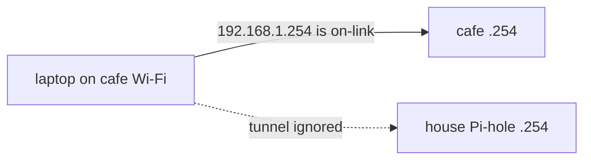
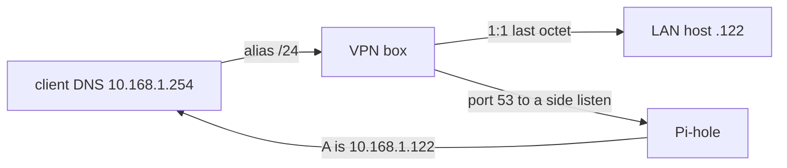

We [put WireGuard on a host]() so we could restart the VPN without restarting the house. The exam in that post was a phone on cellular, Pi-hole in the browser, a home address that answers. Cellular never numbers itself `192.168.1.0/24`. A lot of cafes do.

The laptop joined one and received `192.168.1.253`. That is also the VPN box. The official [WireGuard](https://www.wireguard.com/) app said Connected. `ping 192.168.1.254` hit the shop.

The overlay was fine. The house addresses had become the cafe.

## Cellular Never Collides

The first post's public surface is one UDP port, forwarded to `192.168.1.253`. Inside the tunnel, clients live on `192.168.101.0/24`. The edge router still owns Wi-Fi, DHCP, and NAT for `192.168.1.0/24`, plus a LAN static route that sends the overlay back to the VPN box. [Masquerade stays off](#masquerade-eats-the-return-path) so those packets still look like overlay packets when they hit the LAN.

Phones on LTE pass that exam. There is no local `192.168.1.0/24` to prefer. The kernel has one story about `.254`, and it is the house.

A cafe that hands out the same `/24` gives the kernel two stories. [Longest prefix match](https://en.wikipedia.org/wiki/Longest_prefix_match) picks the on-link `/24` every time, WireGuard included. Renumbering home would only change the odds. Someone else picks any block we pick, and one day we sit down in their shop.



I watched this on a colliding SSID before I believed it. The `utun` had an overlay `/32`. Handshake packets left the Wi-Fi interface. Some days a reply came back. The inner packets for `192.168.1.254` never used that pipe. They were already home, as far as the routing table was concerned. Home was the espresso machine.

## A Prefix That Cannot Live Next Door

The house needed an address that a `192.168.1.0/24` cafe cannot claim. We picked `10.168.1.0/24` and kept the last octet: the host at `192.168.1.122` is also `10.168.1.122`. Pi-hole is `10.168.1.254`. The VPN box is `10.168.1.253`. Client DNS points at the alias, never at `192.168.1.254`.

The VPN box translates the whole `/24` on the way in. One rule, no per-host redirects, no `.vpn` hostname split. Overlay sources stay `192.168.101.x` because masquerade is still off. The edge route still has something to match. Conntrack undoes the translation on the way back, so the laptop sees replies from `10.168.1.x`.



Names have to return the alias. A resolver that still answers `192.168.1.122` for a home name has just handed the laptop back to the cafe, with extra steps.

## The Chain That Nobody Jumped

OpenWrt [fw4](https://openwrt.org/docs/guide-user/firewall/firewall_configuration) will include a file from `/etc/nftables.d/` at the *table* root. We put the translation in `chain dstnat_vpn` that way. `nft list` showed the chain. The packet counter stayed at zero. Off-LAN, `ping 10.168.1.122` timed out.

fw4 only *jumps* from `dstnat` into `dstnat_<zone>` when a UCI `redirect` exists for that zone. We had deleted the old per-host redirects. The chain sat in kernel memory with no caller. Defining `chain dstnat` in the drop-in failed too: fw4 includes those files before it creates the base chains.

The include that actually runs is a UCI `chain-append` on `dstnat` itself:

```uci
config include 'alias_netmap'
	option type 'nftables'
	option path '/etc/nftables.d/netmap.include'
	option position 'chain-append'
	option chain 'dstnat'
```

A chain you can list is not a chain that sees packets. The counter is the proof.

## The Pool That Looked Like a Map

The first line we appended looked like whole-subnet translation:

```nftables
iifname "wg0" ip daddr 10.168.1.0/24 dnat ip to 192.168.1.0/24
```

[nftables treats a prefix on the right-hand side of `dnat to` as a pool](https://wiki.nftables.org/wiki-nftables/index.php/Performing_Network_Address_Translation_%28NAT%29#NAT_pooling). `nft --debug=netlink` said `addr_min 192.168.1.0` / `addr_max 192.168.1.255`. Last-octet identity is a coincidence you get for one flow and lose on the next. A 1:1 map needs the prefix form, which [current nftables spells as a destination map](https://serverfault.com/questions/1156428/configuring-destination-nat-nftables-entire-subnet):

```nftables
iifname "wg0" ip daddr 10.168.1.0/24 counter dnat ip prefix to ip daddr map { 10.168.1.0/24 : 192.168.1.0/24 }
```

That compiled on OpenWrt 24.10.8, kernel `6.6.144`, the same release image as the first post. Rule text that contains both `/24`s is not evidence. Netlink is.

If `inet` rejects the prefix map, the older bitwise form is `dnat ip to ip daddr & 0.0.0.255 | 192.168.1.0`. We did not need it.

## House Numbers on a Foreign Street

The map can be perfect and the browser still goes to the cafe, because the name still resolved to `192.168.1.122`.

[Pi-hole's FTL](https://docs.pi-hole.net/ftldns/) owns `192.168.1.254:53` for the house. That is the right answer on the LAN. It is the wrong answer in a shop that already uses that `/24`. [WireGuard's `DNS =` line is an IPv4 address on port 53](https://man.archlinux.org/man/wg-quick.8.en#CONFIGURATION). There is no "use DoH" field in the profile.

We already had [dnsdist](https://dnsdist.org/) as a sidecar for DNS-over-HTTPS, with overlay sources (`192.168.101.0/24`) spoofed to `10.168.1.x`. DoH to `https://10.168.1.254/dns-query` returned the alias. `dig @10.168.1.254` returned the house A. FTL had never heard of the split.

Putting dnsdist in front of house `:53` would have made one rewrite engine. It would also have taken `:53` off FTL for every laptop on the LAN. dnsdist is there so DoH clients still show up in FTL as themselves. VPN-only port-53 traffic is not a reason to move the house resolver.

FTL kept `:53`. dnsdist grew a plain listen on `192.168.1.254:5300`. The VPN box dest-port-rewrites `iif wg0` `10.168.1.254:53` onto that listen, and it does so *before* the `/24` map. If the map wins first, `:53` still lands on FTL.

```nftables
iifname "wg0" ip daddr 10.168.1.254 udp dport 53 dnat ip to 192.168.1.254:5300
iifname "wg0" ip daddr 10.168.1.254 tcp dport 53 dnat ip to 192.168.1.254:5300
iifname "wg0" ip daddr 10.168.1.0/24 counter dnat ip prefix to ip daddr map { 10.168.1.0/24 : 192.168.1.0/24 }
```

The spoof is source-gated, not bind-gated. A LAN `dig` to `:5300` still returns `192.168.1.122`. Only `192.168.101.0/24` gets the alias. A new listen has to be proven from the LAN; a VPN query can hit a different bind and still look like success.

On a colliding hotspot that also used `192.168.1.0/24`, alias ICMP came back and DoH returned `10.168.1.122`. That is the first time the house was reachable *as itself* from a street that had already claimed its numbers.

## Two /1s and a Cafe /8

A later cafe numbered the laptop out of `10.0.0.0/8`. Handshake lived. `1.1.1.1` through the tunnel lived. `10.168.1.254` timed out.

`ping` left the Wi-Fi interface. The cafe's filter rejected `10.168.1.0/24` as someone else's RFC 1918. The packets never entered `utun`.

On that Mac, `AllowedIPs = 0.0.0.0/0` had become two `/1` routes, `0.0.0.0/1` and `128.0.0.0/1`. A connected `/8` is more specific than `/1` for every `10.` address. The full tunnel was winning the default route and losing the alias.

```ini
AllowedIPs = 0.0.0.0/0, ::/0, 10.168.1.0/24
```

`route -n get 10.168.1.254` has to show the utun. After it did, the same SSID passed: overlay, DoH, and port 53 all returned `10.168.1.122`.

`::/0` is still leak prevention for the client's other stacks, same as the first post. We have not put IPv6 on the home LAN.

We keep the full tunnel. A dead handshake must not leak to foreign Wi-Fi. Split `AllowedIPs` is for diagnosis. The official app will say Connected while `tcpdump` on the Wi-Fi interface shows a handshake every five seconds and nothing coming back. Connected is the button. The handshake is the fact.

## The Shop That Will Not Dial the House

One SSID dropped the handshake on the usual UDP port and on UDP 443. Ordinary HTTPS to public hosts loaded. TCP 443 to the house WAN timed out the same way. The shop dest-filtered the house address. The port was incidental.

A second listen on the same public IP is not a second path. We did forward UDP 443 from the edge onto the box's existing listen, for networks that drop unusual UDP and still pass 443. Daily profiles stayed on the first port. The shops that refuse the house address fail both. Vanilla WireGuard has one `Endpoint` per peer. There is no 443-if-the-other-port-dies line in a `.conf`.

A hop whose address is not the house WAN would get through that filter. We have not built it. Until we do, those shops are phone-hotspot weather. Fail-closed still applies: if the handshake dies, the cafe does not get the session.

## After the Lodge Is Up

Numbers match this house and [the first paste](#release-image-to-a-tunnel). Change the alias if `10.168.1.0/24` is already someone else's. The snippets use listen port `51820` the same way that paste does.

### On the VPN box

`/etc/nftables.d/netmap.include`, then the UCI include above, then `fw4 reload`. Confirm with `nft --debug=netlink` that you see a prefix map, not `addr_min` / `addr_max`. `fw4 print` should still have no srcnat of `192.168.101.0/24`.

### On the Pi-hole

Keep FTL on `192.168.1.254:53`. Add a dnsdist plain listen and leave `newServer` pointed at FTL:

```lua
addLocal('192.168.1.254:5300')
```

Overlay spoof, source-gated. Load your real LAN names however you like; this is the shape:

```lua
local wgNet = newNMG()
wgNet:addMask("192.168.101.0/24")

addAction(
	AndRule({
		NetmaskGroupRule(wgNet),
		QNameRule("box.internal."),
		QTypeRule(DNSQType.A)
	}),
	SpoofAction("10.168.1.122")
)
```

`systemctl restart dnsdist`. dnsdist has no useful reload. `ss -tulnp` is the bind inventory; `ss -ulnp` will hide a TCP-only DoH listen and lie to you.

Allow overlay queries on FTL if you have not already, and keep WAN 53 closed, same as the first post.

### On the client

```ini
[Interface]
Address = 192.168.101.2/32
DNS = 10.168.1.254

[Peer]
Endpoint = vpn.example.com:51820
AllowedIPs = 0.0.0.0/0, ::/0, 10.168.1.0/24
PersistentKeepalive = 25
```

From a colliding `/24`, `dig @10.168.1.254 box.internal` must return `10.168.1.122`. A house A on port 53 is a fail. DoH to the same alias should agree. `ping 192.168.1.254` may still hit the shop; that is the point of the alias.

## Leave 192.168.1 at Home

The overlay did not need another exam. The addresses did. A tunnel is a pipe. A name that still returns `192.168.1.x` is a vote for whoever is sitting on that `/24`, and the kernel will honor the vote. Carry a prefix the cafe cannot claim, make the resolver say so on port 53, and write that prefix into `AllowedIPs` so a nearby `/8` cannot steal it back.

Some shops will not dial the house at all. That is a different pipe, and we do not have it yet. Until then, Connected is a suggestion, the handshake is the measurement, and `.254` means the house only when it is `10.168.1.254`.
