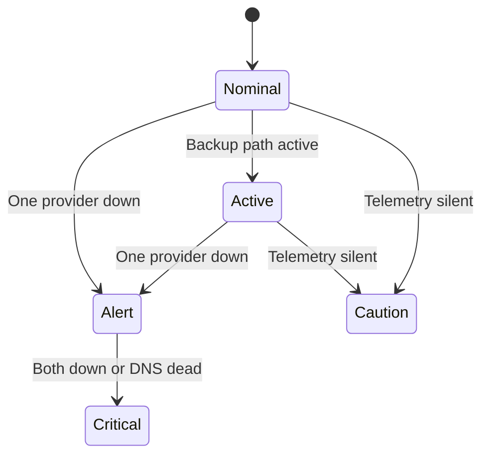

Last night, [Rise Broadband](https://www.risebroadband.com/) flapped on the primary WAN port of our router. Within seconds, the failover script engaged, traffic shifted to [Spectrum](https://www.spectrum.com/) on the backup WAN port, and the home dashboard in my browser shifted from calm green to amber. Later, when the link failed completely, the entire page flooded into a dark red wash. Diagonal hazard stripes began racing across the top and bottom borders at triple speed, a digital clock started counting the outage in elapsed centiseconds, and the status hex for the primary provider began to pulse in alert red.

It looked like the tactical command bridge in [*Neon Genesis Evangelion*](https://www.imdb.com/title/tt0112159/). More importantly, every pixel on the screen was telling the truth.

Most NGE anime UI recreations on GitHub feel like hollow cosplay. Someone copies an amber-and-black palette, draws a few hexagons, and slaps them onto a standard Bootstrap layout or a set of rounded Tailwind cards. It looks neat in a static screenshot, but it feels lifeless the moment you touch it.

Gennaro's [The Beautiful Chaos: UI/UX design storytelling in Neon Genesis Evangelion](https://medium.com/@gennarolgr/the-beautiful-chaos-ui-ux-design-storytelling-in-neon-genesis-evangelion-26ae2d09613f) names the gap cleanly. Evangelion's fictional interfaces were never meant for passive reading or comfortable enterprise workflows. They were designed as instruments of narrative tension. The bridge crew is watching an existential operational crisis unfold in real time. If your system has no concept of an escalation cascade, slapping NERV decals onto your CSS is just dressing up a spreadsheet.

A dual-WAN home router, however, actually lives inside an operational drama.

## The Geometry of Belief

Modern web design is obsessed with softening the world: 12-pixel border radii, diffuse drop shadows, airy whitespace, and pastel accents. As zemnmez pointed out in [Why We Don't Have UIs Like The Ones In Neon Genesis Evangelion](https://zemnmez.medium.com/why-we-dont-have-uis-like-the-ones-in-neon-genesis-9b6631dc3714), NERV consoles look the way they do because they inherit the harsh, disciplined grammar of 1990s vector CRT displays and industrial [SCADA](https://en.wikipedia.org/wiki/SCADA) terminals.

There are no rounded corners. Containers are sharp rectangles framed by 1-pixel borders or skewed parallelograms. Structural zones sit on top of a faint substrate of registration crosshairs. High-contrast phosphor bloom bleeds against an absolute void of `#000000`. And when an element needs to indicate state, it does not gently crossfade with a CSS transition; it snaps immediately into place using `steps()` animations or hard visibility cuts.



When both providers are up and the primary route is carrying traffic, the console sits in **Nominal**. The center honeycomb cluster glows in phosphor green. The active route displays in electric blue for Rise Broadband, while the standby route waits in cyan for Spectrum.

To make the interactive controls feel authentic without breaking DOM accessibility, the time-window selector buttons are parallelograms skewed via `transform: skewX(-15deg)`. The button label inside is counter-skewed by `15deg` so the text remains upright while the slanted padding establishes the physical click target.

The upper section of the screen is the glance area: six hexagonal cells arranged in a honeycomb cluster that summarize the instantaneous health of the router, DNS resolution, internet reachability, and both ISP uplinks.

Below the glance cluster, telemetry is plotted across a 24-hour timeline using [uPlot](https://github.com/leeoniya/uPlot). Most network dashboards plot discrete polling points - leaving you to guess what happened between two dots on a line chart. Here, each lane records a continuous history of *defended intervals*: unbroken spans of time where link state is actively defended by incoming syslog events or ongoing probes.

## The Offline Irony

The visual system behind this dashboard started life in [nervouscsstem](https://github.com/Texarkanine/nervouscsstem), an in-progress SCSS design kit we started earlier this year to replicate the operational screens of Evangelion. The library is unfinished - it still has open milestones for psychographic SVG waveforms, topographic wireframe maps, and complex dropdown primitives.

When we decided to build a local WAN status monitor, our initial impulse was to wait: finish the library, publish it to npm, set up a CDN pipeline, and only then build an application on top of it.

That impulse was a mistake. Waiting on an entire component library to reach 1.0 would have delayed the dashboard by months, and publishing to a public CDN was fundamentally at odds with the problem we were solving.

A dashboard whose sole reason for existing is to diagnose network outages cannot depend on external assets. The compiled stylesheet contained 26 `@font-face` rules pointing out to [Google Fonts](https://fonts.google.com/) and [jsDelivr](https://www.jsdelivr.com/). If we had loaded the stylesheet over a CDN, the exact moment our home internet died would also be the exact moment the dashboard failed to fetch its fonts, falling back to Times New Roman in the middle of a blackout.

Instead, we vendored the compiled tokens and core stylesheet directly into the dashboard repository, downloaded the Latin HUD fonts locally ([Barlow Condensed](https://fonts.google.com/specimen/Barlow+Condensed), [Antonio](https://fonts.google.com/specimen/Antonio), [IBM Plex Mono](https://fonts.google.com/specimen/IBM+Plex+Mono), and [DSEG7 Classic](https://github.com/keshikan/DSEG)), and stripped out all external network requests.

We also made a conscious architectural cut: we threw away the idea of using the unfinished psychographic waveforms. In the anime, those squiggling curves represent the mental synchronization between pilots and giant biomechanical units; they are decorative fiction. A home network monitor demands defended timeline intervals, not fictional squiggles. By pairing vendored NERV styling tokens with uPlot for the data plane, the dashboard stays grounded in empirical facts while preserving the aesthetic.

## Telemetry as an Escalation Ladder

The aesthetic works because it is tied directly to router telemetry. The edge router (an [Asus ROG Rapture GT-AXE16000](https://rog.asus.com/networking/rog-rapture-gt-axe16000-model/) running [Asuswrt-Merlin](https://www.asuswrt-merlin.net/) firmware) forwards its [syslog](https://en.wikipedia.org/wiki/Syslog) stream across the LAN to a dedicated logging host. A background process parses link state changes and `wan-failover` debug output, combining router syslog events with active LAN pings and independent UDP DNS probes.

In most home networks, DNS is an invisible detail handed down by an ISP's DHCP server. But our LAN runs an independent [Pi-hole](https://pi-hole.net/) paired with an [Unbound](https://nlnetlabs.nl/projects/unbound/about/) recursive resolver (the same DNS foundation from [The Gate Lodge]()). Because we operate our own name resolution, DNS is a critical local service that can degrade independently of raw IP connectivity. An upstream failover might scramble outbound routes while the local resolver is still answering cache hits, or recursive lookups might stall while gateway pings sail through unimpeded. Giving DNS its own glance hex and timeline lane means a resolver outage never hides behind a working IP route, and an ISP hiccup is not mistaken for a local DNS crash.

Those telemetry inputs feed into a deterministic state machine that drives the NERV alert cascade:

Each step up the ladder changes the ambiance tokens on the document root:

* **Nominal:** Primary provider active, backup standby, all probes passing. Glows in cool green.
* **Active:** Primary flapped or forced onto Spectrum backup. Internet is working, but the household is running without its main pipe.
* **Caution:** Telemetry stream has gone quiet or syslog lacks failover markers. Unknown states render in neutral steel (`--nerv-steel`), never an assumed-up green.
* **Alert:** A single point of failure has occurred. One ISP is unplugged or confirmed down, outbound probes are degraded, or recursive DNS has failed consecutive queries.
* **Critical:** Total blackout. Both providers are down, outbound ping probes are failing, or the recursive resolver is completely unresponsive.



In **Alert**, the system flags that redundancy has been lost even while household internet continues uninterrupted. Traffic has shifted over to Spectrum, the header hazard stripes flare in cautionary orange, and the digital clock in the corner begins tracking the duration of the primary outage.



When the cascade trips all the way to **Critical**, the interface transforms. The background void shifts to a deep crimson wash, the central cascade hex flips to `CRITICAL`, and the diagonal hazard stripes along the header and footer engage their scrolling animation at maximum velocity. The honeycomb hex for the failed primary provider pulses in alert red, the secondary glows in warning orange, and the outage clock keeps ticking in centiseconds.

If the laptop goes to sleep or the browser tab loses its [Server-Sent Events](https://developer.mozilla.org/en-US/docs/Web/API/Server-sent_events) (SSE) connection, the system does not cry wolf. It greys out the live telemetry region into a muted monochrome wash, signaling that the display is stale without falsely declaring a network emergency.

## The Handheld Terminal

Desktop widescreen monitors give you the sprawl of a command center bridge, with room for a six-hex status array and a full day of multi-lane history. But when the internet drops at night, nobody wants to walk over to an office workstation to figure out what happened. You pull out your phone.

Translating a dense, vector-heavy desktop HUD onto a mobile screen usually destroys either the density or the aesthetic. If you simply wrap columns, you end up with an endless scroll of generic cards.



Instead of generic wrapping, the mobile layout reorganizes into a compact field terminal - a handheld NERV PDA. The honeycomb collapses into a vertical stack of pointed status rows spelling out `ONLINE`, `OUTAGE`, or `UNPLUGGED`. Time-range selectors squeeze into a tight bar; uPlot lanes contract to width without losing their hazard fills.

Even constrained to a mobile viewport, the high-contrast typography and sharp borders read as purpose-built tactical instrumentation, not a desktop site that gave up.

## Going Critical in Style

On a dual-WAN home network, the NERV aesthetic is not costume - it is how the operational cascade reads at a glance. By skipping the idealized 1.0 library release, we solved an immediate homelab problem with the tools we had: router syslog, offline local fonts, and defended intervals.

The next time Rise Broadband decides to drop off the pole in the middle of the afternoon, the house will not simply lose connection silently. It will sound the alarm, flash its hazard stripes, and go critical in style!
