# [aisearch] Diagram drafts

Standardize on **Consumer / Producer / Platform** (+ Converter); only node labels change per specimen.

Line language (working convention):
- solid `-->` = healthy / paying loop
- thick `==>` = dominant new path
- dotted `-.->` = attenuated / starved
- `-.-x` / `x-.-x` = dead / non-landing payoff (input arrives; reputation/community/prestige do not stick)

---

## 1. Working shape — NYT

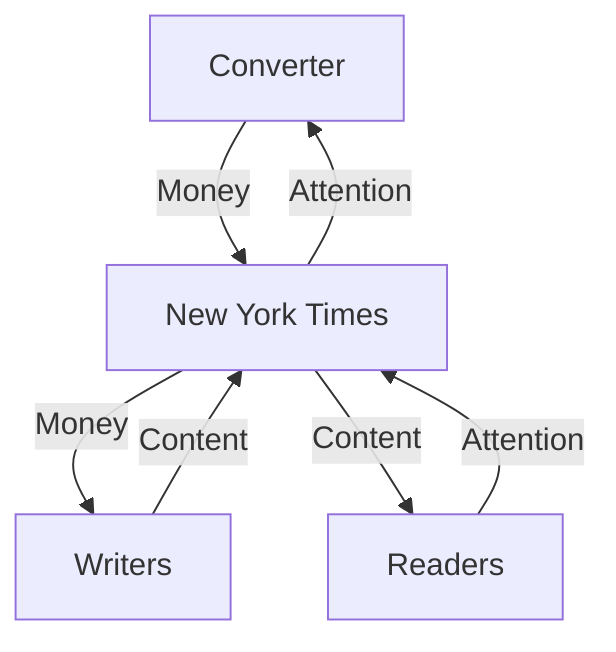

---

## 2. Break — NYT / AI aggregator

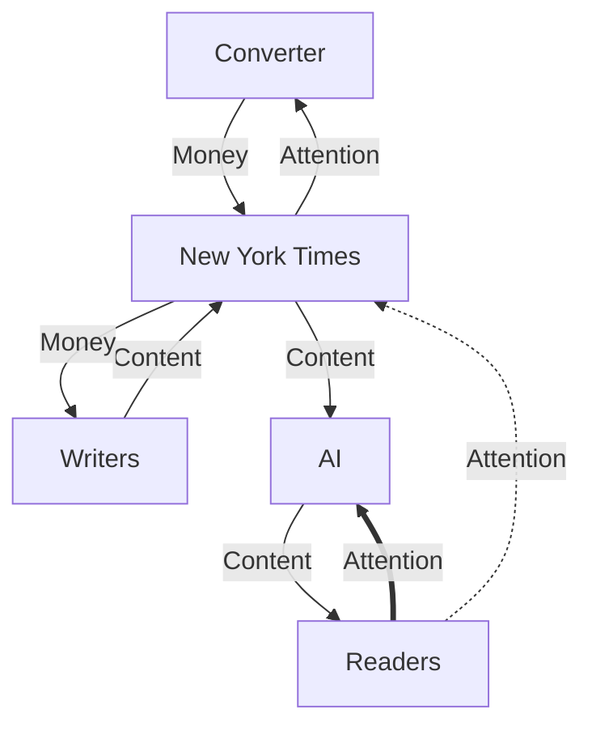

Intent: consumer block pulled onto AI; attention loop closes there; platform still feeds AI content; residual reader→platform attention is a leak, not the flywheel.

---

## 3. Working shape — Reddit / SO

Same topology as NYT; producer pay is reputation, not salary. Community loop explicit (matches Rust working).

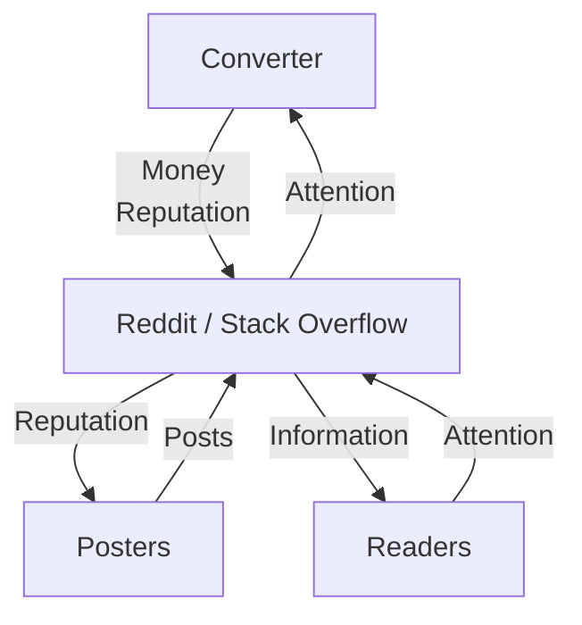

Converter skim = ads / premium / API deals. Producer pay = karma, badges, status. SO labels the same; "Posts" → "Answers" if you want a SO-only figure.

---

## 4. Break — Reddit / SO / AI aggregator

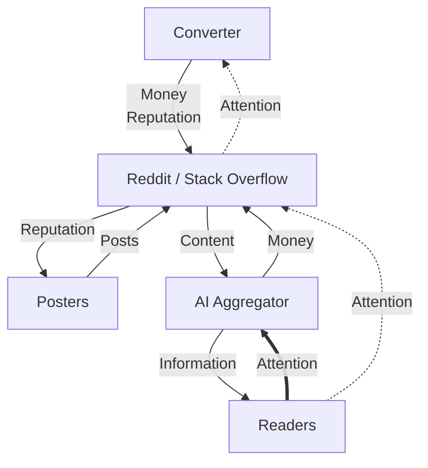

Same break geometry as NYT. Act III "charge the AI" is a *response* diagram (thick Money from AI→Platform) — not drawn here; optional later. That line feeds the converter/platform without restoring Consumer→Platform attention to pay producers.

---

## 5. Working shape — Rust

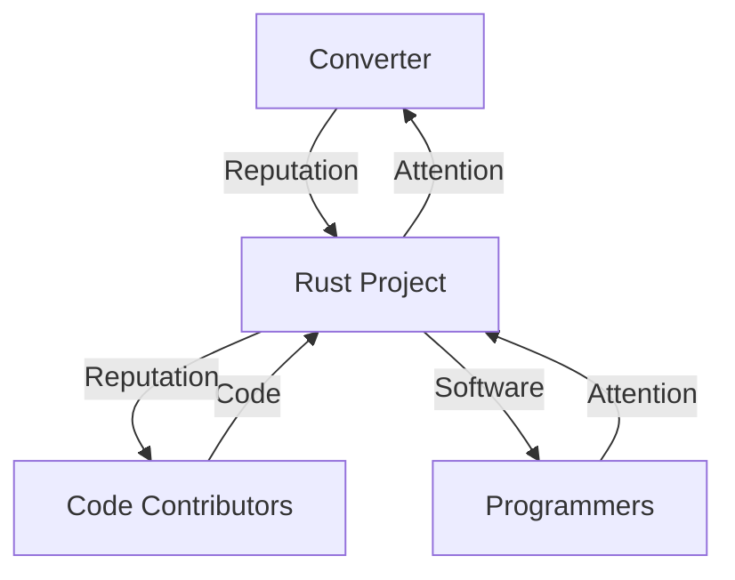

---

## 6. Break — Rust (winner)

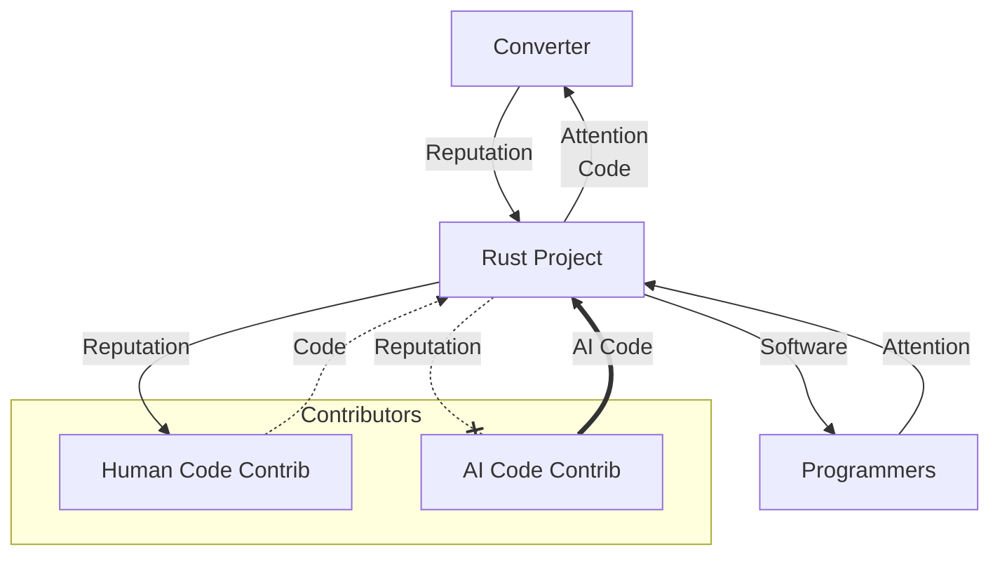

**Intent (locked):** "AI Code" is called out separately and arrives bold, but only human "Code" feeds the converter as usable input. AI contrib pays no community and draws no reputation — no cross-payout to humans. AI code takes converter cycles and produces nothing that feeds the flywheel; dashed human Code = crowded-out split.

Converter capacity scales with the project — it can only convert so much code into appreciated reputation. AI competition turns a lot of that into unconsumed/unappreciated output. Community still converts *out*; none is paid back *in* by AI contribs. Converter saturates; much of its output does not land on a working (human) flywheel. Growth would expand capacity, but growth needs the system to work — AI code reduces converter power instead.

---

## 7. Working shape — Codeberg (winner)

Forge one level up: **projects** are the producers. A living project pays **Software Catalog + Community Attention** into the platform; platform relays **Attention** into the converter. Community = the catalog payment that also returns attention. Catalog alone is not enough.

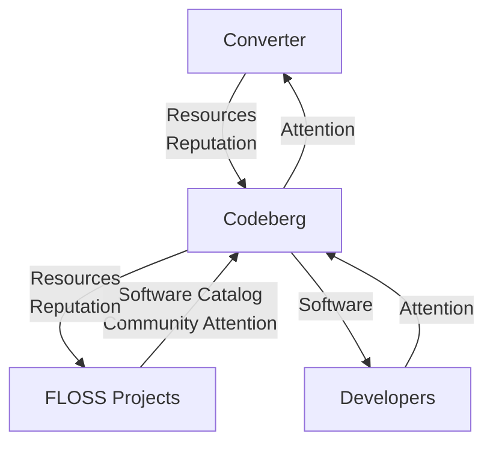

- **Software Catalog + Community Attention** = one producer wire, two payloads. Catalog = discoverable repos; Community Attention = what only humans-in-the-project can add so the platform has attention worth converting.
- **Platform → Attention → Converter** = the relay; starved when the producer wire loses its community half.
- **Consumers → Attention → Platform** / **Software → consumers** = leech path (clone/tarball).
- **Resources / Reputation → producers** = why projects inhabit the forge.
- Converter skim ≈ donations / e.V. membership / identity.

---

## 8. Break — Codeberg / ghost factories (winner)

Rust’s failure pulled up a level: bad producer unit = **project**, not PR author.

**Mechanism (locked):** ghosts pay **Ghost Projects** (catalog-shaped presence, no community attention) and **draw Resources**; they mint no Reputation. Human `Software Catalog + Community Attention` thins → platform relays less Attention into the converter → Resources/Reputation production falls → less left for human projects.

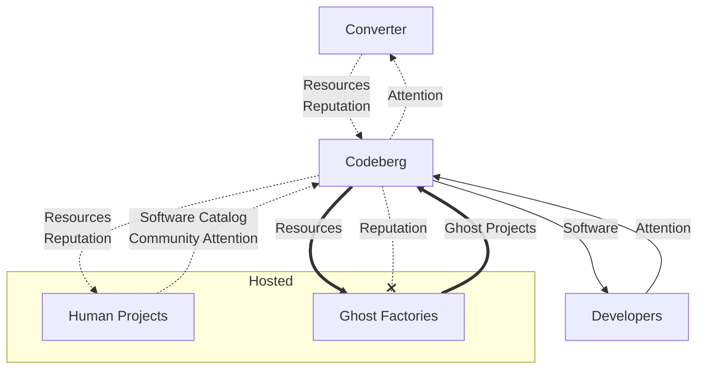

**Intent (locked):**

- Discriminator is on the producer wire label: humans pay catalog *and* community attention; ghosts pay ghost projects only — resources still flow out thick, reputation dead-letters.
- Consumer Attention + Software out can stay solid: leeches still arrive and clone; that is not converter fuel without the community half.
- No cross-payout. Resource saturation = Rust code-saturation twin.

**Still confirm:** manifesto wording ("ghost factories" / "development team of none").

---

## 9. Optional later — Act III response sketches

Not drawn yet; prose may suffice:

- **NYT:** scissors on `NYT -->|Content| AI` / `Readers ==> AI` — circle that leaves consumers outside.
- **Reddit charge-AI:** add `AI -->|Money| Platform` (or via Converter); Consumer→Platform attention stays dotted.
- **Rust policy:** chill/filter on `ProducersAI` and drive-by humans — consumer market still large (loop mismatch).
- **Codeberg Amish:** delete `Ghosts` subgraph entirely; both human loops smaller but solid — matched, fenced.

---

## Superseded Rust-break drafts

Kept only so we don't re-litigate. Winner is §6.

4a / 4b / 4c

### 4a. Split producers (first pass)

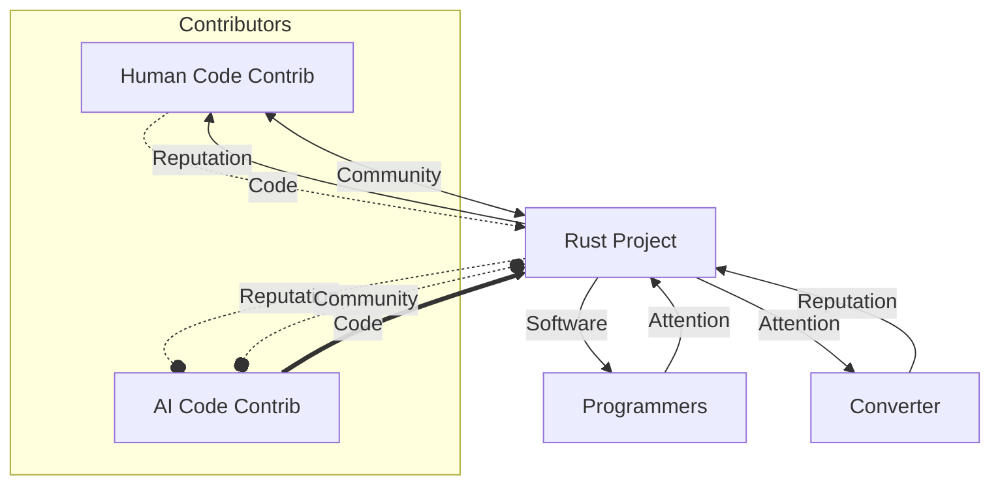

### 4b. Second converter attempt

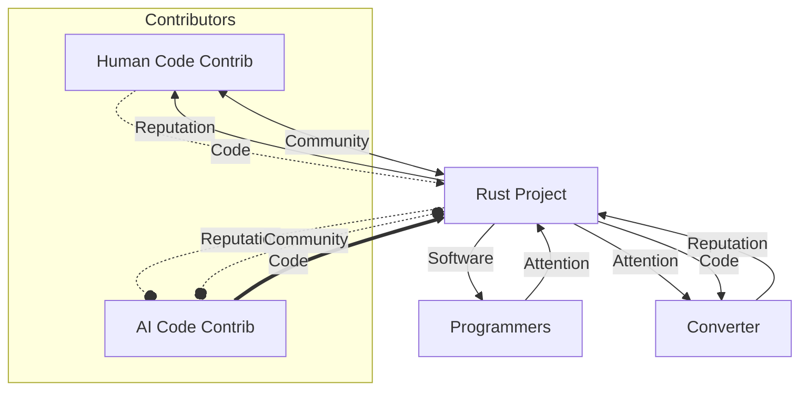

### 4c. Payoff node variant

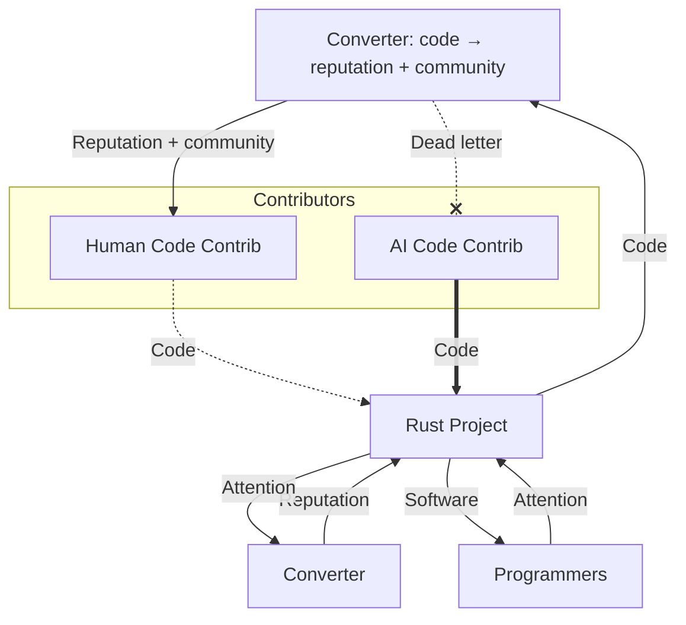

