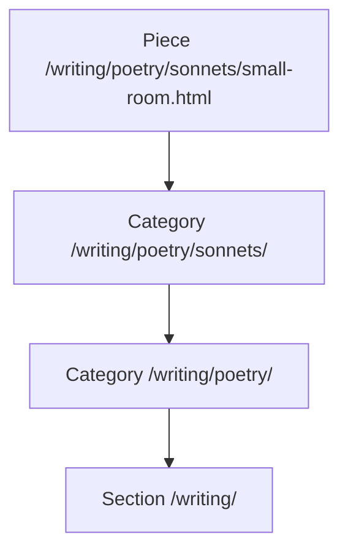

# Task: Folder category pages

* Task ID: writing-collection
* Complexity: Level 3
* Type: enhancement

Each writing folder's URL is that folder's category page. A piece is a child of that page. `/writing/poetry/` lists poetry, including pieces in nested folders. `/writing/poetry/sonnets/` lists that nested folder. The flat pages at `/writing/categories/<name>/` go away. `/writing/categories/` stays the list of every category, and its links point at the folder pages.

## Pinned Info

### Folder path is the category page

`jekyll-archives` puts `:name` through `Jekyll::Utils.slugify`. The default mode turns a slash into a hyphen, so a permalink `/writing/:name/` cannot publish `/writing/poetry/sonnets/`. The page has to be created with the folder path itself.

```mermaid
graph TD
  piece["Piece /writing/poetry/sonnets/small-room.html"]
  poetry["Category /writing/poetry/"]
  sonnets["Category /writing/poetry/sonnets/"]
  piece --> sonnets
  sonnets --> poetry
  poetry --> home["Section /writing/"]
```

## Component Analysis

### Affected Components

- `_plugins/writing_categories.rb`: sets `categories` from the folder segments. It will set the cumulative paths instead, `poetry` and `poetry/sonnets`, so each key is the URL path under `/writing/`.
- `_plugins/garden_archives.rb`: builds `site.writing_categories` and the archive pages. The hash stays. Writing category archive pages turn off, because those pages use the slugified `:name` permalink.
- New `_plugins/writing_folder_indexes.rb`: publishes one `writing-cat-archive` page per cumulative folder path.
- `_config.yaml`: the writing archives block stops enabling categories and drops the `/writing/categories/:name/` permalink. `llm_sidecars.exclude_paths` gains a glob for the folder index HTML so those pages do not get an `index.md` sidecar.
- `_layouts/writing.html`: category links and the `..` link. The visible label stays the last segment. The `..` link goes back to the plain parent directory, which is now the category page.
- `_layouts/writing-cat-archive.html`: unchanged. It already lists `page.posts` newest first.
- `pages/writing/categories.md`: links each category at `/writing/<path>/`.
- `_plugins/20_llms_scope_builders.rb`: the writing-category scope uses the raw folder path. It must not slugify that path.
- `tests/test_writing_collection.py`: the fixture copies the new plugin, and the category URL assertions move from `/writing/categories/<name>/` to the folder path.
- `_plugins/README.md`: the writing-category URL and the reserved-folder note.

### Cross-Module Dependencies

- `writing_categories.rb` runs at `post_init` and writes `document.data["categories"]`. The folder-index generator and `garden_archives` both read that array later, during `generate`.
- `garden_archives` builds `site.writing_categories` from those values even when category archive pages are disabled. The category index and the scope builder read that hash.
- The scope builder runs at `lowest`, after the hashes exist. It does not read the generated HTML page.
- The piece layout does not call the generator. It prints links from `page.categories`.

### Boundary Changes

- A writing category's public URL changes from `/writing/categories/<name>/` to `/writing/<folder path>/`.
- `categories` on a writing document become cumulative folder paths. The visible label is the last segment.
- Post category URLs, writing tag URLs, and piece URLs stay as they are.
- This branch has not shipped the flat category URLs. No redirect is added.

### Invariants and Constraints

- A piece URL stays `/writing/<folder>/<slug>` with no date in the path.
- A piece in a nested folder is listed on every ancestor folder page and on its own folder page.
- A category used once still has a page. A tag used once still does not.
- `/writing/categories/` remains the list of categories. `/writing/tags/` remains the tag index.
- A top-level writing folder must not be named `tags` or `categories`, because those URLs are the index pages.
- The writing home, the piece sidecar, and the posts category scopes stay.
- `site.future` still drops a future filename before the collection accepts it, so a future piece does not grow a folder page.

## Open Questions

None - implementation approach is clear. The flat `:name` permalink was inspected in `jekyll-archives` 2.3.0 and rejected because `slugify` destroys the slash.

## Test Plan (TDD)

### Behaviors to Verify

- A songs piece builds a page at `/writing/songs/` that links the piece, and `/writing/categories/songs/` is absent.
- A piece in `poetry/sonnets` builds `/writing/poetry/` and `/writing/poetry/sonnets/`. Both list the piece. The nested page's heading names `sonnets`.
- The poetry piece's category link and its `..` link are `/writing/poetry/`. Neither link is `/writing/categories/poetry/`.
- The nested piece links `/writing/poetry/` and `/writing/poetry/sonnets/`. Its `..` link is `/writing/poetry/sonnets/`.
- A folderless piece's `..` link is `/writing/`.
- `/writing/categories/` links `/writing/poetry/` and `/writing/songs/` and does not link `/writing/categories/poetry/`.
- One poetry piece publishes `/writing/poetry/llms.txt` and does not publish `/writing/categories/poetry/llms.txt`.
- A nested folder publishes `/writing/poetry/sonnets/llms.txt`.
- The folder page does not get `/writing/poetry/index.md`. The piece still gets `porch-light.md`.
- A writing folder still does not publish `/categories/poetry/llms.txt`. A post category still publishes `/categories/tools/llms.txt`.

### Test Infrastructure

- Framework: `python3 -m unittest`
- Test location: `tests/test_writing_collection.py`
- Conventions: one throwaway Jekyll build per test, repository `_config.yaml` plus a plugin overlay, assertions on the built files
- New test files: none

### Integration Tests

- The archives fixture covers the folder page, the piece links, and the missing flat archive together, because those are one build of the repo config.
- The sidecar fixture covers the scope path and the absent `index.md` together.
- The section fixture covers the category index links.

## Implementation Plan

### 1. Folder pages — executable

- Files: `_plugins/writing_folder_indexes.rb`, `_plugins/writing_categories.rb`, `_config.yaml`, `tests/test_writing_collection.py`

1. Stub tests: add `test_folder_page_replaces_the_flat_category_archive` and `test_nested_folder_pages_list_the_piece` to `WritingCollectionTests`, empty bodies.
2. Stub interface: add `WritingFolderIndexes::Generator` with `generate(site)` and no body. Copy that file from `_prepare_archives`.
3. Write tests and run red: a songs piece writes `/writing/songs/index.html` containing the piece URL, and does not write `/writing/categories/songs/`. A `poetry/sonnets` piece writes both folder indexes, both contain the piece URL, the nested heading says `sonnets`, and the parent page does not have to contain a poetry-only sibling.
4. Write code and run green: set cumulative category paths in the `post_init` hook. Remove `categories` from the writing archives `enabled` list and remove the writing category permalink. The generator adds one page per cumulative path, layout `writing-cat-archive`, title the last segment, permalink `/writing/<path>/`, `posts` the documents in that category.

### 2. Piece links — executable

- Files: `_layouts/writing.html`, `tests/test_writing_collection.py`

1. Stub tests: no new methods. The two existing link tests gain the new assertions in the red step.
2. Stub interface: none. The layout already has the link sites.
3. Write tests and run red: `test_writing_page_links_its_category_and_author_and_shows_both_dates` expects `href="/writing/poetry/"` on the category link and on `..`, and rejects `href="/writing/categories/poetry/"`. `test_nested_piece_links_each_category_segment` expects `/writing/poetry/` and `/writing/poetry/sonnets/`, with `..` on the nested path. Add `test_folderless_piece_parent_is_the_writing_home` expecting `href="/writing/">..</a>`.
4. Write code and run green: remove the `writing_back` special case. Print each category as `/writing/<path>/` with the last segment as the label. The plain parent-directory `..` link then lands on the folder page.

### 3. Category index links — executable

- Files: `pages/writing/categories.md`, `tests/test_writing_collection.py`

1. Stub tests: none new.
2. Stub interface: none.
3. Write tests and run red: `test_writing_category_index_links_a_category_used_once` expects `href="/writing/poetry/"` and `href="/writing/songs/"`, and rejects `href="/writing/categories/poetry/"`.
4. Write code and run green: the category index links `/writing/{{ category[0] }}/` without slugifying the path.

### 4. Category scopes — executable

- Files: `_plugins/20_llms_scope_builders.rb`, `_config.yaml`, `tests/test_writing_collection.py`

1. Stub tests: add `test_nested_folder_scope_publishes_llms_txt` with an empty body.
2. Stub interface: none. The writing-category scope builder already exists.
3. Write tests and run red: the poetry scope is `/writing/poetry/llms.txt` and not `/writing/categories/poetry/llms.txt`. The nested scope is `/writing/poetry/sonnets/llms.txt`. `/writing/poetry/index.md` is absent and `porch-light.md` is present. The post-category and writing-folder-is-not-a-post-category tests stay green.
4. Write code and run green: the writing-category builder sets `path_prefix` to `/writing/<path>/` from the raw category string. Add an `exclude_paths` glob that matches the folder index HTML and does not match `/writing/index.html` or a piece HTML file.

### 5. Plugin note — prose/policy

- Files: `_plugins/README.md`
- No tests: prose/policy artifact

1. Record the category URL as `/writing/<folder path>/`, including a nested path.
2. Record that a top-level folder must not be named `tags` or `categories`, and that a nested folder no longer shares the flat archive URL.

## Technology Validation

No new technology - validation not required.

## Challenges & Mitigations

- Slugify destroys slashes. The folder page and the scope path use the raw folder string. They do not pass it through `:name`.
- The generator could overwrite `/writing/index.html` for a folderless piece. It only creates a page when the cumulative path is non-empty.
- A piece whose slug is `index` would occupy the same file as its folder page. The seeds do not do this. The plan does not add a second URL for that collision.
- Disabling category archives must keep `site.writing_categories`. `build_taxonomy_hashes` runs for the collection before it looks at `enabled`.
- The sidecar exclude glob can swallow piece pages or the writing home. The glob is specific to the folder index file, and unit 4 asserts the piece sidecar still exists.
- The archives fixture copies plugins by name. Unit 1 adds the new file to that list, or the build never loads it.

## Pre-Mortem

- The plan is carried out as a permalink edit from `/writing/categories/:name/` to `/writing/:name/`. Nested folders land at `/writing/poetry-sonnets/` and the piece is still not a child. Unit 1's nested test is the guard, and the permalink key is removed rather than rewritten.
- Cumulative paths leak into the visible label, so the piece says `poetry/sonnets` instead of `sonnets`. Unit 2 asserts the label and the nested heading test asserts `sonnets`.
- The scope file stays under `/writing/categories/` while the HTML moves. Unit 4 asserts the new scope path and the absence of the old one.

## Status

- [x] Component analysis complete
- [x] Open questions resolved
- [x] Test planning complete (TDD)
- [x] Implementation plan complete
- [x] Technology validation complete
- [x] Pre-Mortem complete
- [ ] Preflight
- [ ] Build
- [ ] QA
